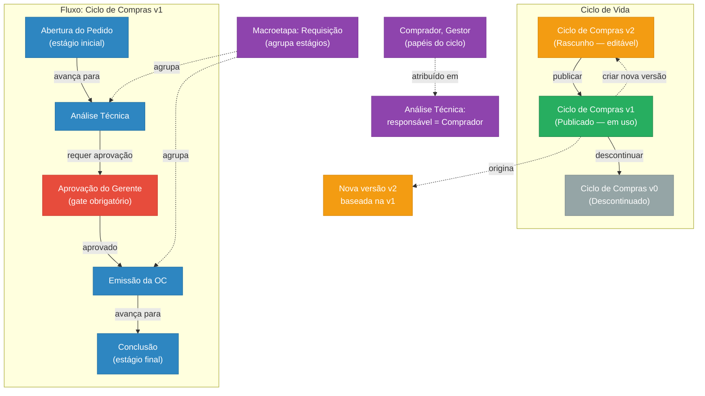
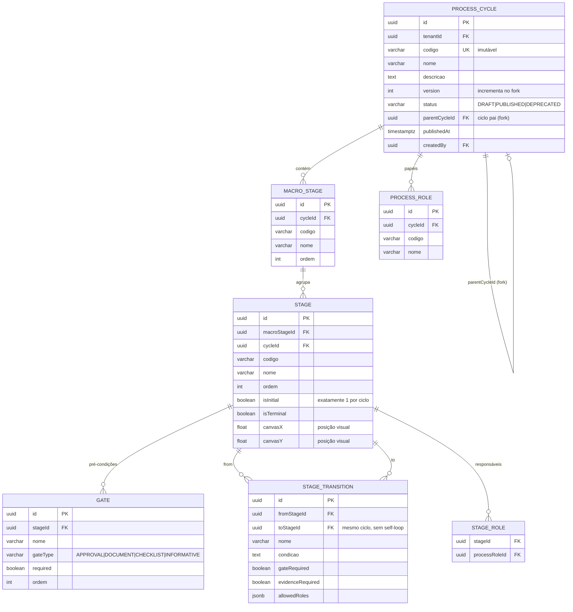

# MOD-005 — Modelo de Domínio

## Ciclo de Vida do Processo & Grafo de Estágios

```mermaid
graph TD
    subgraph LIFECYCLE ["Ciclo de Vida"]
        DRAFT["Ciclo de Compras v2<br/>(Rascunho — editável)"]
        PUB["Ciclo de Compras v1<br/>(Publicado — em uso)"]
        DEP["Ciclo de Compras v0<br/>(Descontinuado)"]
        DRAFT -->|"publicar"| PUB
        PUB -->|"descontinuar"| DEP
        PUB -.->|"criar nova versão"| DRAFT
    end

    subgraph GRAFO ["Fluxo: Ciclo de Compras v1"]
        SI["Abertura do Pedido<br/>(estágio inicial)"]
        SA["Análise Técnica"]
        G["Aprovação do Gerente<br/>(gate obrigatório)"]
        SB["Emissão da OC"]
        ST["Conclusão<br/>(estágio final)"]
        SI -->|"avança para"| SA
        SA -->|"requer aprovação"| G
        G -->|"aprovado"| SB
        SB -->|"avança para"| ST
    end

    MS["Macroetapa: Requisição<br/>(agrupa estágios)"]
    PR["Comprador, Gestor<br/>(papéis do ciclo)"]
    SR["Análise Técnica:<br/>responsável = Comprador"]
    FK["Nova versão v2<br/>baseada na v1"]

    MS -.->|"agrupa"| SA
    MS -.->|"agrupa"| SB
    PR -.->|"atribuído em"| SR
    PUB -.->|"origina"| FK

    classDef draft fill:#F39C12,stroke:#D68910,color:#fff
    classDef published fill:#27AE60,stroke:#1E8449,color:#fff
    classDef deprecated fill:#95A5A6,stroke:#7F8C8D,color:#fff
    classDef stage fill:#2E86C1,stroke:#2471A3,color:#fff
    classDef gate fill:#E74C3C,stroke:#CB4335,color:#fff
    classDef support fill:#8E44AD,stroke:#7D3C98,color:#fff

    class DRAFT,FK draft
    class PUB published
    class DEP deprecated
    class SI,SA,SB,ST stage
    class G gate
    class MS,PR,SR support
```

## Entidades e Relacionamentos

```mermaid
erDiagram
    PROCESS_CYCLE ||--o{ MACRO_STAGE : "contém"
    MACRO_STAGE ||--o{ STAGE : "agrupa"
    STAGE ||--o{ GATE : "pré-condições"
    STAGE ||--o{ STAGE_TRANSITION : "from"
    STAGE ||--o{ STAGE_TRANSITION : "to"
    STAGE ||--o{ STAGE_ROLE : "responsáveis"
    PROCESS_CYCLE ||--o{ PROCESS_ROLE : "papéis"
    PROCESS_CYCLE ||--o| PROCESS_CYCLE : "parentCycleId (fork)"

    PROCESS_CYCLE {
        uuid id PK
        uuid tenantId FK
        varchar codigo UK "imutável"
        varchar nome
        text descricao
        int version "incrementa no fork"
        varchar status "DRAFT|PUBLISHED|DEPRECATED"
        uuid parentCycleId FK "ciclo pai (fork)"
        timestamptz publishedAt
        uuid createdBy FK
    }

    MACRO_STAGE {
        uuid id PK
        uuid cycleId FK
        varchar codigo
        varchar nome
        int ordem
    }

    STAGE {
        uuid id PK
        uuid macroStageId FK
        uuid cycleId FK
        varchar codigo
        varchar nome
        int ordem
        boolean isInitial "exatamente 1 por ciclo"
        boolean isTerminal
        float canvasX "posição visual"
        float canvasY "posição visual"
    }

    GATE {
        uuid id PK
        uuid stageId FK
        varchar nome
        varchar gateType "APPROVAL|DOCUMENT|CHECKLIST|INFORMATIVE"
        boolean required
        int ordem
    }

    STAGE_TRANSITION {
        uuid id PK
        uuid fromStageId FK
        uuid toStageId FK "mesmo ciclo, sem self-loop"
        varchar nome
        text condicao
        boolean gateRequired
        boolean evidenceRequired
        jsonb allowedRoles
    }

    PROCESS_ROLE {
        uuid id PK
        uuid cycleId FK
        varchar codigo
        varchar nome
    }

    STAGE_ROLE {
        uuid stageId FK
        uuid processRoleId FK
    }
```
