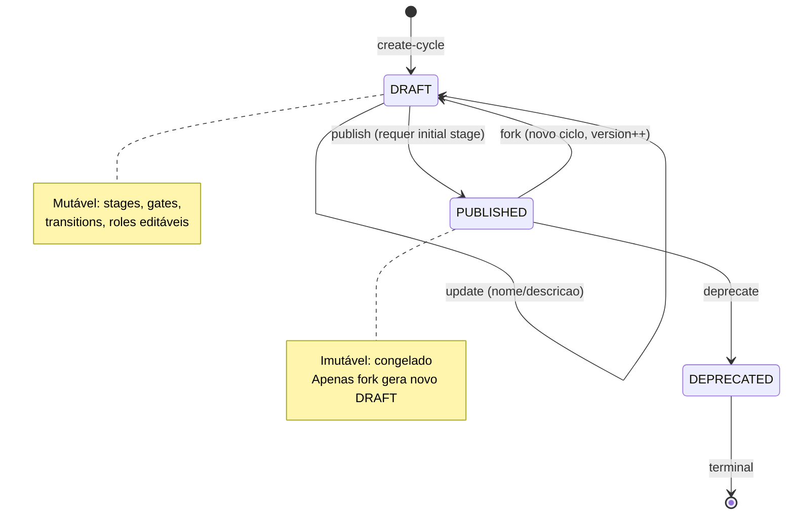
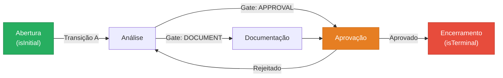
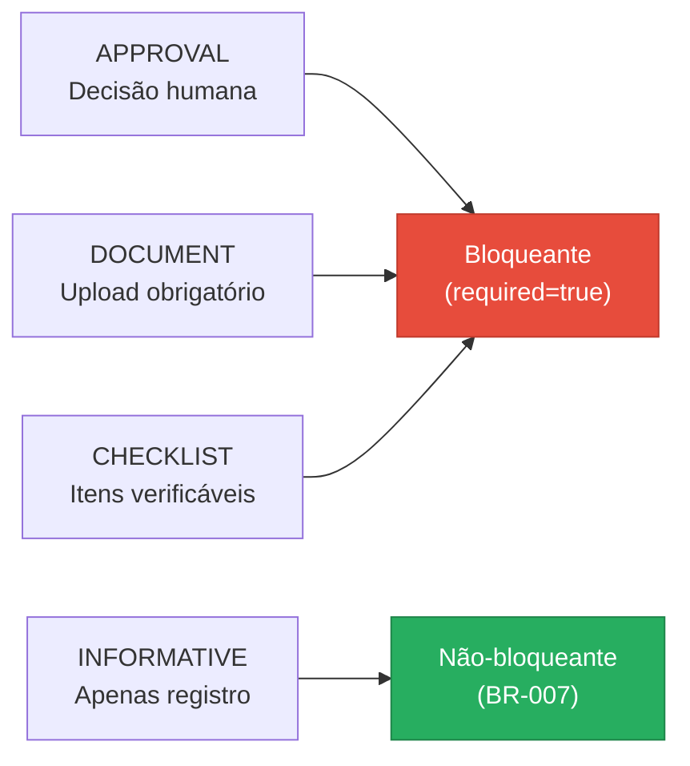

# MOD-005 — Máquinas de Estado

## ProcessCycle Status

```mermaid
stateDiagram-v2
    [*] --> DRAFT : create-cycle
    DRAFT --> DRAFT : update (nome/descricao)
    DRAFT --> PUBLISHED : publish (requer initial stage)
    PUBLISHED --> DEPRECATED : deprecate
    DEPRECATED --> [*] : terminal

    PUBLISHED --> DRAFT : fork (novo ciclo, version++)

    note right of DRAFT
        Mutável: stages, gates,
        transitions, roles editáveis
    end note

    note right of PUBLISHED
        Imutável: congelado
        Apenas fork gera novo DRAFT
    end note
```

## Fluxo de Stages (Exemplo)

```mermaid
flowchart LR
    S1["Abertura<br/>(isInitial)"] -->|"Transição A"| S2["Análise"]
    S2 -->|"Gate: APPROVAL"| S3["Aprovação"]
    S2 -->|"Gate: DOCUMENT"| S4["Documentação"]
    S3 -->|"Aprovado"| S5["Encerramento<br/>(isTerminal)"]
    S4 --> S3
    S3 -->|"Rejeitado"| S2

    style S1 fill:#27AE60,color:#fff,stroke:#1E8449
    style S5 fill:#E74C3C,color:#fff,stroke:#C0392B
    style S3 fill:#E67E22,color:#fff,stroke:#CA6F1E
```

## Gate Types

```mermaid
graph LR
    G1["APPROVAL<br/>Decisão humana"] --> BLOCKING["Bloqueante<br/>(required=true)"]
    G2["DOCUMENT<br/>Upload obrigatório"] --> BLOCKING
    G3["CHECKLIST<br/>Itens verificáveis"] --> BLOCKING
    G4["INFORMATIVE<br/>Apenas registro"] --> NONBLOCK["Não-bloqueante<br/>(BR-007)"]

    classDef block fill:#E74C3C,color:#fff,stroke:#C0392B
    classDef noblock fill:#27AE60,color:#fff,stroke:#1E8449

    class BLOCKING block
    class NONBLOCK noblock
```
