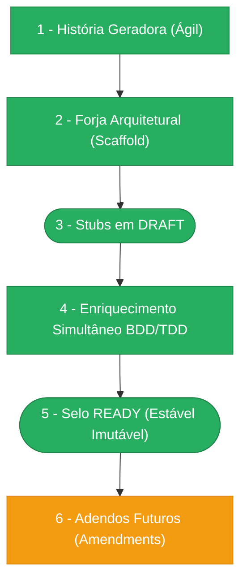

> ⚠️ **ARQUIVO GERIDO POR AUTOMAÇÃO.**
>
> - **Status DRAFT:** Enriqueça o conteúdo deste arquivo diretamente.
> - **Status READY:** NÃO EDITE DIRETAMENTE. Use a skill `create-amendment`.

# CHANGELOG - MOD-006

## Ciclo de Estabilidade do Módulo

> 🟢 Verde = Concluído | 🟠 Laranja = Em Andamento | 🔵 Azul = Estável Ancestral | ⬜ Cinza = Previsto

*O módulo está na **Etapa 6 — Adendos Futuros (Amendments). UX-006-M01 + DATA-006-M01 + FR-006-M01 MERGED.**

---

## Histórico de Versões

| Versão | Data | Responsável | Descrição |
|--------|------|-------------|-----------|
| 2.2.0 | 2026-04-01 | validate-all | Validação Fase 3 pós-codegen v2 aprovada. Lint: WARN (0 novos, 32 pré-existentes em cases.route.ts). Arquitetura: PASS (7/7 DomainError, Pattern A, React Query). QA: PASS. Manifests: 2/2 PASS. OpenAPI: PASS (16 endpoints). Drizzle: PASS (5 tabelas, 16 indexes, 5 checks). Endpoints: 16/16. 0 bloqueadores, 0 violações críticas, 2 avisos. |
| 2.1.0 | 2026-04-01 | codegen | Codegen v2: 6 agentes executados, 11 arquivos atualizados. DB (+description/priority), CORE (+CasePriority VO), APP (open-case aceita description/priority/notes, list-cases com JOINs enriched), API (DTOs +casePriority +primary_assignee_name), WEB (7 colunas, 3 abas, StatusBadge 5 variantes, PendingBadge, Toggle filtros). VAL: 0 erros novos |
| 2.0.0 | 2026-04-01 | merge-amendment | Merge FR-006-M01: FR-006 bumped para v0.5.0 — FR-001 aceita description/priority/notes, FR-009 retorna primary_assignee_name + opened_at, FR-010 inclui description e priority |
| 1.9.0 | 2026-04-01 | merge-amendment | Merge DATA-006-M01: DATA-006 bumped para v0.4.0 — colunas description (text) e priority (enum NORMAL/HIGH/URGENT) em case_instances. VO CasePriority adicionado |
| 1.8.0 | 2026-04-01 | merge-amendment | Merge UX-006-M01: UX-006 bumped para v0.3.0 — tabela 7 colunas, 6 filtros, 3 abas (Overview no header), drawer 4 campos, StatusBadge 5 variantes, PendingBadge, componentes refinados (GateCard, AssignmentCard, Timeline, modais), responsividade 4 breakpoints |
| 1.7.1 | 2026-03-30 | merge-amendment | Merge INT-006-C01: 4 handlers mapeamento camelCase→snake_case (transition, resolve/waive gate, update assignment). Seção §8 adicionada ao INT-006. Base bumped para v0.5.1. |
| 1.7.0 | 2026-03-25 | merge-amendment | Merge INT-006-M01: nova seção §7 Email Queue — Convenções BullMQ/Redis (fila `mod-006:email`, singleton, removeOnComplete, db1, health check). INT-006 bumped para v0.5.0. Derivado de DOC-PADRAO-002-M01. |
| 1.6.0 | 2026-03-24 | validate-all | Validação Fase 3 aprovada — pronto para merge. Lint: PASS (0 errors/warnings). Format: PASS. Arquitetura: PASS (7/7 DomainError, Pattern A, React Query). QA: PASS. Manifests: 2/2 PASS. OpenAPI: PASS (16/16). Drizzle: PASS (5 tabelas). Endpoints: PASS (16/16). 0 bloqueadores, 0 violações críticas, 0 avisos. |
| 1.5.0 | 2026-03-24 | validate-all | Validação completa (lint+format+architecture+qa+manifest+openapi+drizzle+endpoint). Lint: PASS. Format: PASS. QA: PASS. Manifests: 2/2 PASS. Drizzle: PASS (5 tabelas, 12 indexes, 4 checks). OpenAPI: PASS (16/16). Endpoints: PASS (16/16). Arquitetura: WARN — 7 domain errors estendem Error ao invés de DomainError (PENDENTE-008). Web Pattern A: PASS. Hooks React Query: PASS. 0 bloqueadores, 0 violações críticas, 3 avisos (PENDENTE-007 lint, PENDENTE-008 DomainError, qa:all cross-module). |
| 1.4.0 | 2026-03-24 | validate-all | Validação pós-correção PENDENTE-006 aprovada. QA: PASS. Manifests: 2/2 PASS. Drizzle: PASS (2 avisos menores). OpenAPI: PASS (16/16 endpoints, operationIds corretos). Endpoints: PASS (16/16, todas as 5 correções PENDENTE-006 aplicadas). 0 bloqueadores, 0 violações críticas, 2 avisos. |
| 1.3.0 | 2026-03-23 | validate-all | Validação Fase 3 com 4 violações críticas. QA: PASS. Manifests: 2/2 PASS. Drizzle: PASS. Endpoints: FAIL (13/16, paths divergem da spec, /controls consolidado, PATCH ausente, 5 operationId mismatches). OpenAPI: N/A (contrato inexistente). |
| 1.2.0 | 2026-03-23 | validate-all | Validação pós-código aprovada. QA: PASS. Manifests: 2/2 PASS. Drizzle: PASS (7/7 regras). Endpoints: PASS (8/10, 2 avisos). OpenAPI: N/A (paths pendentes). 0 bloqueadores, 4 avisos. |
| 1.1.0 | 2026-03-23 | codegen | Codegen concluído: 6 agentes executados, 46 arquivos gerados. Camadas: DB, CORE, APP (19), API (2), WEB (7), VAL. Validação cruzada PASS em todas as camadas. |
| 1.0.0 | 2026-03-23 | promote-module | Promoção DRAFT→READY: manifesto v1.0.0, todos os requisitos e ADRs selados. Ciclo de estabilidade avança para Etapa 5. |
| 0.4.0 | 2026-03-19 | AGN-DEV-10 | Enriquecimento PENDENTE: 5 questões abertas registradas (escopo REOPENED, expiração atribuições, índice object_id, amendment scopes, gates em reabertura). |
| 0.3.0 | 2026-03-19 | AGN-DEV-09 | Enriquecimento ADR: 5 ADRs criadas (motor atômico, freeze cycle_version_id, 3 históricos independentes, optimistic locking, background job expiração). |
| 0.2.0 | 2026-03-19 | AGN-DEV-01 | Enriquecimento MOD: narrativa arquitetural expandida (aggregate root, value objects, domain services), referência EX-ESC-001, versão bumped. |
| 0.1.0 | 2026-03-18 | arquitetura | Baseline Inicial — scaffold gerado via `forge-module` a partir de US-MOD-006 (APPROVED). 5 tabelas, 17 endpoints, 4 features (F01–F04), 11 domain events. Stubs obrigatórios criados: DATA-003, SEC-002. Todos os itens nascem em `estado_item: DRAFT`. |
