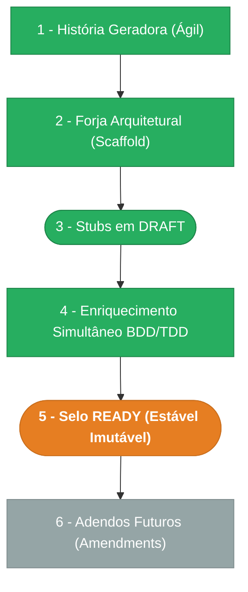

> ⚠️ **ARQUIVO GERIDO POR AUTOMAÇÃO.**
>
> - **Status DRAFT:** Enriqueça o conteúdo deste arquivo diretamente.
> - **Status READY:** NÃO EDITE DIRETAMENTE. Use a skill `create-amendment`.

# CHANGELOG - MOD-006

## Ciclo de Estabilidade do Módulo

> 🟢 Verde = Concluído | 🟠 Laranja = Em Andamento | 🔵 Azul = Estável Ancestral | ⬜ Cinza = Previsto

*O módulo está na **Etapa 5 — Selo READY (Estável Imutável). Alterações futuras via `create-amendment`.**

---

## Histórico de Versões

| Versão | Data | Responsável | Descrição |
|--------|------|-------------|-----------|
| 1.0.0 | 2026-03-23 | promote-module | Promoção DRAFT→READY: manifesto v1.0.0, todos os requisitos e ADRs selados. Ciclo de estabilidade avança para Etapa 5. |
| 0.4.0 | 2026-03-19 | AGN-DEV-10 | Enriquecimento PENDENTE: 5 questões abertas registradas (escopo REOPENED, expiração atribuições, índice object_id, amendment scopes, gates em reabertura). |
| 0.3.0 | 2026-03-19 | AGN-DEV-09 | Enriquecimento ADR: 5 ADRs criadas (motor atômico, freeze cycle_version_id, 3 históricos independentes, optimistic locking, background job expiração). |
| 0.2.0 | 2026-03-19 | AGN-DEV-01 | Enriquecimento MOD: narrativa arquitetural expandida (aggregate root, value objects, domain services), referência EX-ESC-001, versão bumped. |
| 0.1.0 | 2026-03-18 | arquitetura | Baseline Inicial — scaffold gerado via `forge-module` a partir de US-MOD-006 (APPROVED). 5 tabelas, 17 endpoints, 4 features (F01–F04), 11 domain events. Stubs obrigatórios criados: DATA-003, SEC-002. Todos os itens nascem em `estado_item: DRAFT`. |
