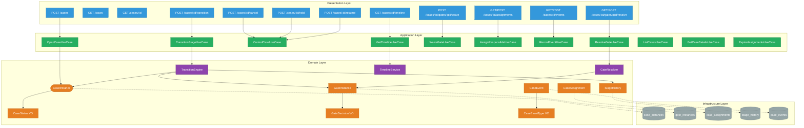

# MOD-006 — Arquitetura de Camadas (DDD-lite, Nível 2)

```mermaid
graph TD
    subgraph PRESENTATION ["Presentation Layer"]
        R1["POST /cases"]
        R2["GET /cases"]
        R3["GET /cases/:id"]
        R4["POST /cases/:id/transition"]
        R5["POST /cases/:id/cancel"]
        R6["POST /cases/:id/hold"]
        R7["POST /cases/:id/resume"]
        R8["GET/POST /cases/:id/gates/:gid/resolve"]
        R9["POST /cases/:id/gates/:gid/waive"]
        R10["GET/POST /cases/:id/assignments"]
        R11["GET/POST /cases/:id/events"]
        R12["GET /cases/:id/timeline"]
    end

    subgraph APPLICATION ["Application Layer"]
        UC1["OpenCaseUseCase"]
        UC2["TransitionStageUseCase"]
        UC3["ControlCaseUseCase"]
        UC4["ResolveGateUseCase"]
        UC5["WaiveGateUseCase"]
        UC6["AssignResponsibleUseCase"]
        UC7["RecordEventUseCase"]
        UC8["GetTimelineUseCase"]
        UC9["ListCasesUseCase"]
        UC10["GetCaseDetailsUseCase"]
        UC11["ExpireAssignmentsUseCase"]
    end

    subgraph DOMAIN ["Domain Layer"]
        E1(["CaseInstance"])
        E2["GateInstance"]
        E3["CaseAssignment"]
        E4["StageHistory"]
        E5["CaseEvent"]
        VO1["CaseStatus VO"]
        VO2["GateDecision VO"]
        VO3["CaseEventType VO"]
        DS1["TransitionEngine"]
        DS2["GateResolver"]
        DS3["TimelineService"]
    end

    subgraph INFRA ["Infrastructure Layer"]
        DB1[("case_instances")]
        DB2[("gate_instances")]
        DB3[("case_assignments")]
        DB4[("stage_history")]
        DB5[("case_events")]
    end

    R1 --> UC1
    R4 --> UC2
    R5 --> UC3
    R6 --> UC3
    R7 --> UC3
    R8 --> UC4
    R9 --> UC5
    R10 --> UC6
    R11 --> UC7
    R12 --> UC8

    UC1 --> E1
    UC2 --> DS1
    UC4 --> DS2
    UC8 --> DS3
    DS1 --> E1
    DS1 --> E2
    DS1 --> E4
    DS2 --> E2

    E1 --> VO1
    E2 --> VO2
    E5 --> VO3

    E1 -.-> DB1
    E2 -.-> DB2
    E3 -.-> DB3
    E4 -.-> DB4
    E5 -.-> DB5

    classDef presentation fill:#3498DB,stroke:#2980B9,color:#fff
    classDef application fill:#27AE60,stroke:#1E8449,color:#fff
    classDef domain fill:#E67E22,stroke:#CA6F1E,color:#fff
    classDef infra fill:#95A5A6,stroke:#7F8C8D,color:#fff
    classDef service fill:#8E44AD,stroke:#6C3483,color:#fff

    class R1,R2,R3,R4,R5,R6,R7,R8,R9,R10,R11,R12 presentation
    class UC1,UC2,UC3,UC4,UC5,UC6,UC7,UC8,UC9,UC10,UC11 application
    class E1,E2,E3,E4,E5,VO1,VO2,VO3 domain
    class DS1,DS2,DS3 service
    class DB1,DB2,DB3,DB4,DB5 infra
```
