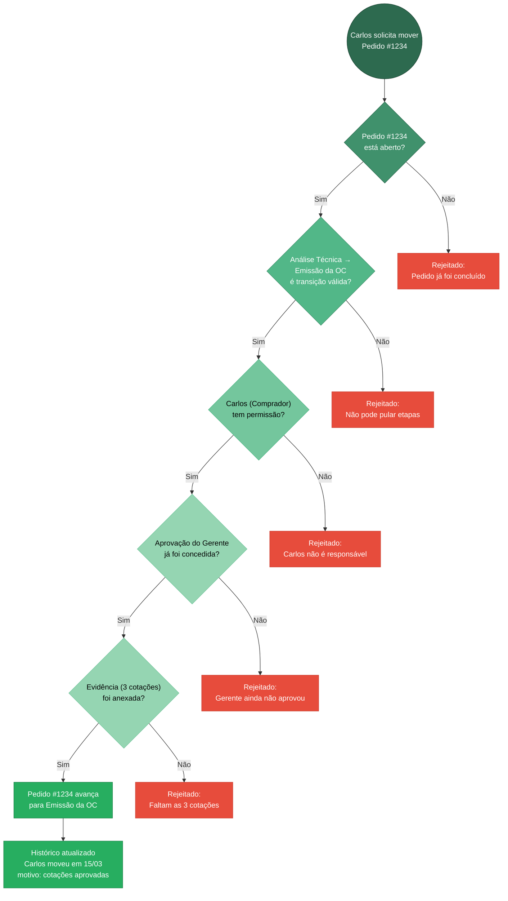
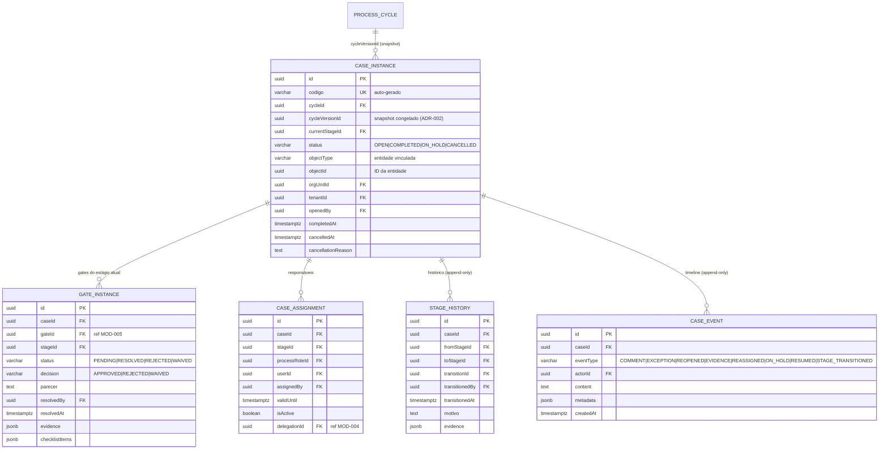

# MOD-006 — Modelo de Domínio

## Motor de Transição (5 Passos)

```mermaid
graph TD
    START(("Carlos solicita mover<br/>Pedido #1234"))
    S1{"Pedido #1234<br/>está aberto?"}
    S2{"Análise Técnica →<br/>Emissão da OC<br/>é transição válida?"}
    S3{"Carlos (Comprador)<br/>tem permissão?"}
    S4{"Aprovação do Gerente<br/>já foi concedida?"}
    S5{"Evidência (3 cotações)<br/>foi anexada?"}
    OK["Pedido #1234 avança<br/>para Emissão da OC"]
    TL["Histórico atualizado<br/>Carlos moveu em 15/03<br/>motivo: cotações aprovadas"]

    R1["Rejeitado:<br/>Pedido já foi concluído"]
    R2["Rejeitado:<br/>Não pode pular etapas"]
    R3["Rejeitado:<br/>Carlos não é responsável"]
    R4["Rejeitado:<br/>Gerente ainda não aprovou"]
    R5["Rejeitado:<br/>Faltam as 3 cotações"]

    START --> S1
    S1 -->|"Sim"| S2
    S1 -->|"Não"| R1
    S2 -->|"Sim"| S3
    S2 -->|"Não"| R2
    S3 -->|"Sim"| S4
    S3 -->|"Não"| R3
    S4 -->|"Sim"| S5
    S4 -->|"Não"| R4
    S5 -->|"Sim"| OK
    S5 -->|"Não"| R5
    OK --> TL

    classDef start fill:#2d6a4f,stroke:#1b4332,color:#fff
    classDef step1 fill:#40916c,stroke:#2d6a4f,color:#fff
    classDef step2 fill:#52b788,stroke:#40916c,color:#fff
    classDef step3 fill:#74c69d,stroke:#52b788,color:#000
    classDef step4 fill:#95d5b2,stroke:#74c69d,color:#000
    classDef success fill:#27AE60,stroke:#1E8449,color:#fff
    classDef reject fill:#E74C3C,stroke:#CB4335,color:#fff

    class START start
    class S1 step1
    class S2 step2
    class S3 step3
    class S4 step4
    class S5 step4
    class OK,TL success
    class R1,R2,R3,R4,R5 reject
```

## Entidades e Relacionamentos

```mermaid
erDiagram
    CASE_INSTANCE ||--o{ GATE_INSTANCE : "gates do estágio atual"
    CASE_INSTANCE ||--o{ CASE_ASSIGNMENT : "responsáveis"
    CASE_INSTANCE ||--o{ STAGE_HISTORY : "histórico (append-only)"
    CASE_INSTANCE ||--o{ CASE_EVENT : "timeline (append-only)"
    PROCESS_CYCLE ||--o{ CASE_INSTANCE : "cycleVersionId (snapshot)"

    CASE_INSTANCE {
        uuid id PK
        varchar codigo UK "auto-gerado"
        uuid cycleId FK
        uuid cycleVersionId "snapshot congelado (ADR-002)"
        uuid currentStageId FK
        varchar status "OPEN|COMPLETED|ON_HOLD|CANCELLED"
        varchar objectType "entidade vinculada"
        uuid objectId "ID da entidade"
        uuid orgUnitId FK
        uuid tenantId FK
        uuid openedBy FK
        timestamptz completedAt
        timestamptz cancelledAt
        text cancellationReason
    }

    GATE_INSTANCE {
        uuid id PK
        uuid caseId FK
        uuid gateId FK "ref MOD-005"
        uuid stageId FK
        varchar status "PENDING|RESOLVED|REJECTED|WAIVED"
        varchar decision "APPROVED|REJECTED|WAIVED"
        text parecer
        uuid resolvedBy FK
        timestamptz resolvedAt
        jsonb evidence
        jsonb checklistItems
    }

    CASE_ASSIGNMENT {
        uuid id PK
        uuid caseId FK
        uuid stageId FK
        uuid processRoleId FK
        uuid userId FK
        uuid assignedBy FK
        timestamptz validUntil
        boolean isActive
        uuid delegationId FK "ref MOD-004"
    }

    STAGE_HISTORY {
        uuid id PK
        uuid caseId FK
        uuid fromStageId FK
        uuid toStageId FK
        uuid transitionId FK
        uuid transitionedBy FK
        timestamptz transitionedAt
        text motivo
        jsonb evidence
    }

    CASE_EVENT {
        uuid id PK
        uuid caseId FK
        varchar eventType "COMMENT|EXCEPTION|REOPENED|EVIDENCE|REASSIGNED|ON_HOLD|RESUMED|STAGE_TRANSITIONED"
        uuid actorId FK
        text content
        jsonb metadata
        timestamptz createdAt
    }
```
