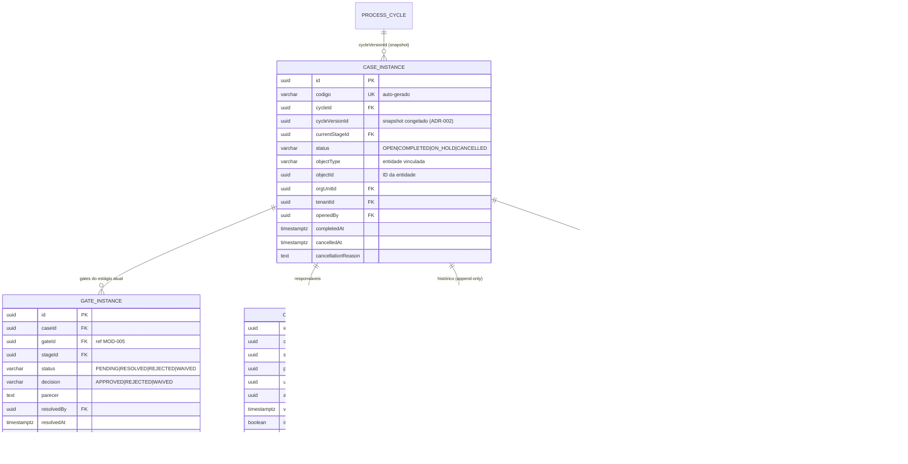

# MOD-006 — Modelo de Domínio

```mermaid
erDiagram
    CASE_INSTANCE ||--o{ GATE_INSTANCE : "gates do estágio atual"
    CASE_INSTANCE ||--o{ CASE_ASSIGNMENT : "responsáveis"
    CASE_INSTANCE ||--o{ STAGE_HISTORY : "histórico (append-only)"
    CASE_INSTANCE ||--o{ CASE_EVENT : "timeline (append-only)"
    PROCESS_CYCLE ||--o{ CASE_INSTANCE : "cycleVersionId (snapshot)"

    CASE_INSTANCE {
        uuid id PK
        varchar codigo UK "auto-gerado"
        uuid cycleId FK
        uuid cycleVersionId "snapshot congelado (ADR-002)"
        uuid currentStageId FK
        varchar status "OPEN|COMPLETED|ON_HOLD|CANCELLED"
        varchar objectType "entidade vinculada"
        uuid objectId "ID da entidade"
        uuid orgUnitId FK
        uuid tenantId FK
        uuid openedBy FK
        timestamptz completedAt
        timestamptz cancelledAt
        text cancellationReason
    }

    GATE_INSTANCE {
        uuid id PK
        uuid caseId FK
        uuid gateId FK "ref MOD-005"
        uuid stageId FK
        varchar status "PENDING|RESOLVED|REJECTED|WAIVED"
        varchar decision "APPROVED|REJECTED|WAIVED"
        text parecer
        uuid resolvedBy FK
        timestamptz resolvedAt
        jsonb evidence
        jsonb checklistItems
    }

    CASE_ASSIGNMENT {
        uuid id PK
        uuid caseId FK
        uuid stageId FK
        uuid processRoleId FK
        uuid userId FK
        uuid assignedBy FK
        timestamptz validUntil
        boolean isActive
        uuid delegationId FK "ref MOD-004"
    }

    STAGE_HISTORY {
        uuid id PK
        uuid caseId FK
        uuid fromStageId FK
        uuid toStageId FK
        uuid transitionId FK
        uuid transitionedBy FK
        timestamptz transitionedAt
        text motivo
        jsonb evidence
    }

    CASE_EVENT {
        uuid id PK
        uuid caseId FK
        varchar eventType "COMMENT|EXCEPTION|REOPENED|EVIDENCE|REASSIGNED|ON_HOLD|RESUMED|STAGE_TRANSITIONED"
        uuid actorId FK
        text content
        jsonb metadata
        timestamptz createdAt
    }
```
