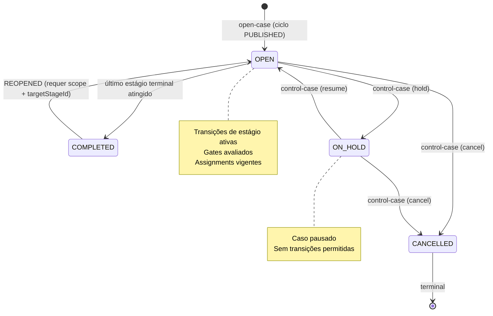
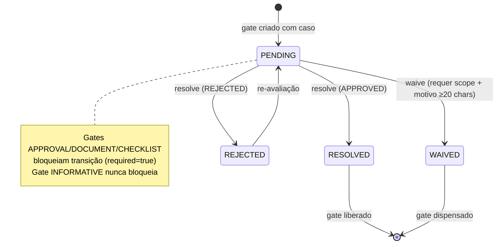
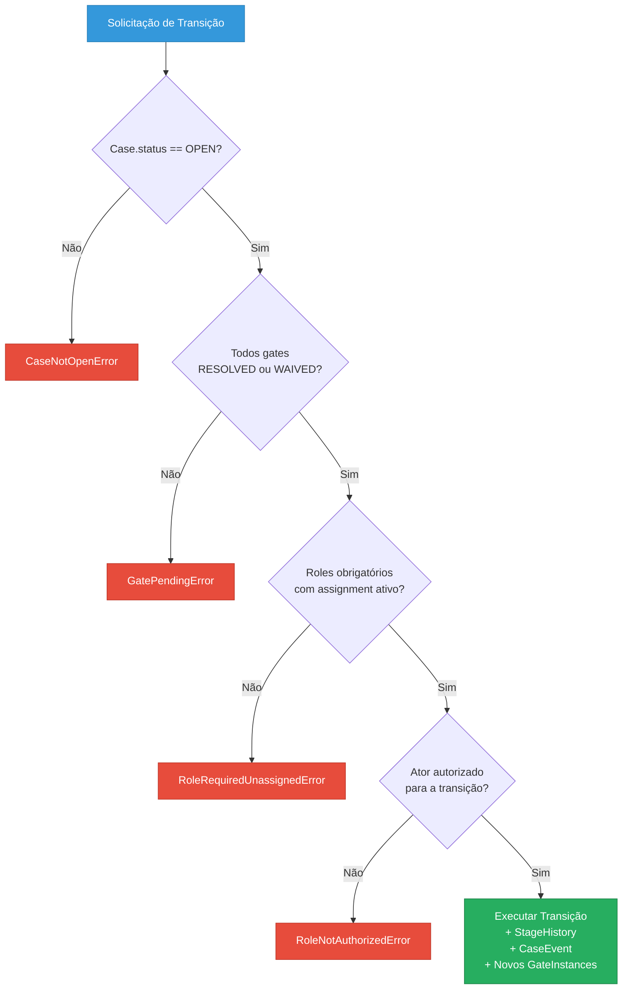

# MOD-006 — Máquinas de Estado

## CaseInstance Status

```mermaid
stateDiagram-v2
    [*] --> OPEN : open-case (ciclo PUBLISHED)

    OPEN --> COMPLETED : último estágio terminal atingido
    OPEN --> ON_HOLD : control-case (hold)
    OPEN --> CANCELLED : control-case (cancel)

    ON_HOLD --> OPEN : control-case (resume)
    ON_HOLD --> CANCELLED : control-case (cancel)

    COMPLETED --> OPEN : REOPENED (requer scope + targetStageId)

    CANCELLED --> [*] : terminal

    note right of OPEN
        Transições de estágio ativas
        Gates avaliados
        Assignments vigentes
    end note

    note right of ON_HOLD
        Caso pausado
        Sem transições permitidas
    end note
```

## GateInstance Status

```mermaid
stateDiagram-v2
    [*] --> PENDING : gate criado com caso

    PENDING --> RESOLVED : resolve (APPROVED)
    PENDING --> REJECTED : resolve (REJECTED)
    PENDING --> WAIVED : waive (requer scope + motivo ≥20 chars)

    RESOLVED --> [*] : gate liberado
    REJECTED --> PENDING : re-avaliação
    WAIVED --> [*] : gate dispensado

    note right of PENDING
        Gates APPROVAL/DOCUMENT/CHECKLIST
        bloqueiam transição (required=true)
        Gate INFORMATIVE nunca bloqueia
    end note
```

## Fluxo de Transição de Estágio

```mermaid
flowchart TD
    START["Solicitação de Transição"] --> CHECK_STATUS{"Case.status == OPEN?"}
    CHECK_STATUS -->|Não| ERR1["CaseNotOpenError"]
    CHECK_STATUS -->|Sim| CHECK_GATES{"Todos gates<br/>RESOLVED ou WAIVED?"}
    CHECK_GATES -->|Não| ERR2["GatePendingError"]
    CHECK_GATES -->|Sim| CHECK_ROLES{"Roles obrigatórios<br/>com assignment ativo?"}
    CHECK_ROLES -->|Não| ERR3["RoleRequiredUnassignedError"]
    CHECK_ROLES -->|Sim| CHECK_AUTH{"Ator autorizado<br/>para a transição?"}
    CHECK_AUTH -->|Não| ERR4["RoleNotAuthorizedError"]
    CHECK_AUTH -->|Sim| TRANSITION["Executar Transição<br/>+ StageHistory<br/>+ CaseEvent<br/>+ Novos GateInstances"]

    classDef trigger fill:#3498DB,color:#fff,stroke:#2980B9
    classDef success fill:#27AE60,color:#fff,stroke:#1E8449
    classDef error fill:#E74C3C,color:#fff,stroke:#C0392B

    class START trigger
    class TRANSITION success
    class ERR1,ERR2,ERR3,ERR4 error
```
