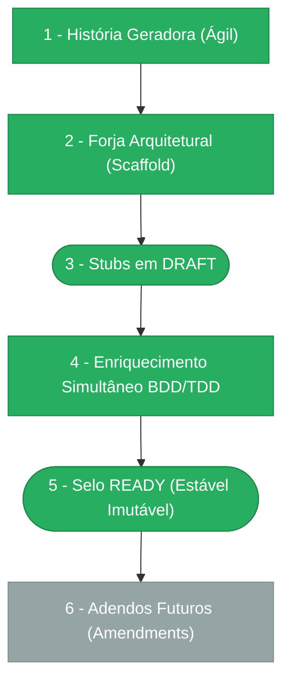

> ⚠️ **ARQUIVO GERIDO POR AUTOMAÇÃO.**
>
> - **Status DRAFT:** Enriqueça o conteúdo deste arquivo diretamente.
> - **Status READY:** NÃO EDITE DIRETAMENTE. Use a skill `create-amendment`.

# CHANGELOG - MOD-007

## Ciclo de Estabilidade do Módulo

> 🟢 Verde = Concluído | 🟠 Laranja = Em Andamento | 🔵 Azul = Estável Ancestral | ⬜ Cinza = Previsto

*O módulo está na **Etapa 5 — Selo READY (Estável Imutável). Alterações futuras via `create-amendment`.**

---

## Histórico de Versões

| Versão | Data | Responsável | Descrição |
|--------|------|-------------|-----------|
| 1.4.0 | 2026-03-24 | validate-all | Validação Fase 3 aprovada — pronto para merge. Lint: PASS (0 errors/warnings). Format: PASS. Arquitetura: PASS (6/6 DomainError, Pattern A, React Query). QA: PASS. Manifests: 2/2 PASS. OpenAPI: N/A (inline). Drizzle: PASS (9 tabelas). Endpoints: PASS (7 route files). 0 bloqueadores, 0 violações críticas, 0 avisos. Domain errors corrigidos (PENDENTE-011 resolvida). |
| 1.3.0 | 2026-03-24 | validate-all | Validacao pos-codegen: lint PASS, format PASS, drizzle 9 tabelas OK, relations OK, 25 endpoints OK, 14 domain events OK, 6 hooks react-query OK, 2 pages OK. Warnings: domain errors nao estendem DomainError (cross-module), openapi standalone ausente. FAIL: tests_present. PENDENTE-011 registrada. Verdict: PASS_WITH_WARNINGS. |
| 1.2.0 | 2026-03-24 | codegen | Codegen concluido: 6 agentes executados, 57 arquivos gerados. Camadas: DB (3), CORE (14), APP (22), API (10), WEB (8), VAL (0 — validacao). Checks: 5/7 passed, tests_present missing, openapi standalone missing. |
| 1.1.0 | 2026-03-24 | codegen | Codegen parcial: AGN-COD-APP + AGN-COD-API (2 agentes, 32 arquivos). Camadas: application (22 use cases + ports), presentation (10 routes + DTOs). Faltam: WEB, VAL. |
| 1.0.0 | 2026-03-23 | promote-module | Promoção DRAFT→READY: manifesto v1.0.0, todos os requisitos e ADRs selados. Ciclo de estabilidade avança para Etapa 5. |
| 0.6.0 | 2026-03-19 | arquitetura | PENDENTE-001 decidida+implementada: Opção 1 — JSONLogic como engine v2 para `condition_expr`. Serialização nativa em jsonb, biblioteca madura (json-logic-js). CEL como fallback se limitações forem encontradas. ADR futuro quando v2 iniciar. |
| 0.5.0 | 2026-03-19 | arquitetura | PENDENTE-003 decidida+implementada: Opção 2 — tabela auxiliar `routine_integration_config` com FK para `behavior_routines.id` WHERE `routine_type=INTEGRATION`. MOD-008 responsável pela migração quando wave chegar. |
| 0.1.0 | 2026-03-19 | arquitetura | Baseline Inicial — scaffold gerado via `forge-module` a partir de US-MOD-007 (APPROVED). 9 tabelas, 24 endpoints, 5 features (F01–F05), 7 scopes. Stubs obrigatórios criados: DATA-003, SEC-002. Todos os itens nascem em `estado_item: DRAFT`. |
