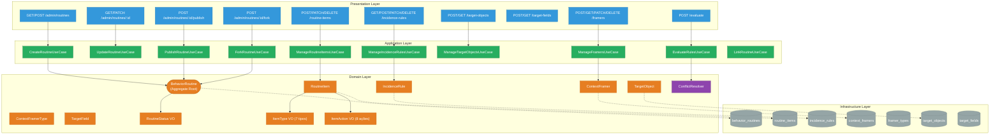

# MOD-007 — Arquitetura de Camadas (DDD-lite, Nível 2)

```mermaid
graph TD
    subgraph PRESENTATION ["Presentation Layer"]
        R1["GET/POST /admin/routines"]
        R2["GET/PATCH /admin/routines/:id"]
        R3["POST /admin/routines/:id/publish"]
        R4["POST /admin/routines/:id/fork"]
        R5["POST/PATCH/DELETE /routine-items"]
        R6["GET/POST/PATCH/DELETE /incidence-rules"]
        R7["POST/GET /target-objects"]
        R8["POST/GET /target-fields"]
        R9["POST/GET/PATCH/DELETE /framers"]
        R10["POST /evaluate"]
    end

    subgraph APPLICATION ["Application Layer"]
        UC1["CreateRoutineUseCase"]
        UC2["UpdateRoutineUseCase"]
        UC3["PublishRoutineUseCase"]
        UC4["ForkRoutineUseCase"]
        UC5["ManageRoutineItemsUseCase"]
        UC6["ManageIncidenceRulesUseCase"]
        UC7["ManageTargetObjectsUseCase"]
        UC8["ManageFramersUseCase"]
        UC9["EvaluateRulesUseCase"]
        UC10["LinkRoutineUseCase"]
    end

    subgraph DOMAIN ["Domain Layer"]
        AG(["BehaviorRoutine<br/>(Aggregate Root)"])
        E1["RoutineItem"]
        E2["IncidenceRule"]
        E3["ContextFramer"]
        E4["ContextFramerType"]
        E5["TargetObject"]
        E6["TargetField"]
        VO1["RoutineStatus VO"]
        VO2["ItemType VO (7 tipos)"]
        VO3["ItemAction VO (8 ações)"]
        DS1["ConflictResolver"]
    end

    subgraph INFRA ["Infrastructure Layer"]
        DB1[("behavior_routines")]
        DB2[("routine_items")]
        DB3[("incidence_rules")]
        DB4[("context_framers")]
        DB5[("framer_types")]
        DB6[("target_objects")]
        DB7[("target_fields")]
    end

    R1 --> UC1
    R2 --> UC2
    R3 --> UC3
    R4 --> UC4
    R5 --> UC5
    R6 --> UC6
    R7 --> UC7
    R9 --> UC8
    R10 --> UC9

    UC1 --> AG
    UC3 --> AG
    UC4 --> AG
    UC5 --> E1
    UC6 --> E2
    UC8 --> E3
    UC9 --> DS1

    AG --> VO1
    E1 --> VO2
    E1 --> VO3

    AG -.-> DB1
    E1 -.-> DB2
    E2 -.-> DB3
    E3 -.-> DB4
    E5 -.-> DB6

    classDef presentation fill:#3498DB,stroke:#2980B9,color:#fff
    classDef application fill:#27AE60,stroke:#1E8449,color:#fff
    classDef domain fill:#E67E22,stroke:#CA6F1E,color:#fff
    classDef infra fill:#95A5A6,stroke:#7F8C8D,color:#fff
    classDef service fill:#8E44AD,stroke:#6C3483,color:#fff

    class R1,R2,R3,R4,R5,R6,R7,R8,R9,R10 presentation
    class UC1,UC2,UC3,UC4,UC5,UC6,UC7,UC8,UC9,UC10 application
    class AG,E1,E2,E3,E4,E5,E6,VO1,VO2,VO3 domain
    class DS1 service
    class DB1,DB2,DB3,DB4,DB5,DB6,DB7 infra
```
