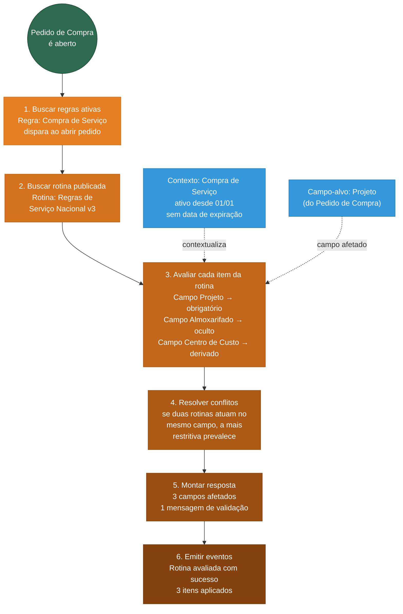
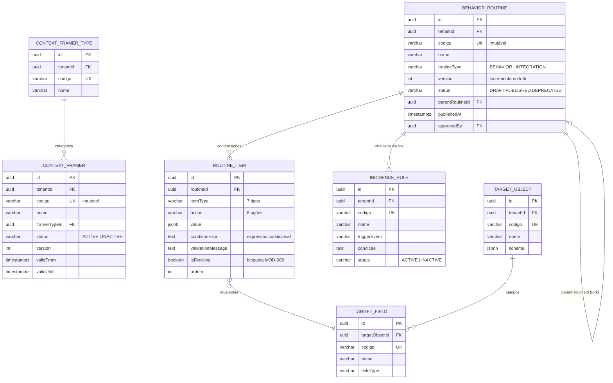
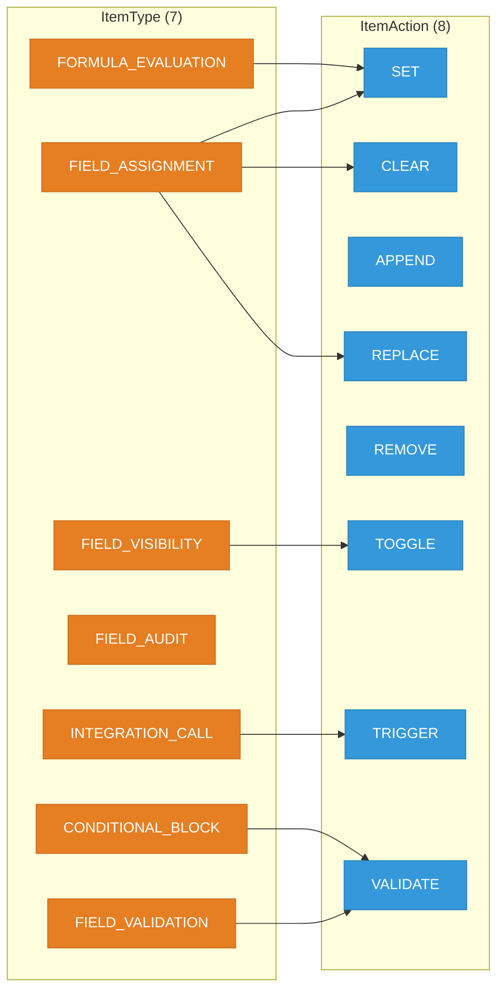

# MOD-007 — Modelo de Domínio

## Motor de Avaliação (6 Passos)

```mermaid
graph TD
    START(("Pedido de Compra<br/>é aberto"))
    S1["1. Buscar regras ativas<br/>Regra: Compra de Serviço<br/>dispara ao abrir pedido"]
    S2["2. Buscar rotina publicada<br/>Rotina: Regras de<br/>Serviço Nacional v3"]
    S3["3. Avaliar cada item da rotina<br/>Campo Projeto → obrigatório<br/>Campo Almoxarifado → oculto<br/>Campo Centro de Custo → derivado"]
    S4["4. Resolver conflitos<br/>se duas rotinas atuam no<br/>mesmo campo, a mais<br/>restritiva prevalece"]
    S5["5. Montar resposta<br/>3 campos afetados<br/>1 mensagem de validação"]
    S6["6. Emitir eventos<br/>Rotina avaliada com sucesso<br/>3 itens aplicados"]

    START --> S1
    S1 --> S2
    S2 --> S3
    S3 --> S4
    S4 --> S5
    S5 --> S6

    CF["Contexto: Compra de Serviço<br/>ativo desde 01/01<br/>sem data de expiração"]
    TF["Campo-alvo: Projeto<br/>(do Pedido de Compra)"]

    CF -.->|"contextualiza"| S3
    TF -.->|"campo afetado"| S3

    classDef start fill:#2d6a4f,stroke:#1b4332,color:#fff
    classDef step1 fill:#E67E22,stroke:#CA6F1E,color:#fff
    classDef step2 fill:#D4721E,stroke:#BA6118,color:#fff
    classDef step3 fill:#C0651A,stroke:#A85716,color:#fff
    classDef step4 fill:#AD5916,stroke:#964D12,color:#fff
    classDef step5 fill:#994D12,stroke:#84410E,color:#fff
    classDef step6 fill:#85410E,stroke:#72360A,color:#fff
    classDef support fill:#3498DB,stroke:#2980B9,color:#fff

    class START start
    class S1 step1
    class S2 step2
    class S3 step3
    class S4 step4
    class S5 step5
    class S6 step6
    class CF,TF support
```

## Entidades e Relacionamentos

```mermaid
erDiagram
    BEHAVIOR_ROUTINE ||--o{ ROUTINE_ITEM : "contém ações"
    BEHAVIOR_ROUTINE ||--o{ INCIDENCE_RULE : "vinculada via link"
    BEHAVIOR_ROUTINE ||--o| BEHAVIOR_ROUTINE : "parentRoutineId (fork)"
    CONTEXT_FRAMER_TYPE ||--o{ CONTEXT_FRAMER : "categoriza"
    TARGET_OBJECT ||--o{ TARGET_FIELD : "campos"
    ROUTINE_ITEM }o--|| TARGET_FIELD : "atua sobre"

    BEHAVIOR_ROUTINE {
        uuid id PK
        uuid tenantId FK
        varchar codigo UK "imutável"
        varchar nome
        varchar routineType "BEHAVIOR | INTEGRATION"
        int version "incrementa no fork"
        varchar status "DRAFT|PUBLISHED|DEPRECATED"
        uuid parentRoutineId FK
        timestamptz publishedAt
        uuid approvedBy FK
    }

    ROUTINE_ITEM {
        uuid id PK
        uuid routineId FK
        varchar itemType "7 tipos"
        varchar action "8 ações"
        jsonb value
        text conditionExpr "expressão condicional"
        text validationMessage
        boolean isBlocking "bloqueia MOD-006"
        int ordem
    }

    INCIDENCE_RULE {
        uuid id PK
        uuid tenantId FK
        varchar codigo UK
        varchar nome
        varchar triggerEvent
        text condicao
        varchar status "ACTIVE | INACTIVE"
    }

    CONTEXT_FRAMER {
        uuid id PK
        uuid tenantId FK
        varchar codigo UK "imutável"
        varchar nome
        uuid framerTypeId FK
        varchar status "ACTIVE | INACTIVE"
        int version
        timestamptz validFrom
        timestamptz validUntil
    }

    CONTEXT_FRAMER_TYPE {
        uuid id PK
        uuid tenantId FK
        varchar codigo UK
        varchar nome
    }

    TARGET_OBJECT {
        uuid id PK
        uuid tenantId FK
        varchar codigo UK
        varchar nome
        jsonb schema
    }

    TARGET_FIELD {
        uuid id PK
        uuid targetObjectId FK
        varchar codigo UK
        varchar nome
        varchar fieldType
    }
```

## Tipos de RoutineItem (7) x Ações (8)

```mermaid
graph LR
    subgraph ITEM_TYPES ["ItemType (7)"]
        T1["FIELD_ASSIGNMENT"]
        T2["FIELD_VALIDATION"]
        T3["FIELD_VISIBILITY"]
        T4["FIELD_AUDIT"]
        T5["CONDITIONAL_BLOCK"]
        T6["FORMULA_EVALUATION"]
        T7["INTEGRATION_CALL"]
    end

    subgraph ACTIONS ["ItemAction (8)"]
        A1["SET"]
        A2["CLEAR"]
        A3["APPEND"]
        A4["REPLACE"]
        A5["REMOVE"]
        A6["TOGGLE"]
        A7["TRIGGER"]
        A8["VALIDATE"]
    end

    T1 --> A1
    T1 --> A2
    T1 --> A4
    T2 --> A8
    T3 --> A6
    T5 --> A8
    T6 --> A1
    T7 --> A7

    classDef types fill:#E67E22,color:#fff,stroke:#CA6F1E
    classDef actions fill:#3498DB,color:#fff,stroke:#2980B9

    class T1,T2,T3,T4,T5,T6,T7 types
    class A1,A2,A3,A4,A5,A6,A7,A8 actions
```
