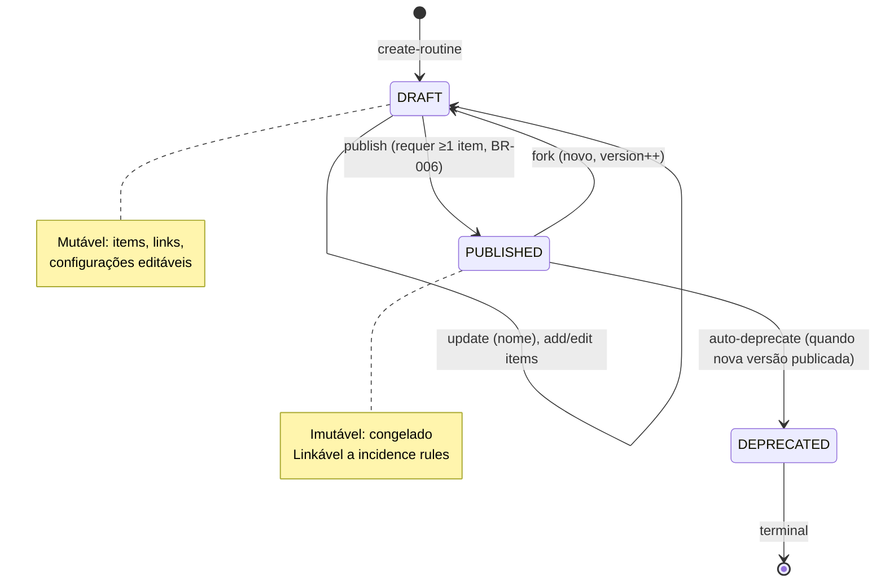
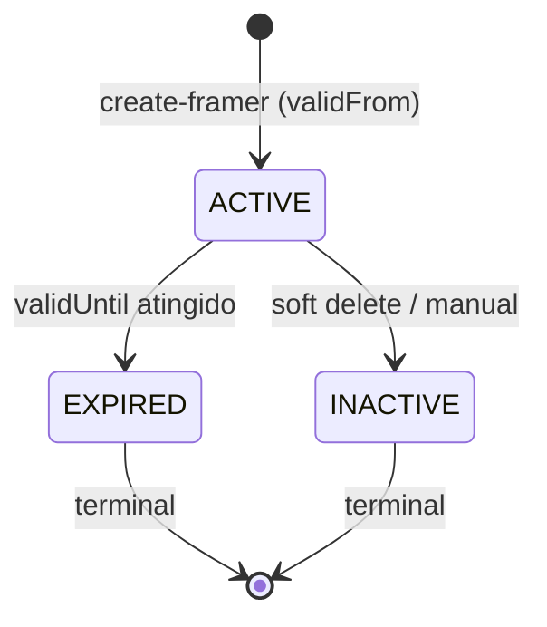
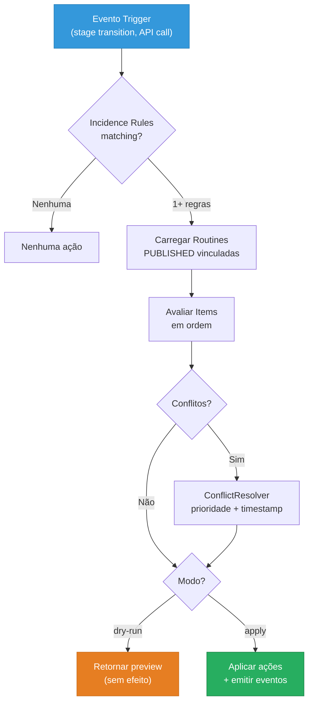

# MOD-007 — Máquinas de Estado

## BehaviorRoutine Status

```mermaid
stateDiagram-v2
    [*] --> DRAFT : create-routine
    DRAFT --> DRAFT : update (nome), add/edit items
    DRAFT --> PUBLISHED : publish (requer ≥1 item, BR-006)
    PUBLISHED --> DEPRECATED : auto-deprecate (quando nova versão publicada)
    DEPRECATED --> [*] : terminal

    PUBLISHED --> DRAFT : fork (novo, version++)

    note right of DRAFT
        Mutável: items, links,
        configurações editáveis
    end note

    note right of PUBLISHED
        Imutável: congelado
        Linkável a incidence rules
    end note
```

## ContextFramer Status

```mermaid
stateDiagram-v2
    [*] --> ACTIVE : create-framer (validFrom)
    ACTIVE --> INACTIVE : soft delete / manual
    ACTIVE --> EXPIRED : validUntil atingido
    EXPIRED --> [*] : terminal
    INACTIVE --> [*] : terminal
```

## Fluxo de Avaliação (Motor)

```mermaid
flowchart TD
    TRIGGER["Evento Trigger<br/>(stage transition, API call)"] --> MATCH{"Incidence Rules<br/>matching?"}
    MATCH -->|Nenhuma| SKIP["Nenhuma ação"]
    MATCH -->|1+ regras| LOAD["Carregar Routines<br/>PUBLISHED vinculadas"]
    LOAD --> EVAL["Avaliar Items<br/>em ordem"]
    EVAL --> CONFLICT{"Conflitos?"}
    CONFLICT -->|Sim| RESOLVE["ConflictResolver<br/>prioridade + timestamp"]
    CONFLICT -->|Não| APPLY
    RESOLVE --> APPLY{"Modo?"}
    APPLY -->|dry-run| PREVIEW["Retornar preview<br/>(sem efeito)"]
    APPLY -->|apply| EXEC["Aplicar ações<br/>+ emitir eventos"]

    style TRIGGER fill:#3498DB,color:#fff,stroke:#2980B9
    style EXEC fill:#27AE60,color:#fff,stroke:#1E8449
    style PREVIEW fill:#E67E22,color:#fff,stroke:#CA6F1E
```
