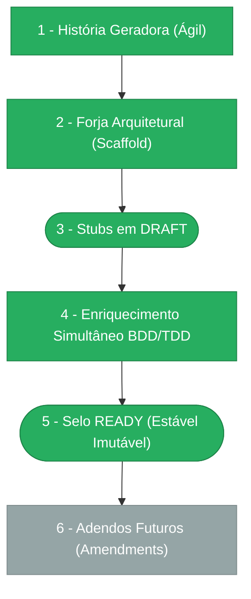

> ⚠️ **ARQUIVO GERIDO POR AUTOMAÇÃO.**
>
> - **Status DRAFT:** Enriqueça o conteúdo deste arquivo diretamente.
> - **Status READY:** NÃO EDITE DIRETAMENTE. Use a skill `create-amendment`.

# CHANGELOG — MOD-008

## Ciclo de Estabilidade do Módulo

> 🟢 Verde = Concluído | 🟠 Laranja = Em Andamento | ⬜ Cinza = Previsto

*O módulo está na **Etapa 5** — Selo READY (Estável Imutável). Alterações futuras via `create-amendment`.*

---

## Histórico de Versões

| Versão | Data | Responsável | Descrição |
|--------|------|-------------|-----------|
| 1.0.0 | 2026-03-23 | promote-module | Promoção DRAFT→READY: manifesto v1.0.0, todos os requisitos e ADRs selados. Ciclo de estabilidade avança para Etapa 5. |
| 0.1.0 | 2026-03-19 | arquitetura | Baseline Inicial — scaffold gerado via `forge-module` a partir de US-MOD-008 (APPROVED v1.2.0). 6 tabelas, 15 endpoints, 5 features, 6 scopes. Stubs criados: BR-008, FR-008, DATA-008, DATA-003, INT-008, SEC-008, SEC-002, UX-008, NFR-008, pen-008-pendente. Todos os itens em `estado_item: DRAFT`. |
| 0.2.0 | 2026-03-19 | AGN-DEV-01/02/03 | Enriquecimento Batch 1 — AGN-DEV-01 (MOD/Escala): mod.md enriquecido com summary detalhado, score DOC-ESC-001 6/6, premissas e restrições expandidas. AGN-DEV-02 (BR): 12 regras de negócio (BR-001 a BR-012) com Gherkin extraídas de F01–F05. AGN-DEV-03 (FR): 11 requisitos funcionais (FR-001 a FR-011) com done funcional, dependências e Gherkin extraídos de F01–F05. |
| 0.3.0 | 2026-03-19 | AGN-DEV-04/05/08 | Enriquecimento Batch 2 — AGN-DEV-04 (DATA): DATA-008 com 6 tabelas completas (campos, tipos, constraints, índices, FKs, soft-delete, volume estimado, queries críticas, migração). DATA-003 com 8 domain events completos (payload, sensitivity, view rule, ponte UI-API-Domain, outbox/dedupe). AGN-DEV-05 (INT): INT-008 com 4 integrações detalhadas (MOD-007 herança, MOD-006 events, MOD-000 Foundation, Protheus/TOTVS HTTP REST), 15 endpoints, contratos de erro, paginação, retry policy. AGN-DEV-08 (NFR): NFR-008 com SLOs p95/p99, limites, observabilidade Prometheus/OpenTelemetry, DLQ monitoring, healthchecks, DR, concorrência, input validation, testabilidade, escalabilidade. |
| 0.4.0 | 2026-03-19 | AGN-DEV-06/07 | Enriquecimento Batch 3 — AGN-DEV-06 (SEC): SEC-008 enriquecido com autenticação JWT + service account BullMQ, matriz completa 15 endpoints x scopes, classificação de dados (Confidencial/Restrito/Interno), mascaramento & LGPD (auth_config, is_sensitive, headers), auditoria via domain events + correlation_id + call_logs imutáveis, multi-tenancy com RLS considerations para 6 tabelas, proteções específicas (credenciais em trânsito, imutabilidade PUBLISHED, reprocessamento governado, concorrência BullMQ). SEC-002 enriquecido com matriz Emit/View/Notify completa para 8 eventos, regras de filtragem ACL, regras de notificação por evento, política de retenção. AGN-DEV-07 (UX): UX-008 enriquecido com 2 telas detalhadas — UX-INTEG-001 (Editor) com 3 abas (Config HTTP, Mapeamentos, Parâmetros), aviso PROD, teste HML, fork, readonly PUBLISHED, 12 ações UX-010; UX-INTEG-002 (Monitor) com métricas header, tabela com badges, auto-refresh 30s, split-view detalhe, DLQ tab dedicado, reprocessamento com motivo, chain de tentativas, filtro correlation_id, 6 ações UX-010. |
| 0.5.0 | 2026-03-19 | AGN-DEV-09/10/11 | Enriquecimento Batch 4 — AGN-DEV-09 (ADR): 4 ADRs criados — ADR-001 (Outbox Pattern para garantia de entrega), ADR-002 (Retry gerenciado pelo Outbox vs. BullMQ), ADR-003 (Herança de behavior_routines do MOD-007 via extensão 1:1), ADR-004 (Credenciais criptografadas AES-256 via secret do ambiente). AGN-DEV-10 (PENDENTE): 5 pendências identificadas — PENDENTE-001 (particionamento call_logs > 10M), PENDENTE-002 (retenção call_logs vs. LGPD), PENDENTE-003 (OAuth2 refresh token Protheus), PENDENTE-004 (limite real concurrency Protheus), PENDENTE-005 (seed HML para testes). AGN-DEV-11 (VAL): Validação cruzada completa — 0 erros, 2 warnings, cobertura 100% entre pilares. |
| 0.6.0 | 2026-03-19 | arquitetura | PENDENTE-001 implementada — Opção B (tabela simples + trigger migração 10M). Alerta `call_logs.count > 5M` adicionado ao NFR-008 §6.5. Env var `INTEGRATION_CONCURRENCY` já limita throughput. PEN-008 v0.8.0. |
| 0.7.0 | 2026-03-19 | arquitetura | PENDENTE-002 implementada — Opção A (retenção 6 meses hot storage + archive S3 com anonimização PII). Original purgado após 6 meses; metadados (id, status, correlation_id, duration_ms) permanecem no PostgreSQL. PEN-008 v0.9.0. |
| 1.1.0 | 2026-03-23 | codegen | Codegen concluído: 6 agentes executados, 35 arquivos gerados. Camadas: DB, CORE, APP (12 use cases), API (15 endpoints, OpenAPI), WEB (2 telas UX). |
| 1.5.2 | 2026-03-30 | merge-amendment | Merge INT-008-C01: correção prefixo Fastify — servicesRoutes e routinesRoutes devem usar `/api/v1/admin` (não `/api/v1`). INT-008 bumped para v0.4.1. Spec: spec-fix-integration-services-route-prefix. |
| 1.5.1 | 2026-03-25 | merge-amendment | Merge NFR-008-C01: nova §11 tipagem Drizzle — `InferInsertModel<>` obrigatório, `as any` proibido em repositories. NFR-008 bumped para v0.4.1. |
| 1.5.0 | 2026-03-25 | merge-amendment | Merge INT-008-M01: nova seção §10 Ingest Queue — Convenções BullMQ/Redis (fila `mod-008:ingest`, singleton, removeOnComplete, db1, health check). INT-008 bumped para v0.4.0. Derivado de DOC-PADRAO-002-M01. |
| 1.4.0 | 2026-03-24 | validate-all | Validação Fase 3 com 1 violação crítica — 8 domain errors estendem Error ao invés de DomainError (PKG-COD-001 §3.2). Lint: PASS. Format: PASS. QA: PASS. Manifests: 2/2 PASS. OpenAPI: PASS. Drizzle: PASS (6 tabelas). Endpoints: PASS (3 route files). PENDENTE-010 registrada. |
| 1.3.0 | 2026-03-24 | validate-all | Re-validação completa: WARN — 0 bloqueadores, 4 ALTA (inalteradas), 7 MEDIA/warnings. QA: PASS (45 source files). Lint: WARN (cross-module PEN-000/018). Architecture: WARN (domain errors extend Error, cross-module). Manifests: WARN (V-M01 inalterada). OpenAPI: WARN (sem error schemas). Drizzle: PASS (6/6, 21 indexes, 16 CHECKs). Endpoints: WARN (V-RT-1/V-RT-2 inalteradas). |
| 1.2.0 | 2026-03-23 | validate-all | Validação Fase 3: WARN — 0 bloqueadores, 4 ALTA, 5 MEDIA. QA: PASS. Manifests: 1/2. OpenAPI: PASS (sem error schemas). Drizzle: PASS (6/6). Endpoints: PASS (4 ALTA a corrigir). |
