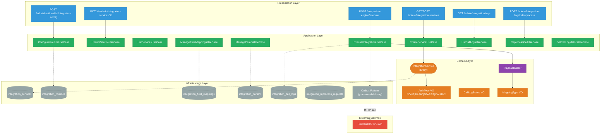

# MOD-008 — Arquitetura de Camadas (DDD-lite, Nível 2)

```mermaid
graph TD
    subgraph PRESENTATION ["Presentation Layer"]
        R1["GET/POST /admin/integration-services"]
        R2["PATCH /admin/integration-services/:id"]
        R3["POST /admin/routines/:id/integration-config"]
        R4["POST /integration-engine/execute"]
        R5["GET /admin/integration-logs"]
        R6["POST /admin/integration-logs/:id/reprocess"]
    end

    subgraph APPLICATION ["Application Layer"]
        UC1["CreateServiceUseCase"]
        UC2["UpdateServiceUseCase"]
        UC3["ListServicesUseCase"]
        UC4["ConfigureRoutineUseCase"]
        UC5["ManageFieldMappingsUseCase"]
        UC6["ManageParamsUseCase"]
        UC7["ExecuteIntegrationUseCase"]
        UC8["ListCallLogsUseCase"]
        UC9["ReprocessCallUseCase"]
        UC10["GetCallLogMetricsUseCase"]
    end

    subgraph DOMAIN ["Domain Layer"]
        E1(["IntegrationService<br/>(Entity)"])
        VO1["AuthType VO<br/>NONE|BASIC|BEARER|OAUTH2"]
        VO2["CallLogStatus VO"]
        VO3["MappingType VO"]
        DS1["PayloadBuilder"]
    end

    subgraph INFRA ["Infrastructure Layer"]
        DB1[("integration_services")]
        DB2[("integration_routines")]
        DB3[("integration_field_mappings")]
        DB4[("integration_params")]
        DB5[("integration_call_logs")]
        DB6[("integration_reprocess_requests")]
        OUT["Outbox Pattern<br/>(guaranteed delivery)"]
    end

    subgraph EXTERNAL ["Sistemas Externos"]
        EXT1["Protheus/TOTVS API"]
    end

    R1 --> UC1
    R2 --> UC2
    R3 --> UC4
    R4 --> UC7
    R5 --> UC8
    R6 --> UC9

    UC1 --> E1
    UC7 --> DS1
    UC7 --> OUT

    E1 --> VO1
    DS1 --> VO3

    E1 -.-> DB1
    UC4 -.-> DB2
    UC5 -.-> DB3
    UC6 -.-> DB4
    UC7 -.-> DB5

    OUT -->|"HTTP call"| EXT1

    classDef presentation fill:#3498DB,stroke:#2980B9,color:#fff
    classDef application fill:#27AE60,stroke:#1E8449,color:#fff
    classDef domain fill:#E67E22,stroke:#CA6F1E,color:#fff
    classDef infra fill:#95A5A6,stroke:#7F8C8D,color:#fff
    classDef service fill:#8E44AD,stroke:#6C3483,color:#fff
    classDef external fill:#E74C3C,stroke:#C0392B,color:#fff

    class R1,R2,R3,R4,R5,R6 presentation
    class UC1,UC2,UC3,UC4,UC5,UC6,UC7,UC8,UC9,UC10 application
    class E1,VO1,VO2,VO3 domain
    class DS1 service
    class DB1,DB2,DB3,DB4,DB5,DB6,OUT infra
    class EXT1 external
```
