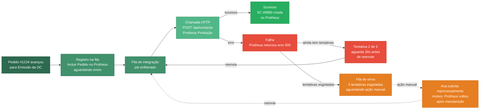
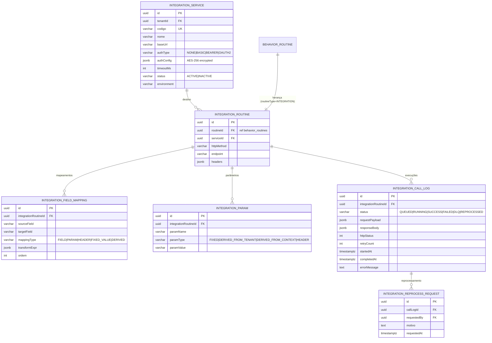

# MOD-008 — Modelo de Domínio

## Pipeline de Integração (Outbox Pattern)

```mermaid
graph LR
    CE["Pedido #1234 avançou<br/>para Emissão da OC"]
    OB["Registro na fila<br/>Incluir Pedido no Protheus<br/>aguardando envio"]
    BQ["Fila de integração<br/>job enfileirado"]
    HC["Chamada HTTP<br/>POST /api/compras<br/>Protheus Produção"]

    OK["Sucesso<br/>SC #8890 criada<br/>no Protheus"]
    FAIL["Falha<br/>Protheus retornou erro 500"]
    RT["Tentativa 2 de 5<br/>aguarda 30s antes<br/>de reenviar"]
    DLQ["Fila de erros<br/>5 tentativas esgotadas<br/>aguardando ação manual"]
    RR["Ana solicita reprocessamento<br/>motivo: Protheus voltou<br/>após manutenção"]

    CE --> OB
    OB --> BQ
    BQ --> HC
    HC -->|"sucesso"| OK
    HC -->|"erro"| FAIL
    FAIL -->|"ainda tem tentativas"| RT
    RT -->|"reenvia"| BQ
    FAIL -->|"tentativas esgotadas"| DLQ
    DLQ -.->|"ação manual"| RR
    RR -.->|"reenvia"| BQ

    classDef source fill:#2d6a4f,stroke:#1b4332,color:#fff
    classDef queue fill:#40916c,stroke:#2d6a4f,color:#fff
    classDef httpcall fill:#52b788,stroke:#40916c,color:#fff
    classDef success fill:#27AE60,stroke:#1E8449,color:#fff
    classDef fail fill:#E74C3C,stroke:#CB4335,color:#fff
    classDef dlq fill:#E67E22,stroke:#CA6F1E,color:#fff

    class CE source
    class OB,BQ queue
    class HC httpcall
    class OK success
    class FAIL,RT fail
    class DLQ,RR dlq
```

## Entidades e Relacionamentos

```mermaid
erDiagram
    INTEGRATION_SERVICE ||--o{ INTEGRATION_ROUTINE : "destino"
    INTEGRATION_ROUTINE ||--o{ INTEGRATION_FIELD_MAPPING : "mapeamentos"
    INTEGRATION_ROUTINE ||--o{ INTEGRATION_PARAM : "parâmetros"
    INTEGRATION_ROUTINE ||--o{ INTEGRATION_CALL_LOG : "execuções"
    BEHAVIOR_ROUTINE ||--|| INTEGRATION_ROUTINE : "herança (routineType=INTEGRATION)"
    INTEGRATION_CALL_LOG ||--o{ INTEGRATION_REPROCESS_REQUEST : "reprocessamento"

    INTEGRATION_SERVICE {
        uuid id PK
        uuid tenantId FK
        varchar codigo UK
        varchar nome
        varchar baseUrl
        varchar authType "NONE|BASIC|BEARER|OAUTH2"
        jsonb authConfig "AES-256 encrypted"
        int timeoutMs
        varchar status "ACTIVE|INACTIVE"
        varchar environment
    }

    INTEGRATION_ROUTINE {
        uuid id PK
        uuid routineId FK "ref behavior_routines"
        uuid serviceId FK
        varchar httpMethod
        varchar endpoint
        jsonb headers
    }

    INTEGRATION_FIELD_MAPPING {
        uuid id PK
        uuid integrationRoutineId FK
        varchar sourceField
        varchar targetField
        varchar mappingType "FIELD|PARAM|HEADER|FIXED_VALUE|DERIVED"
        jsonb transformExpr
        int ordem
    }

    INTEGRATION_PARAM {
        uuid id PK
        uuid integrationRoutineId FK
        varchar paramName
        varchar paramType "FIXED|DERIVED_FROM_TENANT|DERIVED_FROM_CONTEXT|HEADER"
        varchar paramValue
    }

    INTEGRATION_CALL_LOG {
        uuid id PK
        uuid integrationRoutineId FK
        varchar status "QUEUED|RUNNING|SUCCESS|FAILED|DLQ|REPROCESSED"
        jsonb requestPayload
        jsonb responseBody
        int httpStatus
        int retryCount
        timestamptz startedAt
        timestamptz completedAt
        text errorMessage
    }

    INTEGRATION_REPROCESS_REQUEST {
        uuid id PK
        uuid callLogId FK
        uuid requestedBy FK
        text motivo
        timestamptz requestedAt
    }
```
