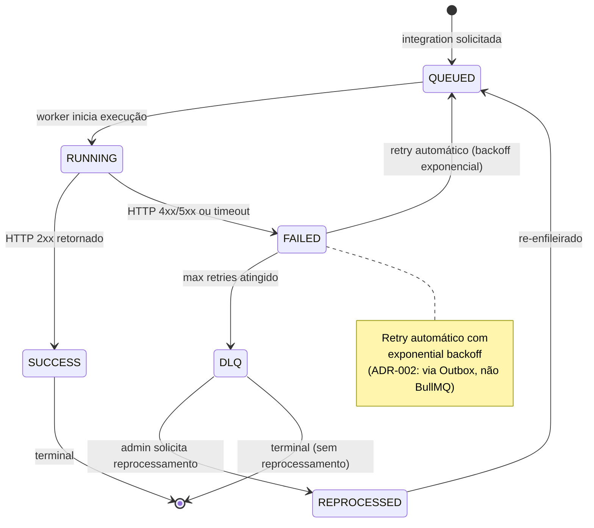
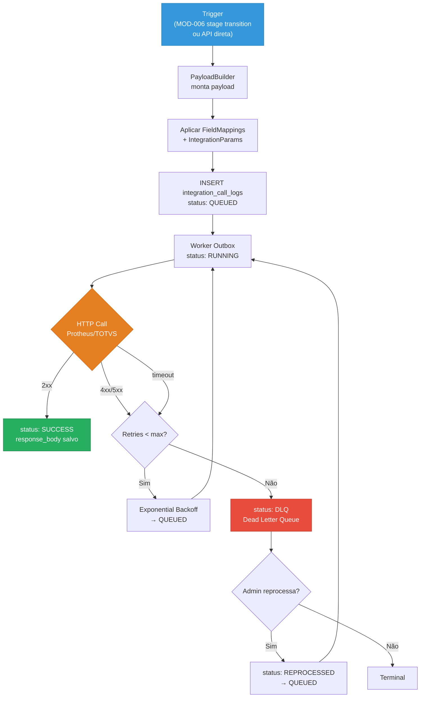

# MOD-008 — Máquinas de Estado

## CallLog Status (Outbox Pattern)

```mermaid
stateDiagram-v2
    [*] --> QUEUED : integration solicitada
    QUEUED --> RUNNING : worker inicia execução
    RUNNING --> SUCCESS : HTTP 2xx retornado
    RUNNING --> FAILED : HTTP 4xx/5xx ou timeout

    FAILED --> QUEUED : retry automático (backoff exponencial)
    FAILED --> DLQ : max retries atingido

    DLQ --> REPROCESSED : admin solicita reprocessamento
    REPROCESSED --> QUEUED : re-enfileirado

    SUCCESS --> [*] : terminal
    DLQ --> [*] : terminal (sem reprocessamento)

    note right of FAILED
        Retry automático com
        exponential backoff
        (ADR-002: via Outbox, não BullMQ)
    end note
```

## Fluxo de Execução da Integração

```mermaid
flowchart TD
    TRIGGER["Trigger<br/>(MOD-006 stage transition<br/>ou API direta)"] --> BUILD["PayloadBuilder<br/>monta payload"]
    BUILD --> MAP["Aplicar FieldMappings<br/>+ IntegrationParams"]
    MAP --> OUTBOX["INSERT integration_call_logs<br/>status: QUEUED"]
    OUTBOX --> WORKER["Worker Outbox<br/>status: RUNNING"]
    WORKER --> HTTP{"HTTP Call<br/>Protheus/TOTVS"}

    HTTP -->|2xx| OK["status: SUCCESS<br/>response_body salvo"]
    HTTP -->|4xx/5xx| RETRY{"Retries < max?"}
    HTTP -->|timeout| RETRY

    RETRY -->|Sim| BACKOFF["Exponential Backoff<br/>→ QUEUED"]
    RETRY -->|Não| DLQ["status: DLQ<br/>Dead Letter Queue"]

    BACKOFF --> WORKER
    DLQ --> ADMIN{"Admin reprocessa?"}
    ADMIN -->|Sim| REPROCESS["status: REPROCESSED<br/>→ QUEUED"]
    ADMIN -->|Não| END["Terminal"]
    REPROCESS --> WORKER

    style TRIGGER fill:#3498DB,color:#fff,stroke:#2980B9
    style OK fill:#27AE60,color:#fff,stroke:#1E8449
    style DLQ fill:#E74C3C,color:#fff,stroke:#C0392B
    style HTTP fill:#E67E22,color:#fff,stroke:#CA6F1E
```
