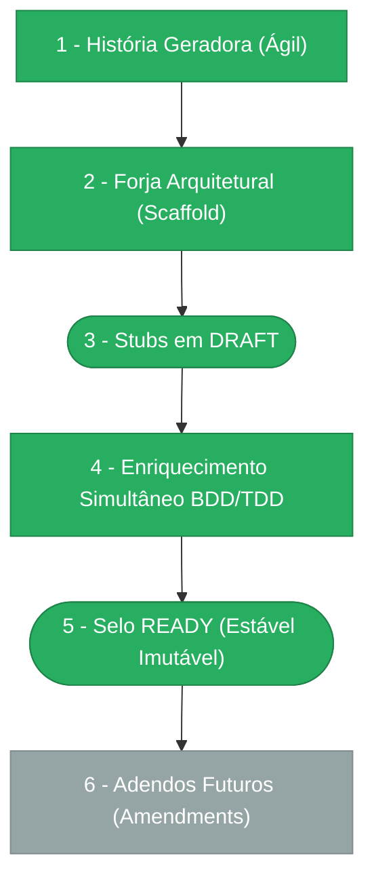

> ⚠️ **ARQUIVO GERIDO POR AUTOMAÇÃO.**
>
> - **Status DRAFT:** Enriqueça o conteúdo deste arquivo diretamente.
> - **Status READY:** NÃO EDITE DIRETAMENTE. Use a skill `create-amendment`.

# CHANGELOG - MOD-009

## Ciclo de Estabilidade do Módulo

> 🟢 Verde = Concluído | 🟠 Laranja = Em Andamento | 🔵 Azul = Estável Ancestral | ⬜ Cinza = Previsto

*O módulo está na **Etapa 5 — Selo READY (Estável Imutável). Alterações futuras via `create-amendment`.**

---

## Histórico de Versões

| Versão | Data | Responsável | Descrição |
|--------|------|-------------|-----------|
| 1.2.0 | 2026-03-24 | validate-all | Revalidação completa: Lint PASS (0 ESLint errors, 10 Prettier warnings tracked in PENDENTE-001). Architecture PASS (DomainError+type+statusHint, Pattern A react-query, clean arch). QA PASS. Manifests 2/2 PASS. OpenAPI PASS (14 ops). Drizzle PASS (7 tabelas, 7 relations). Endpoints PASS (14/14, 4 route files). 0 bloqueadores, 0 violações críticas, 10 warnings. |
| 1.1.0 | 2026-03-24 | validate-all | Validação Fase 3 aprovada — pronto para merge. QA: PASS. Manifests: 2/2 PASS. OpenAPI: PASS (14 ops). Drizzle: PASS (7 tabelas). Endpoints: PASS (14/14). 0 bloqueadores, 0 violações críticas, 32 warnings LOW. |
| 1.0.0 | 2026-03-23 | promote-module | Promoção DRAFT→READY: manifesto v1.0.0, todos os requisitos e ADRs selados. Ciclo de estabilidade avança para Etapa 5. |
| 0.9.0| 2026-03-19 | arquitetura | PEN-009-005 implementada — sem particionamento de `movement_history` no MVP (opção 3, apenas índices). Suficiente até 10M registros. Threshold preventivo de 5M registros para acionar migração para range partitioning mensal (PostgreSQL 14+ nativo). Monitoramento via métrica count de movement_history. |
| 0.8.0 | 2026-03-19 | arquitetura | PEN-009-007 implementada — polling 60s como MVP para SidebarBadge (opção 1); SSE (Server-Sent Events) registrado no roadmap pós-MVP como enhancement de push unidirecional após validação de UX. Todas as 7 pendências do módulo estão agora implementadas (0 abertas). |
| 0.5.0 | 2026-03-19 | AGN-DEV-09, AGN-DEV-10, AGN-DEV-11 | Enriquecimento Batch 4 (final) — AGN-DEV-09: 4 ADRs criadas (ADR-001 Motor Síncrono, ADR-002 Segregação com Auto-Aprovação por Scope, ADR-003 Outbox Pattern eventos 4-13, ADR-004 Override com Justificativa 20 chars); mod.md §10 adr-index atualizado. AGN-DEV-10: PEN-009 atualizado com 7 pendências identificadas (2 bloqueantes: callback pós-aprovação e amendment MOD-000-F12; 3 médias: dry-run, canal notificação, retry endpoint; 2 baixas: particionamento history, real-time inbox). AGN-DEV-11: Cross-validation de todos os artefatos — IDs, metadata, rastreabilidade, cobertura de eventos, scopes, endpoints, SLOs verificados. |
| 0.4.0 | 2026-03-19 | AGN-DEV-06, AGN-DEV-07 | Enriquecimento Batch 3 — AGN-DEV-06: SEC-009 expandido com lógica detalhada de segregação/auto-aprovação/cancelamento/override (§3.1–3.4), Gherkin BDD para caminhos críticos de segurança, LGPD §7 com direitos do titular (Art. 18), auditoria §8 com mapeamento evento→tabela e controle de acesso, rate limits por operação; SEC-002 expandido com retenção por categoria (admin indefinida, movimentos 5 anos, override indefinida, notificações 1 ano), maskable_fields detalhados com regras de mascaramento, Gherkin para enforcement da matriz de autorização e mascaramento. AGN-DEV-07: UX-009 expandido com action_ids DOC-UX-010 (11 ações inbox + 9 ações configurador), state machines completas (card de movimento, drawer de regra), acessibilidade WCAG 2.1 AA, responsive behavior (desktop/tablet/mobile), estados loading/error/empty detalhados por componente, mapeamento consolidado action→endpoint→domain_event (16 entradas), Gherkin BDD para fluxos UX. |
| 0.3.0 | 2026-03-19 | AGN-DEV-04, AGN-DEV-05, AGN-DEV-08 | Enriquecimento Batch 2 — AGN-DEV-04: DATA-009 FK ON DELETE RESTRICT verificado, índices hot-query (inbox, timeout, object lookup), campos padrão completos; DATA-003 expandido com formato individual por evento (PKG-DEV-001 §5): notify, outbox, dedupe_key, maskable_fields, payload_policy, ponte UI-API-Domain. AGN-DEV-05: INT-009 enriquecido com request/response JSON completos para todos os 13 endpoints, erros RFC 9457 com extensions.correlationId (6 exemplos), middleware/hook integration pattern documentado, async failure behavior (notificações, timeout job, execução pós-aprovação). AGN-DEV-08: NFR-009 enriquecido com SLOs detalhados (baseline/alvo P95/P99), healthcheck endpoints, DR (RPO=0, RTO<15min), limites (5 níveis, 200 regras, 10K pendentes, 256KB payload), observabilidade completa (logging, 10 métricas Prometheus, traces OpenTelemetry, 4 dashboards, 8 alertas). |
| 0.2.0 | 2026-03-19 | AGN-DEV-01, AGN-DEV-02, AGN-DEV-03 | Enriquecimento Batch 1 — AGN-DEV-01: narrativa §1 expandida com aggregate root, value objects, domain services; module_paths completos; score 6/6 verificado. AGN-DEV-02: Gherkin BDD adicionado a BR-001..BR-009; impactos explícitos. AGN-DEV-03: Gherkin adicionado a FR-001..FR-008; idempotency e timeline flags completos. |
| 0.1.0 | 2026-03-19 | arquitetura | Baseline Inicial — scaffold gerado via `forge-module` a partir de US-MOD-009 (APPROVED). 7 tabelas, 13 endpoints, 5 features (F01–F05), 13 domain events. Stubs obrigatórios criados: DATA-003, SEC-002. Todos os itens nascem em `estado_item: DRAFT`. |
