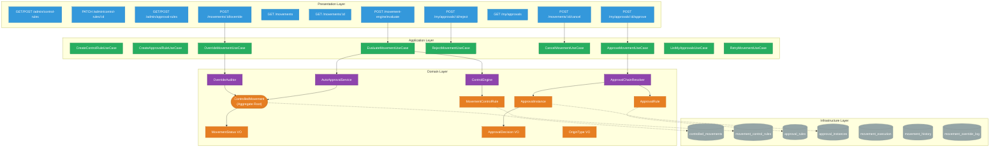

# MOD-009 — Arquitetura de Camadas (DDD-lite, Nível 2)

```mermaid
graph TD
    subgraph PRESENTATION ["Presentation Layer"]
        R1["GET/POST /admin/control-rules"]
        R2["PATCH /admin/control-rules/:id"]
        R3["GET/POST /admin/approval-rules"]
        R4["POST /movement-engine/evaluate"]
        R5["GET /movements"]
        R6["GET /movements/:id"]
        R7["POST /movements/:id/cancel"]
        R8["POST /movements/:id/override"]
        R9["GET /my/approvals"]
        R10["POST /my/approvals/:id/approve"]
        R11["POST /my/approvals/:id/reject"]
    end

    subgraph APPLICATION ["Application Layer"]
        UC1["CreateControlRuleUseCase"]
        UC2["CreateApprovalRuleUseCase"]
        UC3["EvaluateMovementUseCase"]
        UC4["ApproveMovementUseCase"]
        UC5["RejectMovementUseCase"]
        UC6["CancelMovementUseCase"]
        UC7["OverrideMovementUseCase"]
        UC8["ListMyApprovalsUseCase"]
        UC9["RetryMovementUseCase"]
    end

    subgraph DOMAIN ["Domain Layer"]
        AG(["ControlledMovement<br/>(Aggregate Root)"])
        E1["MovementControlRule"]
        E2["ApprovalRule"]
        E3["ApprovalInstance"]
        VO1["MovementStatus VO"]
        VO2["ApprovalDecision VO"]
        VO3["OriginType VO"]
        DS1["ControlEngine"]
        DS2["ApprovalChainResolver"]
        DS3["OverrideAuditor"]
        DS4["AutoApprovalService"]
    end

    subgraph INFRA ["Infrastructure Layer"]
        DB1[("controlled_movements")]
        DB2[("movement_control_rules")]
        DB3[("approval_rules")]
        DB4[("approval_instances")]
        DB5[("movement_execution")]
        DB6[("movement_history")]
        DB7[("movement_override_log")]
    end

    R4 --> UC3
    R10 --> UC4
    R11 --> UC5
    R7 --> UC6
    R8 --> UC7

    UC3 --> DS1
    UC3 --> DS4
    UC4 --> DS2
    UC7 --> DS3

    DS1 --> E1
    DS2 --> E2
    DS2 --> E3
    DS3 --> AG
    DS4 --> AG

    AG --> VO1
    E3 --> VO2

    AG -.-> DB1
    E1 -.-> DB2
    E2 -.-> DB3
    E3 -.-> DB4

    classDef presentation fill:#3498DB,stroke:#2980B9,color:#fff
    classDef application fill:#27AE60,stroke:#1E8449,color:#fff
    classDef domain fill:#E67E22,stroke:#CA6F1E,color:#fff
    classDef infra fill:#95A5A6,stroke:#7F8C8D,color:#fff
    classDef service fill:#8E44AD,stroke:#6C3483,color:#fff

    class R1,R2,R3,R4,R5,R6,R7,R8,R9,R10,R11 presentation
    class UC1,UC2,UC3,UC4,UC5,UC6,UC7,UC8,UC9 application
    class AG,E1,E2,E3,VO1,VO2,VO3 domain
    class DS1,DS2,DS3,DS4 service
    class DB1,DB2,DB3,DB4,DB5,DB6,DB7 infra
```
