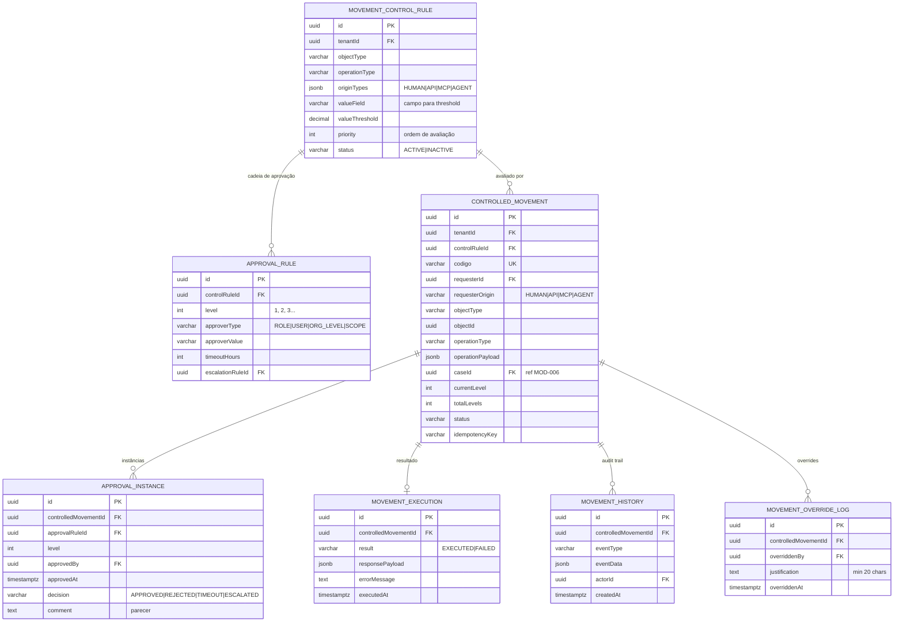

# MOD-009 — Modelo de Domínio

```mermaid
erDiagram
    MOVEMENT_CONTROL_RULE ||--o{ APPROVAL_RULE : "cadeia de aprovação"
    MOVEMENT_CONTROL_RULE ||--o{ CONTROLLED_MOVEMENT : "avaliado por"
    CONTROLLED_MOVEMENT ||--o{ APPROVAL_INSTANCE : "instâncias"
    CONTROLLED_MOVEMENT ||--o| MOVEMENT_EXECUTION : "resultado"
    CONTROLLED_MOVEMENT ||--o{ MOVEMENT_HISTORY : "audit trail"
    CONTROLLED_MOVEMENT ||--o{ MOVEMENT_OVERRIDE_LOG : "overrides"

    MOVEMENT_CONTROL_RULE {
        uuid id PK
        uuid tenantId FK
        varchar objectType
        varchar operationType
        jsonb originTypes "HUMAN|API|MCP|AGENT"
        varchar valueField "campo para threshold"
        decimal valueThreshold
        int priority "ordem de avaliação"
        varchar status "ACTIVE|INACTIVE"
    }

    APPROVAL_RULE {
        uuid id PK
        uuid controlRuleId FK
        int level "1, 2, 3..."
        varchar approverType "ROLE|USER|ORG_LEVEL|SCOPE"
        varchar approverValue
        int timeoutHours
        uuid escalationRuleId FK
    }

    CONTROLLED_MOVEMENT {
        uuid id PK
        uuid tenantId FK
        uuid controlRuleId FK
        varchar codigo UK
        uuid requesterId FK
        varchar requesterOrigin "HUMAN|API|MCP|AGENT"
        varchar objectType
        uuid objectId
        varchar operationType
        jsonb operationPayload
        uuid caseId FK "ref MOD-006"
        int currentLevel
        int totalLevels
        varchar status
        varchar idempotencyKey
    }

    APPROVAL_INSTANCE {
        uuid id PK
        uuid controlledMovementId FK
        uuid approvalRuleId FK
        int level
        uuid approvedBy FK
        timestamptz approvedAt
        varchar decision "APPROVED|REJECTED|TIMEOUT|ESCALATED"
        text comment "parecer"
    }

    MOVEMENT_EXECUTION {
        uuid id PK
        uuid controlledMovementId FK
        varchar result "EXECUTED|FAILED"
        jsonb responsePayload
        text errorMessage
        timestamptz executedAt
    }

    MOVEMENT_HISTORY {
        uuid id PK
        uuid controlledMovementId FK
        varchar eventType
        jsonb eventData
        uuid actorId FK
        timestamptz createdAt
    }

    MOVEMENT_OVERRIDE_LOG {
        uuid id PK
        uuid controlledMovementId FK
        uuid overriddenBy FK
        text justification "min 20 chars"
        timestamptz overriddenAt
    }
```
