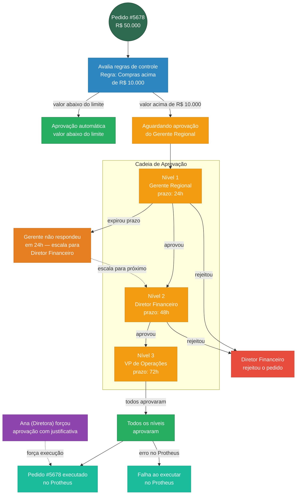
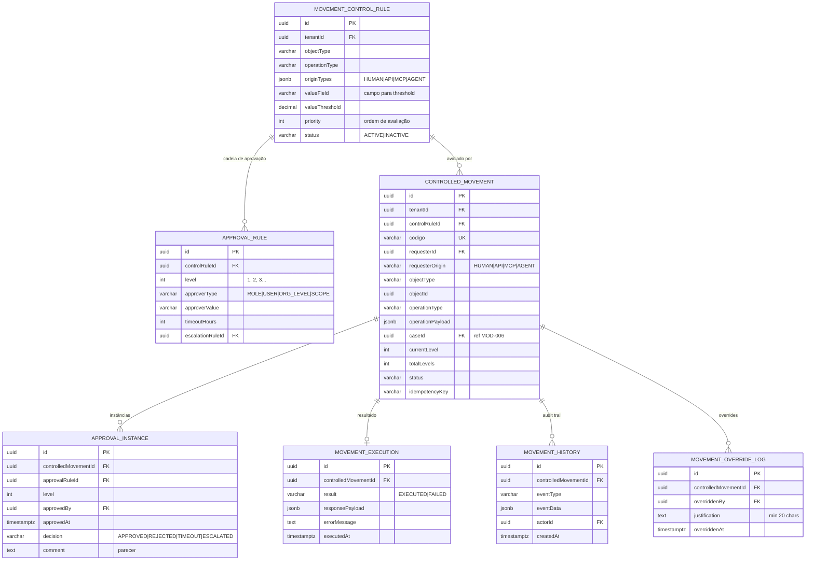

# MOD-009 — Modelo de Domínio

## Cadeia de Aprovação Multinível

```mermaid
graph TD
    OP(("Pedido #5678<br/>R$ 50.000"))
    RE["Avalia regras de controle<br/>Regra: Compras acima<br/>de R$ 10.000"]

    subgraph CHAIN ["Cadeia de Aprovação"]
        N1["Nível 1<br/>Gerente Regional<br/>prazo: 24h"]
        N2["Nível 2<br/>Diretor Financeiro<br/>prazo: 48h"]
        N3["Nível 3<br/>VP de Operações<br/>prazo: 72h"]
        N1 -->|"aprovou"| N2
        N2 -->|"aprovou"| N3
    end

    AUTO["Aprovação automática<br/>valor abaixo do limite"]
    PEND["Aguardando aprovação<br/>do Gerente Regional"]
    APR["Todos os níveis<br/>aprovaram"]
    REJ["Diretor Financeiro<br/>rejeitou o pedido"]
    OVR["Ana (Diretora) forçou<br/>aprovação com justificativa"]
    TOUT["Gerente não respondeu<br/>em 24h — escala para<br/>Diretor Financeiro"]
    EXEC["Pedido #5678 executado<br/>no Protheus"]
    FAILED["Falha ao executar<br/>no Protheus"]

    OP --> RE
    RE -->|"valor abaixo do limite"| AUTO
    RE -->|"valor acima de R$ 10.000"| PEND
    PEND --> N1
    N3 -->|"todos aprovaram"| APR
    N1 -->|"rejeitou"| REJ
    N2 -->|"rejeitou"| REJ
    N1 -->|"expirou prazo"| TOUT
    TOUT -.->|"escala para próximo"| N2
    APR --> EXEC
    APR -->|"erro no Protheus"| FAILED
    OVR -.->|"força execução"| EXEC

    classDef start fill:#2d6a4f,stroke:#1b4332,color:#fff
    classDef eval fill:#2E86C1,stroke:#2471A3,color:#fff
    classDef chain fill:#F39C12,stroke:#D68910,color:#fff
    classDef approved fill:#27AE60,stroke:#1E8449,color:#fff
    classDef rejected fill:#E74C3C,stroke:#CB4335,color:#fff
    classDef override fill:#8E44AD,stroke:#7D3C98,color:#fff
    classDef timeout fill:#E67E22,stroke:#CA6F1E,color:#fff
    classDef result fill:#1ABC9C,stroke:#17A589,color:#fff

    class OP start
    class RE eval
    class N1,N2,N3,PEND chain
    class AUTO,APR approved
    class REJ rejected
    class OVR override
    class TOUT timeout
    class EXEC,FAILED result
```

## Entidades e Relacionamentos

```mermaid
erDiagram
    MOVEMENT_CONTROL_RULE ||--o{ APPROVAL_RULE : "cadeia de aprovação"
    MOVEMENT_CONTROL_RULE ||--o{ CONTROLLED_MOVEMENT : "avaliado por"
    CONTROLLED_MOVEMENT ||--o{ APPROVAL_INSTANCE : "instâncias"
    CONTROLLED_MOVEMENT ||--o| MOVEMENT_EXECUTION : "resultado"
    CONTROLLED_MOVEMENT ||--o{ MOVEMENT_HISTORY : "audit trail"
    CONTROLLED_MOVEMENT ||--o{ MOVEMENT_OVERRIDE_LOG : "overrides"

    MOVEMENT_CONTROL_RULE {
        uuid id PK
        uuid tenantId FK
        varchar objectType
        varchar operationType
        jsonb originTypes "HUMAN|API|MCP|AGENT"
        varchar valueField "campo para threshold"
        decimal valueThreshold
        int priority "ordem de avaliação"
        varchar status "ACTIVE|INACTIVE"
    }

    APPROVAL_RULE {
        uuid id PK
        uuid controlRuleId FK
        int level "1, 2, 3..."
        varchar approverType "ROLE|USER|ORG_LEVEL|SCOPE"
        varchar approverValue
        int timeoutHours
        uuid escalationRuleId FK
    }

    CONTROLLED_MOVEMENT {
        uuid id PK
        uuid tenantId FK
        uuid controlRuleId FK
        varchar codigo UK
        uuid requesterId FK
        varchar requesterOrigin "HUMAN|API|MCP|AGENT"
        varchar objectType
        uuid objectId
        varchar operationType
        jsonb operationPayload
        uuid caseId FK "ref MOD-006"
        int currentLevel
        int totalLevels
        varchar status
        varchar idempotencyKey
    }

    APPROVAL_INSTANCE {
        uuid id PK
        uuid controlledMovementId FK
        uuid approvalRuleId FK
        int level
        uuid approvedBy FK
        timestamptz approvedAt
        varchar decision "APPROVED|REJECTED|TIMEOUT|ESCALATED"
        text comment "parecer"
    }

    MOVEMENT_EXECUTION {
        uuid id PK
        uuid controlledMovementId FK
        varchar result "EXECUTED|FAILED"
        jsonb responsePayload
        text errorMessage
        timestamptz executedAt
    }

    MOVEMENT_HISTORY {
        uuid id PK
        uuid controlledMovementId FK
        varchar eventType
        jsonb eventData
        uuid actorId FK
        timestamptz createdAt
    }

    MOVEMENT_OVERRIDE_LOG {
        uuid id PK
        uuid controlledMovementId FK
        uuid overriddenBy FK
        text justification "min 20 chars"
        timestamptz overriddenAt
    }
```
