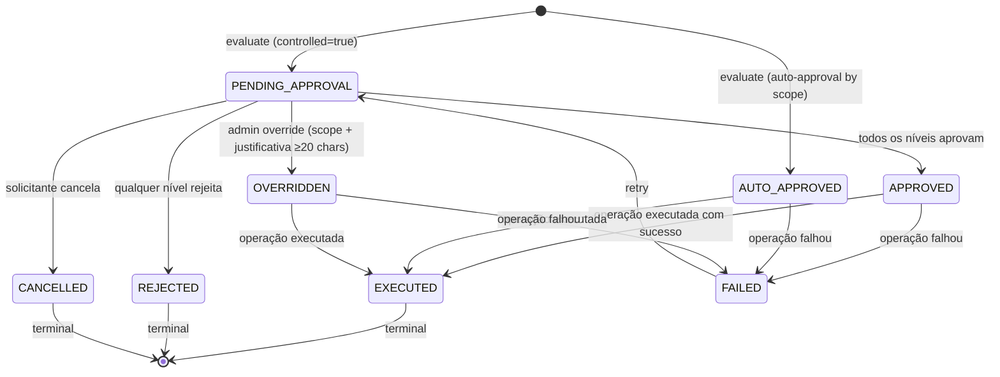
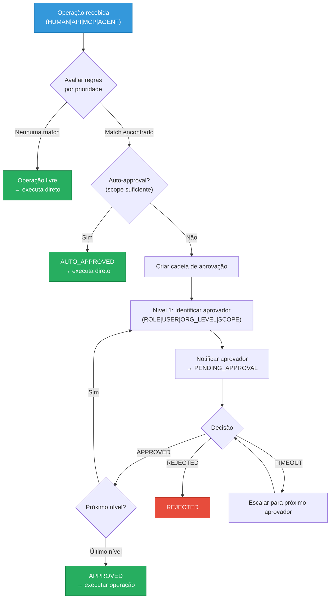
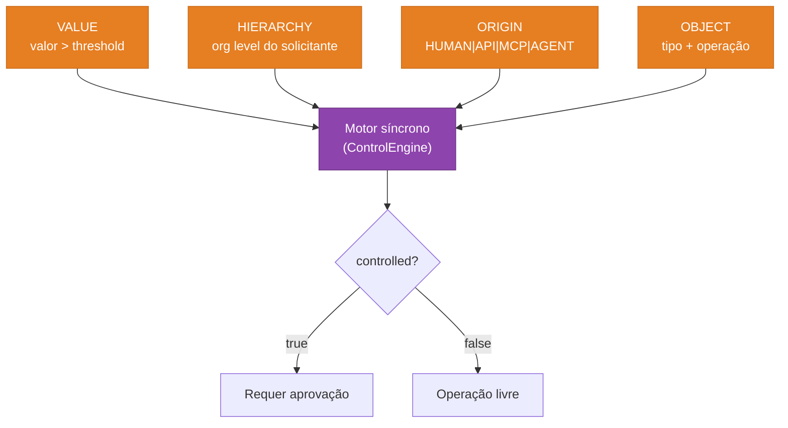

# MOD-009 — Máquinas de Estado

## ControlledMovement Status

```mermaid
stateDiagram-v2
    [*] --> PENDING_APPROVAL : evaluate (controlled=true)
    [*] --> AUTO_APPROVED : evaluate (auto-approval by scope)

    PENDING_APPROVAL --> APPROVED : todos os níveis aprovam
    PENDING_APPROVAL --> REJECTED : qualquer nível rejeita
    PENDING_APPROVAL --> CANCELLED : solicitante cancela
    PENDING_APPROVAL --> OVERRIDDEN : admin override (scope + justificativa ≥20 chars)

    APPROVED --> EXECUTED : operação executada com sucesso
    APPROVED --> FAILED : operação falhou
    AUTO_APPROVED --> EXECUTED : operação executada
    AUTO_APPROVED --> FAILED : operação falhou
    OVERRIDDEN --> EXECUTED : operação executada
    OVERRIDDEN --> FAILED : operação falhou

    FAILED --> PENDING_APPROVAL : retry

    EXECUTED --> [*] : terminal
    REJECTED --> [*] : terminal
    CANCELLED --> [*] : terminal
```

## Fluxo do Motor de Controle (Síncrono)

```mermaid
flowchart TD
    REQUEST["Operação recebida<br/>(HUMAN|API|MCP|AGENT)"] --> RULES{"Avaliar regras<br/>por prioridade"}

    RULES -->|Nenhuma match| FREE["Operação livre<br/>→ executa direto"]
    RULES -->|Match encontrado| CHECK_AUTO{"Auto-approval?<br/>(scope suficiente)"}

    CHECK_AUTO -->|Sim| AUTO["AUTO_APPROVED<br/>→ executa direto"]
    CHECK_AUTO -->|Não| CHAIN["Criar cadeia de aprovação"]

    CHAIN --> LEVEL["Nível 1: Identificar aprovador<br/>(ROLE|USER|ORG_LEVEL|SCOPE)"]
    LEVEL --> INBOX["Notificar aprovador<br/>→ PENDING_APPROVAL"]

    INBOX --> DECISION{"Decisão"}
    DECISION -->|APPROVED| NEXT{"Próximo nível?"}
    DECISION -->|REJECTED| REJECTED["REJECTED"]
    DECISION -->|TIMEOUT| ESCALATE["Escalar para próximo aprovador"]

    NEXT -->|Sim| LEVEL
    NEXT -->|Último nível| APPROVED["APPROVED<br/>→ executar operação"]

    ESCALATE --> DECISION

    style REQUEST fill:#3498DB,color:#fff,stroke:#2980B9
    style FREE fill:#27AE60,color:#fff,stroke:#1E8449
    style AUTO fill:#27AE60,color:#fff,stroke:#1E8449
    style APPROVED fill:#27AE60,color:#fff,stroke:#1E8449
    style REJECTED fill:#E74C3C,color:#fff,stroke:#C0392B
```

## Critérios de Controle (4 combinações)

```mermaid
graph TD
    C1["VALUE<br/>valor > threshold"] --> EVAL["Motor síncrono<br/>(ControlEngine)"]
    C2["HIERARCHY<br/>org level do solicitante"] --> EVAL
    C3["ORIGIN<br/>HUMAN|API|MCP|AGENT"] --> EVAL
    C4["OBJECT<br/>tipo + operação"] --> EVAL

    EVAL --> RESULT{"controlled?"}
    RESULT -->|true| CONTROLLED["Requer aprovação"]
    RESULT -->|false| FREE["Operação livre"]

    classDef criteria fill:#E67E22,color:#fff,stroke:#CA6F1E
    classDef engine fill:#8E44AD,color:#fff,stroke:#6C3483

    class C1,C2,C3,C4 criteria
    class EVAL engine
```
