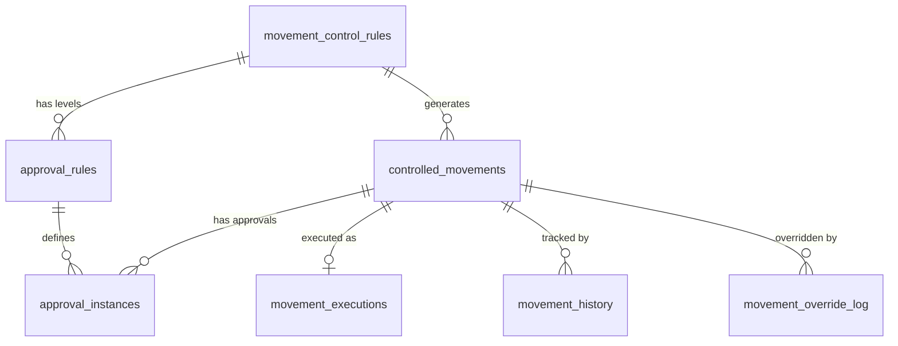

> ⚠️ **ARQUIVO GERIDO POR AUTOMAÇÃO.**
>
> - **Status DRAFT:** Enriqueça o conteúdo deste arquivo diretamente.
> - **Status READY:** NÃO EDITE DIRETAMENTE. Use a skill `create-amendment`.
>
> | Versão | Data       | Responsável | Status/Integração |
> |--------|------------|-------------|-------------------|
> | 0.1.0  | 2026-03-19 | arquitetura | Baseline Inicial (forge-module) |
> | 0.2.0  | 2026-03-19 | AGN-DEV-01  | Enriquecimento Batch 1 |
> | 0.3.0  | 2026-03-19 | AGN-DEV-04  | Enriquecimento Batch 2 — FK ON DELETE RESTRICT, índices hot-query, campos padrão verificados |

# DATA-009 — Modelo de Dados de Movimentos sob Aprovação

- **Objetivo:** Modelo completo de 7 tabelas para controle de movimentos sob aprovação com rastreabilidade integral.
- **Tipo de Tabela/Armazenamento:** Relacional (SQL)

---

## Tabela 1 — `movement_control_rules` (Regras de Controle de Gravação)

| Campo | Tipo Negócio | Tipo DB | Nulidade | Constraint | Descrição |
|---|---|---|---|---|---|
| `id` | UUID | uuid | NOT NULL | PK | |
| `codigo` | String | varchar(50) | NOT NULL | UNIQUE | Imutável após criação |
| `nome` | String | varchar(200) | NOT NULL | | Nome descritivo da regra |
| `object_type` | String | varchar | NOT NULL | | ex: pedido_venda, caso, integration_call |
| `operation_type` | String(enum) | varchar | NOT NULL | | CREATE\|UPDATE\|DELETE\|EXECUTE\|INTEGRATE |
| `origin_types` | JSON Array | jsonb | NOT NULL | | `["HUMAN","API","MCP","AGENT"]` — origens que disparam controle |
| `value_field` | String | varchar | NULL | | Campo a ser avaliado pelo critério de valor |
| `value_threshold` | Decimal | numeric | NULL | | Limite para critério de valor |
| `status` | String(enum) | varchar | NOT NULL | | ACTIVE\|INACTIVE |
| `priority` | Integer | integer | NOT NULL | default 50 | Menor = avaliado primeiro |
| `valid_from` | DateTime | timestamptz | NOT NULL | | Início da vigência |
| `valid_until` | DateTime | timestamptz | NULL | | Fim da vigência (NULL = sem expiração) |
| `created_by` | UUID | uuid | NOT NULL | FK→users ON DELETE RESTRICT | Quem criou a regra |
| `tenant_id` | UUID | uuid | NOT NULL | FK→tenants ON DELETE RESTRICT | Row-Level Security |
| `created_at` | DateTime | timestamptz | NOT NULL | default now() | |
| `updated_at` | DateTime | timestamptz | NOT NULL | default now() | |
| `deleted_at` | DateTime | timestamptz | NULL | | Soft-Delete |

**Índices:**

| Nome Sugerido | Colunas | Tipo | Justificativa |
|---|---|---|---|
| `idx_mcr_tenant_eval` | `(tenant_id, object_type, operation_type, status, priority)` | B-tree | Hot query: motor de controle busca regras ativas por tipo de objeto e operação, ordenadas por prioridade |
| `idx_mcr_tenant_codigo` | `(tenant_id, codigo)` | UNIQUE | Lookup por código dentro do tenant |
| `idx_mcr_status_validity` | `(tenant_id, status, valid_from, valid_until)` | B-tree | Hot query: regras ativas dentro do período de vigência (motor filtra `valid_from <= now() AND (valid_until IS NULL OR valid_until >= now())`) |
| `idx_mcr_deleted_at` | `(deleted_at) WHERE deleted_at IS NULL` | B-tree (partial) | Filtro rápido de registros não excluídos |

---

## Tabela 2 — `approval_rules` (Regras de Alçada)

| Campo | Tipo Negócio | Tipo DB | Nulidade | Constraint | Descrição |
|---|---|---|---|---|---|
| `id` | UUID | uuid | NOT NULL | PK | |
| `control_rule_id` | UUID | uuid | NOT NULL | FK→movement_control_rules ON DELETE RESTRICT | Regra de controle associada |
| `level` | Integer | integer | NOT NULL | | 1 = primeiro aprovador, 2 = segundo (cadeia) |
| `approver_type` | String(enum) | varchar | NOT NULL | | ROLE\|USER\|ORG_LEVEL\|SCOPE |
| `approver_ref` | String | varchar | NOT NULL | | ID do role/user ou nível organizacional |
| `required_scope` | String | varchar | NULL | | Scope RBAC exigido do aprovador |
| `timeout_hours` | Integer | integer | NULL | | Horas para timeout ou escalada |
| `escalation_rule_id` | UUID | uuid | NULL | FK→approval_rules ON DELETE SET NULL | Para onde escala se timeout |
| `allow_self_approve` | Boolean | boolean | NOT NULL | default false | Controle de auto-aprovação por suficiência de escopo (épico §3.1) |
| `tenant_id` | UUID | uuid | NOT NULL | FK→tenants ON DELETE RESTRICT | Row-Level Security |
| `created_at` | DateTime | timestamptz | NOT NULL | default now() | |
| `updated_at` | DateTime | timestamptz | NOT NULL | default now() | |

**Índices:**

| Nome Sugerido | Colunas | Tipo | Justificativa |
|---|---|---|---|
| `idx_ar_control_level` | `(control_rule_id, level)` | UNIQUE | Garante unicidade de nível por regra de controle |
| `idx_ar_tenant_control` | `(tenant_id, control_rule_id)` | B-tree | Lookup de alçadas por tenant + regra |
| `idx_ar_escalation` | `(escalation_rule_id) WHERE escalation_rule_id IS NOT NULL` | B-tree (partial) | Resolução de cadeia de escalada |

---

## Tabela 3 — `controlled_movements` (Movimentos Controlados)

| Campo | Tipo Negócio | Tipo DB | Nulidade | Constraint | Descrição |
|---|---|---|---|---|---|
| `id` | UUID | uuid | NOT NULL | PK | |
| `codigo` | String | varchar(50) | NOT NULL | UNIQUE | ex: MOV-2026-00001 |
| `control_rule_id` | UUID | uuid | NOT NULL | FK→movement_control_rules ON DELETE RESTRICT | Regra que gerou o movimento |
| `object_type` | String | varchar | NOT NULL | | Tipo do objeto alvo |
| `object_id` | UUID | uuid | NULL | | ID do objeto (pode ser nulo para objetos ainda não criados) |
| `operation_type` | String(enum) | varchar | NOT NULL | | Operação solicitada |
| `origin_type` | String(enum) | varchar | NOT NULL | | HUMAN\|API\|MCP\|AGENT |
| `requested_by` | UUID | uuid | NOT NULL | FK→users ON DELETE RESTRICT | Solicitante |
| `requested_at` | DateTime | timestamptz | NOT NULL | | Data/hora da solicitação |
| `operation_payload` | JSON | jsonb | NOT NULL | | Payload original da operação |
| `operation_value` | Decimal | numeric | NULL | | Valor monetário se aplicável |
| `status` | String(enum) | varchar | NOT NULL | | PENDING_APPROVAL\|APPROVED\|AUTO_APPROVED\|REJECTED\|EXECUTED\|CANCELLED\|OVERRIDDEN\|FAILED |
| `current_approval_level` | Integer | integer | NOT NULL | default 1 | Nível atual na cadeia de aprovação |
| `case_id` | UUID | uuid | NULL | FK→case_instances ON DELETE RESTRICT | Caso relacionado (MOD-006) |
| `correlation_id` | String | varchar | NOT NULL | | X-Correlation-ID propagado |
| `cancelled_at` | DateTime | timestamptz | NULL | | |
| `cancellation_reason` | String | text | NULL | | |
| `tenant_id` | UUID | uuid | NOT NULL | FK→tenants ON DELETE RESTRICT | Row-Level Security |
| `created_at` | DateTime | timestamptz | NOT NULL | default now() | |
| `updated_at` | DateTime | timestamptz | NOT NULL | default now() | |

**Índices:**

| Nome Sugerido | Colunas | Tipo | Justificativa |
|---|---|---|---|
| `idx_cm_tenant_status_date` | `(tenant_id, status, requested_at DESC)` | B-tree | Hot query: listagem de movimentos por status ordenados por data (tela de movimentos) |
| `idx_cm_tenant_requester_status` | `(tenant_id, requested_by, status)` | B-tree | Hot query: "meus movimentos" filtrados por status |
| `idx_cm_tenant_codigo` | `(tenant_id, codigo)` | UNIQUE | Lookup por código dentro do tenant |
| `idx_cm_correlation` | `(correlation_id)` | B-tree | Rastreabilidade cross-service via X-Correlation-ID |
| `idx_cm_object` | `(tenant_id, object_type, object_id) WHERE object_id IS NOT NULL` | B-tree (partial) | Hot query: buscar movimentos por objeto alvo (ex: "todos os movimentos do pedido X") |
| `idx_cm_case` | `(tenant_id, case_id) WHERE case_id IS NOT NULL` | B-tree (partial) | Correlação com MOD-006: buscar movimentos por caso |

---

## Tabela 4 — `approval_instances` (Instâncias de Aprovação)

| Campo | Tipo Negócio | Tipo DB | Nulidade | Constraint | Descrição |
|---|---|---|---|---|---|
| `id` | UUID | uuid | NOT NULL | PK | |
| `movement_id` | UUID | uuid | NOT NULL | FK→controlled_movements ON DELETE RESTRICT | Movimento associado |
| `approval_rule_id` | UUID | uuid | NOT NULL | FK→approval_rules ON DELETE RESTRICT | Regra de alçada associada |
| `level` | Integer | integer | NOT NULL | | Nível na cadeia |
| `assigned_to` | UUID | uuid | NULL | FK→users ON DELETE RESTRICT | Aprovador específico |
| `status` | String(enum) | varchar | NOT NULL | | PENDING\|APPROVED\|REJECTED\|TIMEOUT\|ESCALATED |
| `decided_by` | UUID | uuid | NULL | FK→users ON DELETE RESTRICT | Quem decidiu |
| `decided_at` | DateTime | timestamptz | NULL | | Data/hora da decisão |
| `parecer` | String | text | NULL | | Nota do aprovador |
| `notified_at` | DateTime | timestamptz | NULL | | Data/hora da notificação |
| `timeout_at` | DateTime | timestamptz | NULL | | Deadline calculado |
| `tenant_id` | UUID | uuid | NOT NULL | FK→tenants ON DELETE RESTRICT | Row-Level Security |
| `created_at` | DateTime | timestamptz | NOT NULL | default now() | |
| `updated_at` | DateTime | timestamptz | NOT NULL | default now() | |

**Nota:** Segregação solicitante ≠ aprovador validada no service layer. Permite exceção de auto-aprovação por scope (épico §3.1). Log obrigatório em movement_history.

**Índices:**

| Nome Sugerido | Colunas | Tipo | Justificativa |
|---|---|---|---|
| `idx_ai_movement_level` | `(movement_id, level)` | UNIQUE | Garante um registro por nível por movimento |
| `idx_ai_inbox` | `(tenant_id, assigned_to, status) WHERE status = 'PENDING'` | B-tree (partial) | **Hot query — Inbox do aprovador:** busca rápida de aprovações pendentes por aprovador. Query principal da tela de inbox |
| `idx_ai_timeout` | `(tenant_id, status, timeout_at) WHERE status = 'PENDING' AND timeout_at IS NOT NULL` | B-tree (partial) | **Hot query — Job de timeout/escalada:** cron job busca aprovações pendentes que passaram do deadline |
| `idx_ai_movement_status` | `(tenant_id, movement_id, status)` | B-tree | Consulta de aprovações por movimento e status |

---

## Tabela 5 — `movement_executions` (Execuções de Movimentos)

| Campo | Tipo Negócio | Tipo DB | Nulidade | Constraint | Descrição |
|---|---|---|---|---|---|
| `id` | UUID | uuid | NOT NULL | PK | |
| `movement_id` | UUID | uuid | NOT NULL | FK→controlled_movements ON DELETE RESTRICT, UNIQUE | Um por movimento |
| `executed_by` | UUID | uuid | NOT NULL | FK→users ON DELETE RESTRICT | Quem executou |
| `executed_at` | DateTime | timestamptz | NOT NULL | | Data/hora da execução |
| `execution_payload` | JSON | jsonb | NOT NULL | | Payload final executado |
| `result` | String(enum) | varchar | NOT NULL | | SUCCESS\|FAILED |
| `error_message` | String | text | NULL | | Mensagem de erro se FAILED |
| `retry_of` | UUID | uuid | NULL | FK→movement_executions ON DELETE RESTRICT | Para reexecução |
| `tenant_id` | UUID | uuid | NOT NULL | FK→tenants ON DELETE RESTRICT | Row-Level Security |
| `created_at` | DateTime | timestamptz | NOT NULL | default now() | |

**Índices:**

| Nome Sugerido | Colunas | Tipo | Justificativa |
|---|---|---|---|
| `idx_me_movement` | `(movement_id)` | UNIQUE | Um-para-um com controlled_movements |
| `idx_me_tenant_result` | `(tenant_id, result)` | B-tree | Filtro por resultado (dashboard de falhas) |
| `idx_me_retry` | `(retry_of) WHERE retry_of IS NOT NULL` | B-tree (partial) | Cadeia de retentativas |

---

## Tabela 6 — `movement_history` (Histórico Integral do Movimento)

| Campo | Tipo Negócio | Tipo DB | Nulidade | Constraint | Descrição |
|---|---|---|---|---|---|
| `id` | UUID | uuid | NOT NULL | PK | |
| `movement_id` | UUID | uuid | NOT NULL | FK→controlled_movements ON DELETE RESTRICT | Movimento associado |
| `event_type` | String(enum) | varchar | NOT NULL | | CREATED\|APPROVAL_REQUESTED\|APPROVED\|AUTO_APPROVED_BY_SCOPE\|REJECTED\|EXECUTED\|FAILED\|CANCELLED\|OVERRIDDEN\|ESCALATED\|TIMEOUT |
| `actor_id` | UUID | uuid | NOT NULL | FK→users ON DELETE RESTRICT | Ator do evento |
| `event_at` | DateTime | timestamptz | NOT NULL | | Data/hora do evento |
| `payload` | JSON | jsonb | NULL | | Dados relevantes do evento |
| `tenant_id` | UUID | uuid | NOT NULL | FK→tenants ON DELETE RESTRICT | Row-Level Security |
| `created_at` | DateTime | timestamptz | NOT NULL | default now() | |

**Tabela append-only** — registros nunca são alterados ou excluídos.

**Índices:**

| Nome Sugerido | Colunas | Tipo | Justificativa |
|---|---|---|---|
| `idx_mh_movement_timeline` | `(tenant_id, movement_id, event_at DESC)` | B-tree | **Hot query — Timeline do movimento:** exibição cronológica de todos os eventos de um movimento |
| `idx_mh_event_type` | `(tenant_id, event_type, event_at DESC)` | B-tree | Busca por tipo de evento (relatórios, dashboards) |
| `idx_mh_actor` | `(tenant_id, actor_id, event_at DESC)` | B-tree | Auditoria: "o que este usuário fez?" |

---

## Tabela 7 — `movement_override_log` (Registro de Overrides)

| Campo | Tipo Negócio | Tipo DB | Nulidade | Constraint | Descrição |
|---|---|---|---|---|---|
| `id` | UUID | uuid | NOT NULL | PK | |
| `movement_id` | UUID | uuid | NOT NULL | FK→controlled_movements ON DELETE RESTRICT | Movimento com override |
| `overridden_by` | UUID | uuid | NOT NULL | FK→users ON DELETE RESTRICT | Quem fez o override |
| `overridden_at` | DateTime | timestamptz | NOT NULL | | Data/hora do override |
| `justificativa` | String | text | NOT NULL | | Obrigatória (min 20 chars) |
| `scope_used` | String | varchar | NOT NULL | | `approval:override` |
| `tenant_id` | UUID | uuid | NOT NULL | FK→tenants ON DELETE RESTRICT | Row-Level Security |
| `created_at` | DateTime | timestamptz | NOT NULL | default now() | |

**Tabela append-only** — registros imutáveis após criação.

**Índices:**

| Nome Sugerido | Colunas | Tipo | Justificativa |
|---|---|---|---|
| `idx_mol_movement` | `(movement_id)` | B-tree | Buscar overrides por movimento |
| `idx_mol_override_audit` | `(tenant_id, overridden_by, overridden_at DESC)` | B-tree | Auditoria: overrides por usuário (compliance) |

---

## Regras de FK (MUST)

Todas as foreign keys usam **ON DELETE RESTRICT** salvo:

- `approval_rules.escalation_rule_id → approval_rules` usa **ON DELETE SET NULL** (escalada é opcional; remover a regra alvo não invalida a regra corrente).

**Justificativa:** Movimentos controlados e suas decisões são registros de compliance — exclusão em cascata é inaceitável. Remoção de usuário, tenant, ou regra de controle com movimentos associados deve ser bloqueada no application layer (soft-delete obrigatório).

---

## Diagrama ERD (Mermaid) — Entidades núcleo

---

- **estado_item:** DRAFT
- **owner:** arquitetura
- **data_ultima_revisao:** 2026-03-19
- **rastreia_para:** US-MOD-009, FR-009, BR-009, SEC-009
- **referencias_exemplos:** N/A
- **evidencias:** N/A
