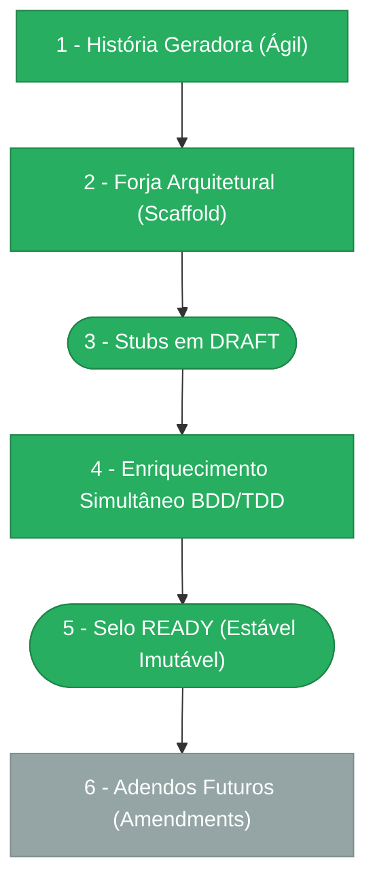

> ⚠️ **ARQUIVO GERIDO POR AUTOMAÇÃO.**
>
> - **Status DRAFT:** Enriqueça o conteúdo deste arquivo diretamente.
> - **Status READY:** NÃO EDITE DIRETAMENTE. Use a skill `create-amendment`.

# CHANGELOG - MOD-010

## Ciclo de Estabilidade do Módulo

> 🟢 Verde = Concluído | 🟠 Laranja = Em Andamento | 🔵 Azul = Estável Ancestral | ⬜ Cinza = Previsto

*O módulo está na **Etapa 5 — Selo READY (Estável Imutável). Alterações futuras via `create-amendment`.**

---

## Histórico de Versões

| Versão | Data | Responsável | Descrição |
|--------|------|-------------|-----------|
| 1.4.1 | 2026-03-31 | codegen | Codegen parcial: AGN-COD-WEB (1 agente, 5 arquivos atualizados). Layout UX conforme UX-010-M01: tab bar A1, catálogo cards grid, drawer uppercase, metric cards progress bar, detail panel seções. TypeScript PASS, Prettier PASS. |
| 1.4.0 | 2026-03-31 | merge-amendment | Merge UX-010-M01: layout visual Penpot incorporado em UX-010 (§2.6, §2.8, §3.6, §3.8). Tab bar A1, catálogo cards grid, drawer uppercase, metric cards progress bar, detail panel seções. UX-010 bumped para v0.3.0. |
| 1.3.0 | 2026-03-31 | ux-apply-layout | Amendment UX-010-M01: alinhar AgentsPage e ExecutionsPage com designs Penpot (60-MCP-Agents). 12 detalhamentos (D1-D12): tab bar A1, toolbar com search, colunas tabela, catálogo em cards grid, permissões matrix estilizada, drawer com labels uppercase, ApiKeyModal e RevokeModal redesenhados, metric cards com progress bar, detail panel com seções agrupadas. 7 frames Penpot validados. |
| 1.2.2 | 2026-03-31 | merge-amendment | Merge FR-010-C01: rename scope `phase2-enable` → `phase2_enable` em FR-010 (6 ocorrências) + PEN-010 (5 ocorrências). Base FR-010 bumped para v0.2.1. Ref: spec-fix-scope-hyphen-rename. |
| 1.2.1 | 2026-03-31 | create-amendment | Amendment FR-010-C01: rename scope `mcp:agent:phase2-enable` → `mcp:agent:phase2_enable` em FR-010 (6 ocorrências), PEN-010 (5 ocorrências) e enable-phase2.use-case.ts. Hífen viola regex canônica. Ref: spec-fix-scope-hyphen-rename. |
| 1.2.0 | 2026-03-24 | validate-all | Revalidação completa: Lint 0 erros (PENDENTE-008 resolvida), Format 5 warnings (cross-module PEN-000/PENDENTE-018), Arquitetura PASS (DomainError+type+statusHint, react-query, Pattern A), QA PASS, Manifests 2/2 PASS, OpenAPI PASS (14 ops), Drizzle PASS (5 tabelas), Endpoints PASS (4 routes, 14 endpoints). 0 bloqueadores, 0 violações críticas. |
| 1.1.0 | 2026-03-24 | validate-all | Validação Fase 3 aprovada — pronto para merge. QA: PASS. Manifests: 2/2 PASS. OpenAPI: PASS. Drizzle: PASS. Endpoints: PASS. Codegen completo (DB+CORE+APP+API+WEB). 0 bloqueadores, 0 violações. |
| 1.0.0 | 2026-03-23 | promote-module | Promoção DRAFT→READY: manifesto v1.0.0, todos os requisitos e ADRs selados. Ciclo de estabilidade avança para Etapa 5. |
| 0.6.0 | 2026-03-19 | arquitetura | PENDENTE-006 decidida+implementada — Opcao A (NotificationService MOD-000) escolhida para canal e-mail de privilege escalation. Dependencia MOD-000 NotificationService multi-canal mapeada (MOD-000 ainda nao possui o servico). PEN-010 v0.9.0. |
| 0.5.0 | 2026-03-19 | AGN-DEV-09, AGN-DEV-10, AGN-DEV-11 | Enriquecimento Batch 4 (final) — AGN-DEV-09: 4 ADRs criadas (ADR-001 Gateway Síncrono, ADR-002 API Key bcrypt, ADR-003 Outbox Pattern, ADR-004 Blocklist Wildcard); mod.md §9 adr-index atualizado. AGN-DEV-10: PEN-010 atualizado com 6 pendências (2 altas: Phase 2 enable e amendment MOD-000-F12; 3 médias: PREPARAR default, DIRECT lógica, callback MOD-009; 1 baixa: e-mail config). AGN-DEV-11: Cross-validation — 2 erros corrigidos (rate limit SEC vs NFR, tenant_id mcp_action_types), 4 warnings documentados, cobertura completa verificada. |
| 0.4.0 | 2026-03-19 | AGN-DEV-06, AGN-DEV-07 | Enriquecimento Batch 3 — AGN-DEV-06: SEC-010 expandido com 14 seções (authn API key, authz RBAC 6 scopes, blocklist Phase 1/2 com enforcement WRITE+RUNTIME, privilege escalation sensitivity_level=2, segregação de funções, classificação de dados, payload sanitization, isolamento multi-tenant, retenção por entidade, LGPD Art.18 com direitos do titular, auditoria 10 EVTs mapeados, rate limits 6 operações, brute force protection, ciclo de vida API key); SEC-002 expandida com 3 sub-matrizes, maskable_fields detalhados, retenção por categoria, 5 cenários Gherkin BDD. AGN-DEV-07: UX-010 expandido com jornadas completas (UX-MCP-001: 8 passos + 5 estados + 3 state machines + 12 ações DOC-UX-010 + 8 componentes + 26 copy strings; UX-MCP-002: 7 passos + 8 estados + 2 state machines + 7 ações + 3 componentes + 16 copy strings), WCAG 2.1 AA (10 critérios + ARIA/keyboard), responsive 3 breakpoints, mapeamento action→endpoint→domain_event (10 ações), 11 cenários Gherkin BDD. |
| 0.3.0 | 2026-03-19 | AGN-DEV-04, AGN-DEV-05, AGN-DEV-08 | Enriquecimento Batch 2 — AGN-DEV-04: DATA-010 FK ON DELETE RESTRICT verificado, 13 índices hot-query, CHECK constraints, ERD textual, migração com ordem e rollback; DATA-003 expandido com formato individual EVT-001 a EVT-010 (outbox, dedupe_key, maskable_fields, payload_policy, notify rules). AGN-DEV-05: INT-010 enriquecido com 5 integrações detalhadas (MOD-009 síncrona, MOD-007 síncrona com degradação, MOD-008 BullMQ+DLQ, MOD-004 in-process, MOD-000 amendment) + 13 contratos de API (INT-006-A a INT-006-K) com request/response JSON, erros RFC 9457, failure behavior e observabilidade. AGN-DEV-08: NFR-010 enriquecido com 9 NFRs (SLOs P95/P99 por endpoint e política, disponibilidade 99.9%/99.5%, segurança API key, escalabilidade com limites e rate limiting, auditoria 5 anos append-only, observabilidade com 15 métricas Prometheus + 17 spans OpenTelemetry + 4 dashboards + 7 alertas, DR RPO 1h/RTO 4h, healthcheck liveness+readiness com bcrypt selftest). |
| 0.2.0 | 2026-03-19 | AGN-DEV-01 | Enriquecimento MOD/Escala — Justificativa architecture_level=2 com 6 gatilhos DOC-ESC-001, module_paths documentados (docs + apps/api + apps/web), EX-AUTH-001 e EX-SEC-001 referenciados. |
| 0.2.0 | 2026-03-19 | AGN-DEV-02 | Enriquecimento BR — Gherkin adicionado a BR-001..BR-009. Novas regras: BR-010 (8 passos gateway), BR-011 (vínculo único), BR-012 (privilege escalation), BR-013 (codigo ação imutável), BR-014 (can_approve false), BR-015 (revocation_reason obrigatório). |
| 0.2.0 | 2026-03-19 | AGN-DEV-03 | Enriquecimento FR — Done funcional, dependências, idempotência, timeline/notifications e Gherkin adicionados a FR-001..FR-009. Rastreabilidade cruzada com BR e DATA-003. |
| 0.1.0 | 2026-03-19 | arquitetura | Baseline Inicial — scaffold gerado via `forge-module` a partir de US-MOD-010 (APPROVED). 5 tabelas, 13 endpoints, 5 features (F01–F05), 3 políticas de execução. Stubs obrigatórios criados: DATA-003, SEC-002. Todos os itens nascem em `estado_item: DRAFT`. |
