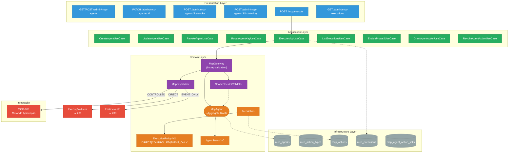

# MOD-010 — Arquitetura de Camadas (DDD-lite, Nível 2)

```mermaid
graph TD
    subgraph PRESENTATION ["Presentation Layer"]
        R1["GET/POST /admin/mcp-agents"]
        R2["PATCH /admin/mcp-agents/:id"]
        R3["POST /admin/mcp-agents/:id/revoke"]
        R4["POST /admin/mcp-agents/:id/rotate-key"]
        R5["POST /mcp/execute"]
        R6["GET /admin/mcp-executions"]
    end

    subgraph APPLICATION ["Application Layer"]
        UC1["CreateAgentUseCase"]
        UC2["UpdateAgentUseCase"]
        UC3["RevokeAgentUseCase"]
        UC4["RotateAgentKeyUseCase"]
        UC5["ExecuteMcpUseCase"]
        UC6["ListExecutionsUseCase"]
        UC7["EnablePhase2UseCase"]
        UC8["GrantAgentActionUseCase"]
        UC9["RevokeAgentActionUseCase"]
    end

    subgraph DOMAIN ["Domain Layer"]
        AG(["McpAgent<br/>(Aggregate Root)"])
        E1["McpAction"]
        VO1["ExecutionPolicy VO<br/>DIRECT|CONTROLLED|EVENT_ONLY"]
        VO2["AgentStatus VO"]
        DS1["McpGateway<br/>(8-step validation)"]
        DS2["ScopeBlocklistValidator"]
        DS3["McpDispatcher"]
    end

    subgraph INFRA ["Infrastructure Layer"]
        DB1[("mcp_agents")]
        DB2[("mcp_action_types")]
        DB3[("mcp_actions")]
        DB4[("mcp_executions")]
        DB5[("mcp_agent_action_links")]
    end

    subgraph EXTERNAL ["Integração"]
        MOD009["MOD-009<br/>Motor de Aprovação"]
    end

    R5 --> UC5
    UC5 --> DS1

    DS1 --> AG
    DS1 --> DS2
    DS1 --> DS3

    DS3 -->|"DIRECT"| EXEC["Execução direta<br/>→ 200"]
    DS3 -->|"CONTROLLED"| MOD009
    DS3 -->|"EVENT_ONLY"| EVENT["Emitir evento<br/>→ 200"]

    AG --> VO2
    E1 --> VO1
    DS2 -.-> AG

    AG -.-> DB1
    E1 -.-> DB3
    UC5 -.-> DB4

    classDef presentation fill:#3498DB,stroke:#2980B9,color:#fff
    classDef application fill:#27AE60,stroke:#1E8449,color:#fff
    classDef domain fill:#E67E22,stroke:#CA6F1E,color:#fff
    classDef infra fill:#95A5A6,stroke:#7F8C8D,color:#fff
    classDef service fill:#8E44AD,stroke:#6C3483,color:#fff
    classDef external fill:#E74C3C,stroke:#C0392B,color:#fff

    class R1,R2,R3,R4,R5,R6 presentation
    class UC1,UC2,UC3,UC4,UC5,UC6,UC7,UC8,UC9 application
    class AG,E1,VO1,VO2 domain
    class DS1,DS2,DS3 service
    class DB1,DB2,DB3,DB4,DB5 infra
    class MOD009,EXEC,EVENT external
```
