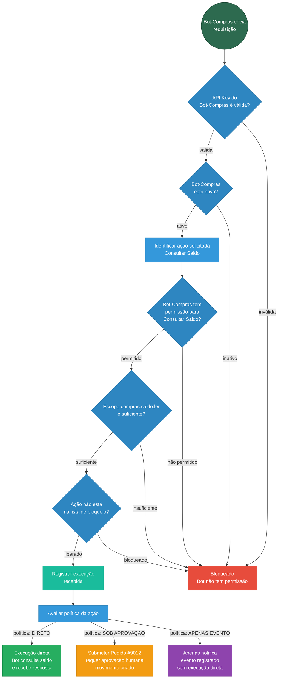
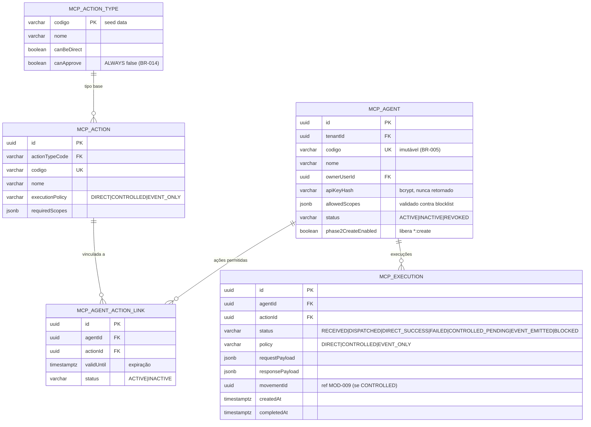
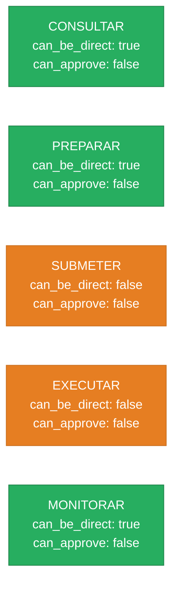

# MOD-010 — Modelo de Domínio

## MCP Gateway (8 Passos)

```mermaid
graph TD
    START(("Bot-Compras envia<br/>requisição"))
    S1{"API Key do<br/>Bot-Compras é válida?"}
    S2{"Bot-Compras<br/>está ativo?"}
    S3["Identificar ação solicitada<br/>Consultar Saldo"]
    S4{"Bot-Compras tem<br/>permissão para<br/>Consultar Saldo?"}
    S5{"Escopo compras:saldo:ler<br/>é suficiente?"}
    S6{"Ação não está<br/>na lista de bloqueio?"}
    S7["Registrar execução<br/>recebida"]
    S8["Avaliar política da ação"]

    DIRECT["Execução direta<br/>Bot consulta saldo<br/>e recebe resposta"]
    CONTROLLED["Submeter Pedido #9012<br/>requer aprovação humana<br/>movimento criado"]
    EVENT["Apenas notifica<br/>evento registrado<br/>sem execução direta"]
    BLOCKED["Bloqueado<br/>Bot não tem permissão"]

    START --> S1
    S1 -->|"válida"| S2
    S1 -->|"inválida"| BLOCKED
    S2 -->|"ativo"| S3
    S2 -->|"inativo"| BLOCKED
    S3 --> S4
    S4 -->|"permitido"| S5
    S4 -->|"não permitido"| BLOCKED
    S5 -->|"suficiente"| S6
    S5 -->|"insuficiente"| BLOCKED
    S6 -->|"liberado"| S7
    S6 -->|"bloqueado"| BLOCKED
    S7 --> S8
    S8 -->|"política: DIRETO"| DIRECT
    S8 -->|"política: SOB APROVAÇÃO"| CONTROLLED
    S8 -->|"política: APENAS EVENTO"| EVENT

    classDef start fill:#2d6a4f,stroke:#1b4332,color:#fff
    classDef check fill:#2E86C1,stroke:#2471A3,color:#fff
    classDef fetch fill:#3498DB,stroke:#2980B9,color:#fff
    classDef insert fill:#1ABC9C,stroke:#17A589,color:#fff
    classDef direct fill:#27AE60,stroke:#1E8449,color:#fff
    classDef controlled fill:#F39C12,stroke:#D68910,color:#fff
    classDef event fill:#8E44AD,stroke:#7D3C98,color:#fff
    classDef blocked fill:#E74C3C,stroke:#CB4335,color:#fff

    class START start
    class S1,S2,S4,S5,S6 check
    class S3 fetch
    class S7 insert
    class S8 fetch
    class DIRECT direct
    class CONTROLLED controlled
    class EVENT event
    class BLOCKED blocked
```

## Entidades e Relacionamentos

```mermaid
erDiagram
    MCP_AGENT ||--o{ MCP_AGENT_ACTION_LINK : "ações permitidas"
    MCP_ACTION ||--o{ MCP_AGENT_ACTION_LINK : "vinculada a"
    MCP_ACTION_TYPE ||--o{ MCP_ACTION : "tipo base"
    MCP_AGENT ||--o{ MCP_EXECUTION : "execuções"

    MCP_AGENT {
        uuid id PK
        uuid tenantId FK
        varchar codigo UK "imutável (BR-005)"
        varchar nome
        uuid ownerUserId FK
        varchar apiKeyHash "bcrypt, nunca retornado"
        jsonb allowedScopes "validado contra blocklist"
        varchar status "ACTIVE|INACTIVE|REVOKED"
        boolean phase2CreateEnabled "libera *:create"
    }

    MCP_ACTION_TYPE {
        varchar codigo PK "seed data"
        varchar nome
        boolean canBeDirect
        boolean canApprove "ALWAYS false (BR-014)"
    }

    MCP_ACTION {
        uuid id PK
        varchar actionTypeCode FK
        varchar codigo UK
        varchar nome
        varchar executionPolicy "DIRECT|CONTROLLED|EVENT_ONLY"
        jsonb requiredScopes
    }

    MCP_AGENT_ACTION_LINK {
        uuid id PK
        uuid agentId FK
        uuid actionId FK
        timestamptz validUntil "expiração"
        varchar status "ACTIVE|INACTIVE"
    }

    MCP_EXECUTION {
        uuid id PK
        uuid agentId FK
        uuid actionId FK
        varchar status "RECEIVED|DISPATCHED|DIRECT_SUCCESS|FAILED|CONTROLLED_PENDING|EVENT_EMITTED|BLOCKED"
        varchar policy "DIRECT|CONTROLLED|EVENT_ONLY"
        jsonb requestPayload
        jsonb responsePayload
        uuid movementId "ref MOD-009 (se CONTROLLED)"
        timestamptz createdAt
        timestamptz completedAt
    }
```

## Seed: ActionTypes (5 tipos)

```mermaid
graph LR
    AT1["CONSULTAR<br/>can_be_direct: true<br/>can_approve: false"]
    AT2["PREPARAR<br/>can_be_direct: true<br/>can_approve: false"]
    AT3["SUBMETER<br/>can_be_direct: false<br/>can_approve: false"]
    AT4["EXECUTAR<br/>can_be_direct: false<br/>can_approve: false"]
    AT5["MONITORAR<br/>can_be_direct: true<br/>can_approve: false"]

    classDef direct fill:#27AE60,color:#fff,stroke:#1E8449
    classDef controlled fill:#E67E22,color:#fff,stroke:#CA6F1E

    class AT1,AT2,AT5 direct
    class AT3,AT4 controlled
```
