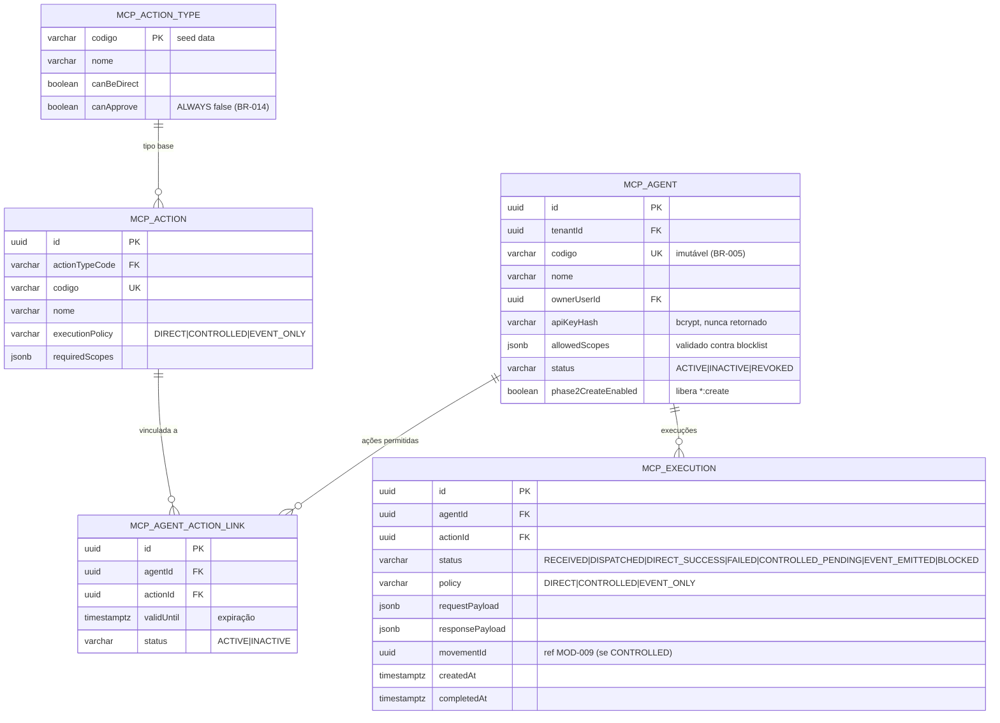
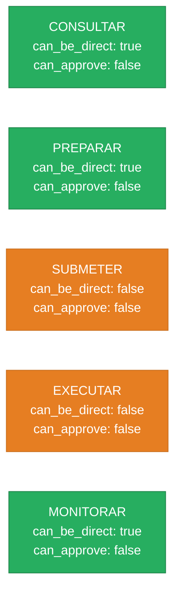

# MOD-010 — Modelo de Domínio

```mermaid
erDiagram
    MCP_AGENT ||--o{ MCP_AGENT_ACTION_LINK : "ações permitidas"
    MCP_ACTION ||--o{ MCP_AGENT_ACTION_LINK : "vinculada a"
    MCP_ACTION_TYPE ||--o{ MCP_ACTION : "tipo base"
    MCP_AGENT ||--o{ MCP_EXECUTION : "execuções"

    MCP_AGENT {
        uuid id PK
        uuid tenantId FK
        varchar codigo UK "imutável (BR-005)"
        varchar nome
        uuid ownerUserId FK
        varchar apiKeyHash "bcrypt, nunca retornado"
        jsonb allowedScopes "validado contra blocklist"
        varchar status "ACTIVE|INACTIVE|REVOKED"
        boolean phase2CreateEnabled "libera *:create"
    }

    MCP_ACTION_TYPE {
        varchar codigo PK "seed data"
        varchar nome
        boolean canBeDirect
        boolean canApprove "ALWAYS false (BR-014)"
    }

    MCP_ACTION {
        uuid id PK
        varchar actionTypeCode FK
        varchar codigo UK
        varchar nome
        varchar executionPolicy "DIRECT|CONTROLLED|EVENT_ONLY"
        jsonb requiredScopes
    }

    MCP_AGENT_ACTION_LINK {
        uuid id PK
        uuid agentId FK
        uuid actionId FK
        timestamptz validUntil "expiração"
        varchar status "ACTIVE|INACTIVE"
    }

    MCP_EXECUTION {
        uuid id PK
        uuid agentId FK
        uuid actionId FK
        varchar status "RECEIVED|DISPATCHED|DIRECT_SUCCESS|FAILED|CONTROLLED_PENDING|EVENT_EMITTED|BLOCKED"
        varchar policy "DIRECT|CONTROLLED|EVENT_ONLY"
        jsonb requestPayload
        jsonb responsePayload
        uuid movementId "ref MOD-009 (se CONTROLLED)"
        timestamptz createdAt
        timestamptz completedAt
    }
```

## Seed: ActionTypes (5 tipos)

```mermaid
graph LR
    AT1["CONSULTAR<br/>can_be_direct: true<br/>can_approve: false"]
    AT2["PREPARAR<br/>can_be_direct: true<br/>can_approve: false"]
    AT3["SUBMETER<br/>can_be_direct: false<br/>can_approve: false"]
    AT4["EXECUTAR<br/>can_be_direct: false<br/>can_approve: false"]
    AT5["MONITORAR<br/>can_be_direct: true<br/>can_approve: false"]

    classDef direct fill:#27AE60,color:#fff,stroke:#1E8449
    classDef controlled fill:#E67E22,color:#fff,stroke:#CA6F1E

    class AT1,AT2,AT5 direct
    class AT3,AT4 controlled
```
