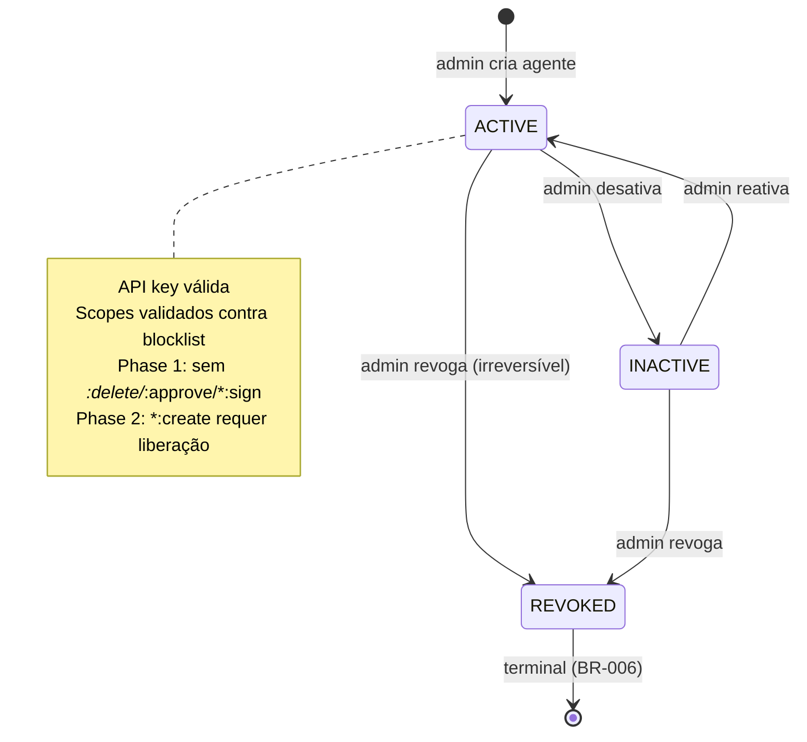
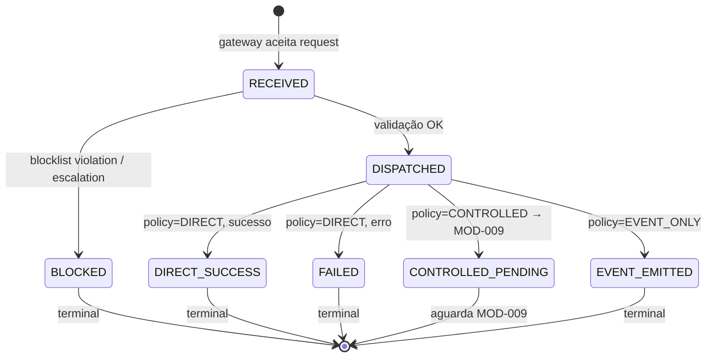
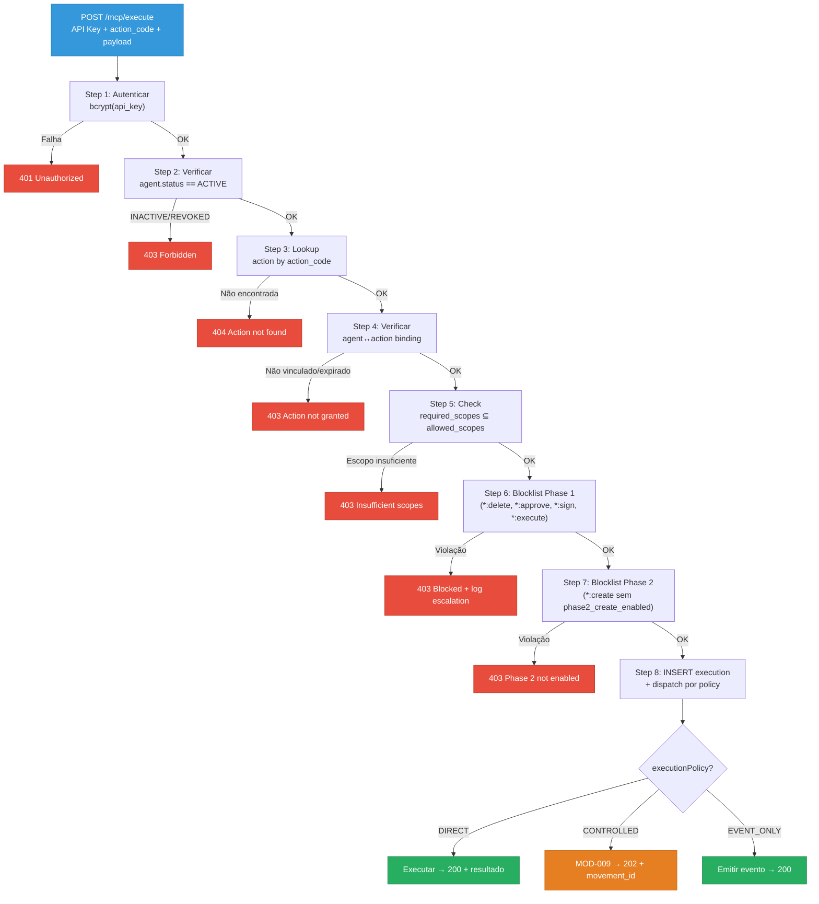

# MOD-010 — Máquinas de Estado

## McpAgent Status

```mermaid
stateDiagram-v2
    [*] --> ACTIVE : admin cria agente
    ACTIVE --> INACTIVE : admin desativa
    ACTIVE --> REVOKED : admin revoga (irreversível)
    INACTIVE --> ACTIVE : admin reativa
    INACTIVE --> REVOKED : admin revoga
    REVOKED --> [*] : terminal (BR-006)

    note right of ACTIVE
        API key válida
        Scopes validados contra blocklist
        Phase 1: sem *:delete/*:approve/*:sign
        Phase 2: *:create requer liberação
    end note
```

## McpExecution Status

```mermaid
stateDiagram-v2
    [*] --> RECEIVED : gateway aceita request

    RECEIVED --> BLOCKED : blocklist violation / escalation
    RECEIVED --> DISPATCHED : validação OK

    DISPATCHED --> DIRECT_SUCCESS : policy=DIRECT, sucesso
    DISPATCHED --> FAILED : policy=DIRECT, erro
    DISPATCHED --> CONTROLLED_PENDING : policy=CONTROLLED → MOD-009
    DISPATCHED --> EVENT_EMITTED : policy=EVENT_ONLY

    BLOCKED --> [*] : terminal
    DIRECT_SUCCESS --> [*] : terminal
    FAILED --> [*] : terminal
    CONTROLLED_PENDING --> [*] : aguarda MOD-009
    EVENT_EMITTED --> [*] : terminal
```

## Gateway: 8 Steps de Validação

```mermaid
flowchart TD
    REQ["POST /mcp/execute<br/>API Key + action_code + payload"] --> S1

    S1["Step 1: Autenticar<br/>bcrypt(api_key)"] -->|Falha| ERR1["401 Unauthorized"]
    S1 -->|OK| S2["Step 2: Verificar<br/>agent.status == ACTIVE"]
    S2 -->|INACTIVE/REVOKED| ERR2["403 Forbidden"]
    S2 -->|OK| S3["Step 3: Lookup<br/>action by action_code"]
    S3 -->|Não encontrada| ERR3["404 Action not found"]
    S3 -->|OK| S4["Step 4: Verificar<br/>agent↔action binding"]
    S4 -->|Não vinculado/expirado| ERR4["403 Action not granted"]
    S4 -->|OK| S5["Step 5: Check<br/>required_scopes ⊆ allowed_scopes"]
    S5 -->|Escopo insuficiente| ERR5["403 Insufficient scopes"]
    S5 -->|OK| S6["Step 6: Blocklist Phase 1<br/>(*:delete, *:approve, *:sign, *:execute)"]
    S6 -->|Violação| ERR6["403 Blocked + log escalation"]
    S6 -->|OK| S7["Step 7: Blocklist Phase 2<br/>(*:create sem phase2_create_enabled)"]
    S7 -->|Violação| ERR7["403 Phase 2 not enabled"]
    S7 -->|OK| S8["Step 8: INSERT execution<br/>+ dispatch por policy"]

    S8 --> DISPATCH{"executionPolicy?"}
    DISPATCH -->|DIRECT| D1["Executar → 200 + resultado"]
    DISPATCH -->|CONTROLLED| D2["MOD-009 → 202 + movement_id"]
    DISPATCH -->|EVENT_ONLY| D3["Emitir evento → 200"]

    style REQ fill:#3498DB,color:#fff,stroke:#2980B9
    style D1 fill:#27AE60,color:#fff,stroke:#1E8449
    style D2 fill:#E67E22,color:#fff,stroke:#CA6F1E
    style D3 fill:#27AE60,color:#fff,stroke:#1E8449
    style ERR1 fill:#E74C3C,color:#fff,stroke:#C0392B
    style ERR2 fill:#E74C3C,color:#fff,stroke:#C0392B
    style ERR3 fill:#E74C3C,color:#fff,stroke:#C0392B
    style ERR4 fill:#E74C3C,color:#fff,stroke:#C0392B
    style ERR5 fill:#E74C3C,color:#fff,stroke:#C0392B
    style ERR6 fill:#E74C3C,color:#fff,stroke:#C0392B
    style ERR7 fill:#E74C3C,color:#fff,stroke:#C0392B
```
