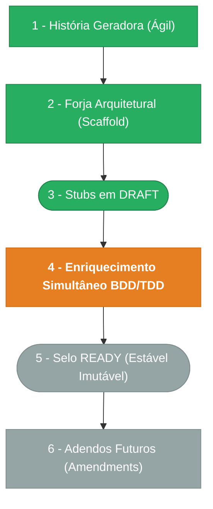

> ⚠️ **ARQUIVO GERIDO POR AUTOMAÇÃO.**
> - **Status DRAFT:** Enriqueça o conteúdo deste arquivo diretamente.
> - **Status READY:** NÃO EDITE DIRETAMENTE. Use a skill `create-amendment`.

# CHANGELOG - MOD-011

## Ciclo de Estabilidade do Módulo

> 🟢 Verde = Concluído | 🟠 Laranja = Em Andamento | 🔵 Azul = Estável Ancestral | ⬜ Cinza = Previsto

*O módulo está na **Etapa 4** — enriquecimento em andamento (Batch 1: MOD, BR, FR concluídos; Batch 2: DATA, INT, NFR concluídos; Batch 3: SEC, UX concluídos; Batch 4: ADR, PENDENTE, VAL concluídos).*

---

## Histórico de Versões

| Versão | Data | Responsável | Descrição |
|--------|------|-------------|-----------|
| 0.14.0 | 2026-03-19 | arquitetura | Pipeline PEND-SGR-04 (DECIDIDA → IMPLEMENTADA): campo `target_endpoints` no context_framer tipo OPERACAO. DATA-011 v0.3.0 (§6 — schema target_endpoints), INT-011 v0.3.0 (INT-003 — resolução via target_endpoints, MI-002 removida), PEN-011 v0.3.0 (PEND-SGR-04 IMPLEMENTADA). Backlog: amendment MOD-007. |
| 0.13.0 | 2026-03-19 | arquitetura | Pipeline PEND-SGR-03 + PEND-SGR-05: NFR-011 atualizado com limite 200 linhas (MAX_GRID_ROWS=200, virtualização obrigatória) e concorrência configurável (env var SMARTGRID_CONCURRENCY default=10). Ambas pendências IMPLEMENTADAS. PEN-011 v0.4.0. |
| 0.12.0 | 2026-03-19 | AGN-DEV-11 | Validação cruzada (Batch 4) — todos os checks passed: rastreabilidade, cobertura F01-F05, consistência DATA-003/SEC-002, mapeamento UX/ações. 1 warning menor (ref BR-006 em SEC-011 SEC-001). 3 questões abertas documentadas (PEND-SGR-03/04/05). |
| 0.11.0 | 2026-03-19 | AGN-DEV-10 | Enriquecimento PENDENTE — PEND-SGR-01/02 documentadas como resolvidas, 3 novas questões abertas (PEND-SGR-03: limite de linhas, PEND-SGR-04: operationId dinâmico, PEND-SGR-05: concorrência throttling) |
| 0.10.0 | 2026-03-19 | AGN-DEV-09 | Enriquecimento ADR — ADR-001 (motor 1-por-1, status ACCEPTED) e ADR-002 (sem persistência server-side, status ACCEPTED) |
| 0.9.0 | 2026-03-19 | AGN-DEV-07 | Enriquecimento UX — 3 telas (UX-SGR-001/002/003): jornadas, happy paths, cenários de erro, estados, ações mapeadas para DOC-UX-010, componentes, copy, telemetria, a11y |
| 0.8.0 | 2026-03-19 | AGN-DEV-06 | Enriquecimento SEC — SEC-011 (RBAC herdado, client-side security, soft delete, audit, telemetria, LGPD) e SEC-002 (matriz de autorização de 4 eventos delegados com Emit/View/Notify) |
| 0.7.0 | 2026-03-19 | AGN-DEV-08 | Enriquecimento NFR — 10 requisitos não funcionais (NFR-001 a NFR-010): performance de renderização, limites de linhas, SLOs de validação, export/import, observabilidade, a11y |
| 0.6.0 | 2026-03-19 | AGN-DEV-05 | Enriquecimento INT — 3 integrações (INT-001 a INT-003): contratos completos MOD-007 com/sem current_record_state, MOD-000 auth/RBAC, módulo destino dinâmico |
| 0.5.0 | 2026-03-19 | AGN-DEV-04 | Enriquecimento DATA — DATA-011 (contrato client-side JSON, entidades consumidas, grid state) e DATA-003 (catálogo de 4 domain events delegados com payloads) |
| 0.4.0 | 2026-03-19 | AGN-DEV-03 | Enriquecimento FR — 9 requisitos funcionais (FR-001 a FR-009) com Gherkin, cobrindo F01-F05 |
| 0.3.0 | 2026-03-19 | AGN-DEV-02 | Enriquecimento BR — 10 regras de comportamento de interface (BR-001 a BR-010) com Gherkin |
| 0.2.0 | 2026-03-19 | AGN-DEV-01 | Enriquecimento MOD — metricas de escopo, fluxo de integracao com MOD-007, mapeamento response→status visual |
| 0.1.0 | 2026-03-19 | arquitetura | Baseline Inicial — scaffold gerado via `forge-module` a partir de US-MOD-011 (APPROVED). Nível 1 (UX Consumer), 0 tabelas, 0 endpoints próprios, 5 features (F01–F05), 3 screen manifests. Amendment F01 em MOD-007-F03. Stubs obrigatórios criados: DATA-003, SEC-002. Todos os itens nascem em `estado_item: DRAFT`. |
