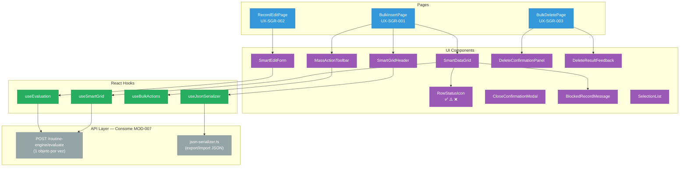

# MOD-011 — Arquitetura de Camadas (UX Consumer, Nível 1)

```mermaid
graph TD
    subgraph PAGES ["Pages"]
        P1["BulkInsertPage<br/>UX-SGR-001"]
        P2["RecordEditPage<br/>UX-SGR-002"]
        P3["BulkDeletePage<br/>UX-SGR-003"]
    end

    subgraph COMPONENTS ["UI Components"]
        C1["SmartGridHeader"]
        C2["MassActionToolbar"]
        C3["SmartDataGrid"]
        C4["RowStatusIcon<br/>✅ ⚠️ ❌"]
        C5["SmartEditForm"]
        C6["CloseConfirmationModal"]
        C7["DeleteConfirmationPanel"]
        C8["DeleteResultFeedback"]
        C9["BlockedRecordMessage"]
        C10["SelectionList"]
    end

    subgraph HOOKS ["React Hooks"]
        H1["useSmartGrid"]
        H2["useEvaluation"]
        H3["useBulkActions"]
        H4["useJsonSerializer"]
    end

    subgraph API ["API Layer — Consome MOD-007"]
        A1["POST /routine-engine/evaluate<br/>(1 objeto por vez)"]
        A2["json-serializer.ts<br/>(export/import JSON)"]
    end

    P1 --> C1
    P1 --> C2
    P1 --> C3
    P2 --> C5
    P3 --> C7
    P3 --> C8

    C3 --> C4
    C3 --> C9

    C1 --> H4
    C2 --> H3
    C3 --> H1
    C5 --> H2

    H1 --> A1
    H2 --> A1
    H4 --> A2

    classDef pages fill:#3498DB,stroke:#2980B9,color:#fff
    classDef components fill:#9B59B6,stroke:#8E44AD,color:#fff
    classDef hooks fill:#27AE60,stroke:#1E8449,color:#fff
    classDef api fill:#95A5A6,stroke:#7F8C8D,color:#fff

    class P1,P2,P3 pages
    class C1,C2,C3,C4,C5,C6,C7,C8,C9,C10 components
    class H1,H2,H3,H4 hooks
    class A1,A2 api
```
