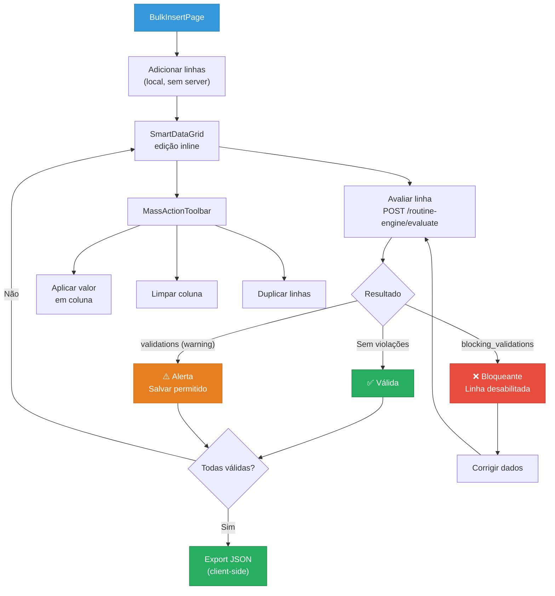
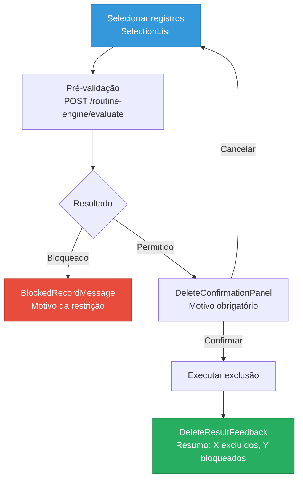
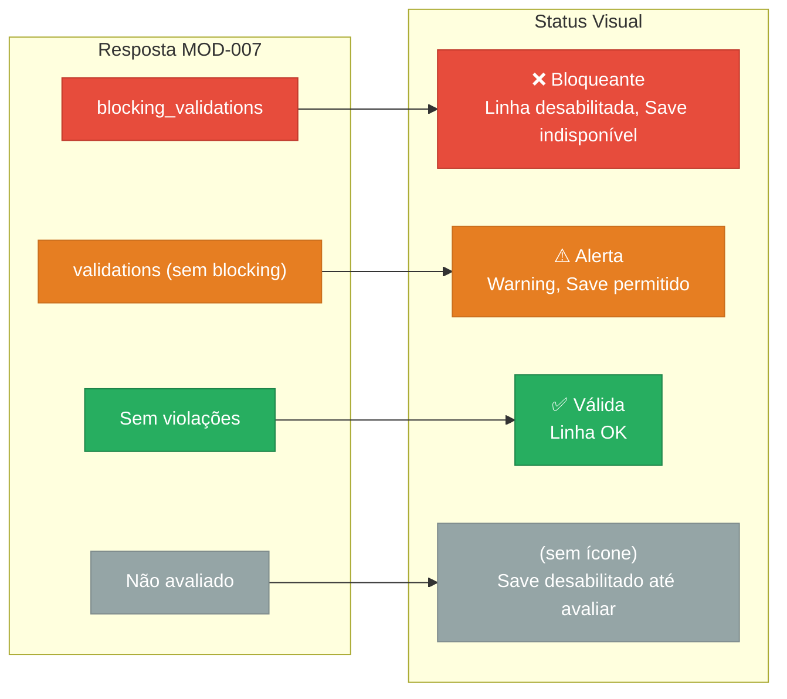

# MOD-011 — Fluxo UX SmartGrid

## Fluxo de Inclusão em Massa (UX-SGR-001)

```mermaid
flowchart TD
    START["BulkInsertPage"] --> ADD["Adicionar linhas<br/>(local, sem server)"]
    ADD --> GRID["SmartDataGrid<br/>edição inline"]

    GRID --> EVAL["Avaliar linha<br/>POST /routine-engine/evaluate"]
    EVAL --> RESPONSE{"Resultado"}

    RESPONSE -->|"blocking_validations"| BLOCKED["❌ Bloqueante<br/>Linha desabilitada"]
    RESPONSE -->|"validations (warning)"| WARNING["⚠️ Alerta<br/>Salvar permitido"]
    RESPONSE -->|"Sem violações"| VALID["✅ Válida"]

    VALID --> SAVE{"Todas válidas?"}
    WARNING --> SAVE
    SAVE -->|Sim| EXPORT["Export JSON<br/>(client-side)"]
    SAVE -->|Não| GRID

    GRID --> MASS["MassActionToolbar"]
    MASS --> APPLY_VAL["Aplicar valor<br/>em coluna"]
    MASS --> CLEAR_COL["Limpar coluna"]
    MASS --> DUPLICATE["Duplicar linhas"]

    BLOCKED --> FIX["Corrigir dados"] --> EVAL

    style START fill:#3498DB,color:#fff,stroke:#2980B9
    style BLOCKED fill:#E74C3C,color:#fff,stroke:#C0392B
    style WARNING fill:#E67E22,color:#fff,stroke:#CA6F1E
    style VALID fill:#27AE60,color:#fff,stroke:#1E8449
    style EXPORT fill:#27AE60,color:#fff,stroke:#1E8449
```

## Fluxo de Exclusão em Massa (UX-SGR-003)

```mermaid
flowchart TD
    SELECT["Selecionar registros<br/>SelectionList"] --> PREVAL["Pré-validação<br/>POST /routine-engine/evaluate"]
    PREVAL --> RESULT{"Resultado"}

    RESULT -->|"Bloqueado"| SHOW_REASON["BlockedRecordMessage<br/>Motivo da restrição"]
    RESULT -->|"Permitido"| CONFIRM["DeleteConfirmationPanel<br/>Motivo obrigatório"]

    CONFIRM -->|"Confirmar"| DELETE["Executar exclusão"]
    CONFIRM -->|"Cancelar"| SELECT

    DELETE --> FEEDBACK["DeleteResultFeedback<br/>Resumo: X excluídos, Y bloqueados"]

    style SELECT fill:#3498DB,color:#fff,stroke:#2980B9
    style SHOW_REASON fill:#E74C3C,color:#fff,stroke:#C0392B
    style FEEDBACK fill:#27AE60,color:#fff,stroke:#1E8449
```

## Mapeamento de Resposta do Motor → UI

```mermaid
graph LR
    subgraph MOTOR ["Resposta MOD-007"]
        M1["blocking_validations"]
        M2["validations (sem blocking)"]
        M3["Sem violações"]
        M4["Não avaliado"]
    end

    subgraph UI ["Status Visual"]
        U1["❌ Bloqueante<br/>Linha desabilitada, Save indisponível"]
        U2["⚠️ Alerta<br/>Warning, Save permitido"]
        U3["✅ Válida<br/>Linha OK"]
        U4["(sem ícone)<br/>Save desabilitado até avaliar"]
    end

    M1 --> U1
    M2 --> U2
    M3 --> U3
    M4 --> U4

    classDef block fill:#E74C3C,color:#fff,stroke:#C0392B
    classDef warn fill:#E67E22,color:#fff,stroke:#CA6F1E
    classDef ok fill:#27AE60,color:#fff,stroke:#1E8449
    classDef neutral fill:#95A5A6,color:#fff,stroke:#7F8C8D

    class M1,U1 block
    class M2,U2 warn
    class M3,U3 ok
    class M4,U4 neutral
```
