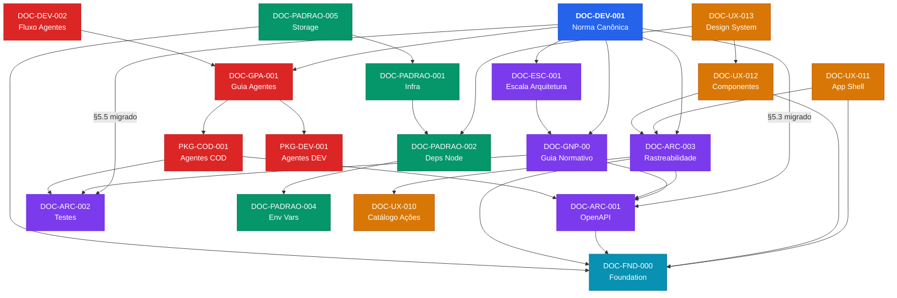

# Índice de Documentação (EasyA2)

> **Regra de manutenção (MUST):** Todo novo documento normativo (DOC-*), pacote (PKG-*) ou módulo (MOD-*) **DEVE** ser registrado neste índice **no mesmo commit** em que for criado. Skills que criam documentos (`/forge-module`, `/create-specification`, `/create-oo-doc`) devem invocar `/update-index` como último passo. IDs de documentos são estáveis e não mudam após publicação.

---

## 01 — Documentos Normativos

| Documento | ID | Versão | Status | Descrição |
|---|---|:---:|:---:|---|
| [DOC-DEV-001 — Especificação Executável](01_normativos/DOC-DEV-001_especificacao_executavel.md) | DOC-DEV-001 | 1.4.0 | ACTIVE | **Norma canônica.** Governança, ciclo de vida, IDs, DoR/DoD |
| [DOC-DEV-002 — Fluxo de Agentes e Governança](01_normativos/DOC-DEV-002_fluxo_agentes_e_governanca.md) | DOC-DEV-002 | 2.0.0 | ACTIVE | Pipeline XP, separação ágil vs. técnico, forge-module |
| [DOC-ESC-001 — Escala de Arquitetura N0/N1/N2](01_normativos/DOC-ESC-001__Escala_de_Arquitetura_Niveis_0_1_2.md) | DOC-ESC-001 | 1.0.0 | ACTIVE | Critérios de nível arquitetural e checklists de PR |
| [DOC-GNP-00 — Guia Normativo e Padrões](01_normativos/DOC-GNP-00__DOC-CEE-00__DOC-CHE-00__Consolidado_v2.0.md) | DOC-GNP-00 | 2.0.0 | ACTIVE | Guia normativo MUST/SHOULD, exemplos EX-OAS-001..004, Gates CI |
| [DOC-GPA-001 — Guia Padrão de Agente](01_normativos/DOC-GPA-001_Guia_Padrao_Agente.md) | DOC-GPA-001 | 1.2.0 | ACTIVE | Catálogo de 11 agentes DEV + 6 agentes COD, contratos JSON |
| [DOC-ARC-001 — Padrões OpenAPI/Swagger](01_normativos/DOC-ARC-001__Padroes_OpenAPI.md) | DOC-ARC-001 | 1.0.0 | ACTIVE | Contratos OpenAPI: organização, convenções, DoD por endpoint |
| [DOC-ARC-002 — Estratégia de Testes](01_normativos/DOC-ARC-002__Estrategia_Testes.md) | DOC-ARC-002 | 1.0.0 | ACTIVE | Testes unitários vs integração, Testcontainers, Gates CI |
| [DOC-ARC-003 — Ponte de Rastreabilidade](01_normativos/DOC-ARC-003__Ponte_de_Rastreabilidade.md) | DOC-ARC-003 | 1.2.0 | READY | UIActionEnvelope, 6 dogmas, Auditoria, RBAC, Padrões Visuais |
| [DOC-ARC-003B — Manifestos e Gates CI](01_normativos/DOC-ARC-003B__Manifestos_Declarativos_e_Gates_CI.md) | DOC-ARC-003B | 1.0.0 | READY | 9 Gates de CI, Screen Manifests, caso de referência (Usuários) |
| [DOC-PADRAO-001 — Infraestrutura e Execução](01_normativos/DOC-PADRAO-001_Infraestrutura_e_Execucao.md) | DOC-PADRAO-001 | 1.0.0 | ACTIVE | Node.js, Docker, PostgreSQL, Redis |
| [DOC-PADRAO-002 — Dependências NodeJS](01_normativos/DOC-PADRAO-002_Dependencias_NodeJS.md) | DOC-PADRAO-002 | 1.0.0 | ACTIVE | Bibliotecas autorizadas, Turbo Repo e pnpm |
| [DOC-PADRAO-004 — Variáveis de Ambiente](01_normativos/DOC-PADRAO-004_Variaveis_de_Ambiente.md) | DOC-PADRAO-004 | 2.0.0 | ACTIVE | Convenções de nome, validação (Zod) e fail-fast |
| [DOC-PADRAO-005 — Storage e Upload](01_normativos/DOC-PADRAO-005_Storage_e_Upload.md) | DOC-PADRAO-005 | 1.0.0 | READY | Uploads, anexos, presigned URLs, provider-agnóstico |
| [DOC-UX-010 — Catálogo de Ações UX](01_normativos/DOC-UX-010__Catalogo_Acoes_e_Template_UX.md) | DOC-UX-010 | 1.0.0 | DRAFT | Catálogo oficial de action_keys reutilizáveis |
| [DOC-UX-011 — Application Shell](01_normativos/DOC-UX-011__Application_Shell_e_Navegacao.md) | DOC-UX-011 | 1.0.0 | READY | Navegação, menus, breadcrumbs, headers |
| [DOC-UX-012 — Componentes Globais](01_normativos/DOC-UX-012__Componentes_Globais_e_Feedback.md) | DOC-UX-012 | 1.0.0 | READY | Tratamento global de erros, busca, dark mode |
| [DOC-UX-013 — Design System e Tokens Visuais](01_normativos/DOC-UX-013__Design_System_e_Tokens_Visuais.md) | DOC-UX-013 | 1.1.0 | ACTIVE | Tokens semânticos, Tailwind v4 @theme, paleta, tipografia, espaçamento |
| [DOC-FND-000 — Contratos Fundacionais](01_normativos/DOC-FND-000__Foundation.md) | DOC-FND-000 | 1.0.0 | ACTIVE | Auth, RBAC, SEC-002, Telemetria, Error Handling, Storage |
| [DOC-PADRAO-003 — (Reservado)](01_normativos/DOC-PADRAO-003__Reservado.md) | DOC-PADRAO-003 | — | DESCONTINUADO | ID reservado, sem conteúdo normativo ativo |

---

## 02 — Pacotes de Agentes

| Documento | ID | Descrição |
|---|---|---|
| [PKG-DEV-001 — Pacote Agentes Enriquecimento](02_pacotes_agentes/PKG-DEV-001_Pacote_Agentes_Enriquecimento.md) | PKG-DEV-001 | Pacote DEV para enriquecer DOC-DEV-001 |
| [PKG-COD-001 — Pacote Agentes Geração de Código](02_pacotes_agentes/PKG-COD-001_Pacote_Agentes_Geracao_Codigo.md) | PKG-COD-001 | Pacote COD para geração de código por camada |
| [Levantamento de Skills Prioritárias](02_pacotes_agentes/Levantamento_Skills_Prioritarias.md) | — | Análise de skills disponíveis vs. necessárias |
| [Plano de Implantação de Agentes e Skills](02_pacotes_agentes/Plano_Implantacao_Agentes_Skills.md) | — | Roadmap de implantação dos agentes |

---

## 03 — Especificações

### Módulo Foundation

| Documento | ID | Descrição |
|---|---|---|
| UX-000 — Tela de Login e Autenticação | UX-000 | Especificação UX completa da tela de login (campos, SSO, MFA, eventos) |
| UX-001 — App Shell e SDUI | UX-001 | App Shell pós-login, Dispatcher de ações, Shell Config, SDUI |

### Especificação Executável (Template)

| Documento | ID | Descrição |
|---|---|---|
| [DOC-DEV-001 — Template](03_especificacoes/template/DOC-DEV-001.template.md) | — | Template oficial para novos módulos |

---

## 04 — Módulos (`04_modules`)

Cada módulo possui raiz em `04_modules/` com `<dirname>.md` (manifesto do módulo), `requirements/`, `amendments/`, `adr/`.

| Módulo | Arquivo Raiz | Estado |
|---|---|---|
| MOD-000 — Framework de Automação / Geradores (Foundation) | [mod-000-foundation.md](04_modules/mod-000-foundation/mod-000-foundation.md) | READY |
| MOD-001 — Backoffice Admin (UX-First Shell) | [mod-001-backoffice-admin.md](04_modules/mod-001-backoffice-admin/mod-001-backoffice-admin.md) | READY |
| MOD-002 — Gestão de Usuários (Backoffice) | [mod-002-gestao-usuarios.md](04_modules/mod-002-gestao-usuarios/mod-002-gestao-usuarios.md) | READY |
| MOD-003 — Estrutura Organizacional | [mod-003-estrutura-organizacional.md](04_modules/mod-003-estrutura-organizacional/mod-003-estrutura-organizacional.md) | READY |
| MOD-004 — Identidade Avançada | [mod-004-identidade-avancada.md](04_modules/mod-004-identidade-avancada/mod-004-identidade-avancada.md) | READY |
| MOD-005 — Modelagem de Processos (Blueprint) | [mod-005-modelagem-processos.md](04_modules/mod-005-modelagem-processos/mod-005-modelagem-processos.md) | READY |
| MOD-006 — Execução de Casos | [mod-006-execucao-casos.md](04_modules/mod-006-execucao-casos/mod-006-execucao-casos.md) | READY |
| MOD-007 — Parametrização Contextual e Rotinas | [mod-007-parametrizacao-contextual.md](04_modules/mod-007-parametrizacao-contextual/mod-007-parametrizacao-contextual.md) | READY |
| MOD-008 — Integração Dinâmica Protheus/TOTVS | [mod-008-integracao-protheus.md](04_modules/mod-008-integracao-protheus/mod-008-integracao-protheus.md) | READY |
| MOD-009 — Movimentos sob Aprovação (Aprovações e Alçadas) | [mod-009-movimentos-aprovacao.md](04_modules/mod-009-movimentos-aprovacao/mod-009-movimentos-aprovacao.md) | READY |
| MOD-010 — MCP e Automação Governada | [mod-010-mcp-automacao.md](04_modules/mod-010-mcp-automacao/mod-010-mcp-automacao.md) | READY |
| MOD-011 — SmartGrid: Componente de Grade com Edição em Massa | [mod-011-smartgrid.md](04_modules/mod-011-smartgrid/mod-011-smartgrid.md) | READY |

### Features — MOD-000

| Feature | Tema | Screen Manifest | Status |
|---|---|---|---|
| [US-MOD-000-F01](04_modules/user-stories/features/US-MOD-000-F01.md) | Autenticação Nativa (E-mail, Senha, Sessão) | UX-AUTH-001 | READY |
| [US-MOD-000-F02](04_modules/user-stories/features/US-MOD-000-F02.md) | Autenticação de Dois Fatores via TOTP (MFA) | — | READY |
| [US-MOD-000-F03](04_modules/user-stories/features/US-MOD-000-F03.md) | Login via SSO OAuth2 (Google/Microsoft) | UX-AUTH-001 | READY |
| [US-MOD-000-F04](04_modules/user-stories/features/US-MOD-000-F04.md) | Recuperação de Senha por E-mail | — | READY |
| [US-MOD-000-F05](04_modules/user-stories/features/US-MOD-000-F05.md) | Cadastro e Gestão de Usuários (CRUD) | UX-USR-001, UX-USR-002 | READY |
| [US-MOD-000-F06](04_modules/user-stories/features/US-MOD-000-F06.md) | Gestão de Perfis (Roles) e RBAC | — | READY |
| [US-MOD-000-F07](04_modules/user-stories/features/US-MOD-000-F07.md) | Gestão de Filiais Multi-Tenant (CRUD) | — | READY |
| [US-MOD-000-F08](04_modules/user-stories/features/US-MOD-000-F08.md) | Perfil do Usuário Autenticado | UX-USR-002 | READY |
| [US-MOD-000-F09](04_modules/user-stories/features/US-MOD-000-F09.md) | Vinculação de Usuários a Filiais com Roles | — | READY |
| [US-MOD-000-F10](04_modules/user-stories/features/US-MOD-000-F10.md) | Alteração de Senha Autenticada | — | READY |
| [US-MOD-000-F11](04_modules/user-stories/features/US-MOD-000-F11.md) | Endpoint GET /info (Versão e Metadados) | — | READY |
| [US-MOD-000-F12](04_modules/user-stories/features/US-MOD-000-F12.md) | Catálogo de Permissões (CRUD de Escopos) | — | READY |
| [US-MOD-000-F13](04_modules/user-stories/features/US-MOD-000-F13.md) | Utilitário de Telemetria UI (UIActionEnvelope) | — | READY |
| [US-MOD-000-F14](04_modules/user-stories/features/US-MOD-000-F14.md) | Middlewares de Correlação E2E (CorrelationId) | — | READY |
| [US-MOD-000-F15](04_modules/user-stories/features/US-MOD-000-F15.md) | Motor de Gates de Pipeline CI | — | READY |
| [US-MOD-000-F16](04_modules/user-stories/features/US-MOD-000-F16.md) | Módulo de Storage e Upload Centralizado | — | READY |
| [US-MOD-000-F17](04_modules/user-stories/features/US-MOD-000-F17.md) | Login via Sign in with Apple (Apple ID) | — | READY |

### Features — MOD-001

| Feature | Tema | Screen Manifest | Status |
|---|---|---|---|
| [US-MOD-001-F01](04_modules/user-stories/features/US-MOD-001-F01.md) | Shell de Autenticação e Layout Base | UX-AUTH-001, UX-SHELL-001 | READY |
| [US-MOD-001-F02](04_modules/user-stories/features/US-MOD-001-F02.md) | Telemetria de UI e Rastreabilidade do Shell | UX-SHELL-001, UX-DASH-001 | READY |
| [US-MOD-001-F03](04_modules/user-stories/features/US-MOD-001-F03.md) | Dashboard Administrativo Executivo | UX-DASH-001 | READY |

### Features — MOD-002

| Feature | Tema | Screen Manifest | Status |
|---|---|---|---|
| [US-MOD-002-F01](04_modules/user-stories/features/US-MOD-002-F01.md) | Listagem de Usuários + Filtros + Ações | UX-USR-001 | READY |
| [US-MOD-002-F02](04_modules/user-stories/features/US-MOD-002-F02.md) | Formulário de Cadastro (senha / convite) | UX-USR-002 | READY |
| [US-MOD-002-F03](04_modules/user-stories/features/US-MOD-002-F03.md) | Fluxo de Convite e Ativação | UX-USR-003 | READY |

### Features — MOD-003

| Feature | Tema | Screen Manifest | Status |
|---|---|---|---|
| [US-MOD-003-F01](04_modules/user-stories/features/US-MOD-003-F01.md) | API Core — CRUD + Tree Query + Vinculação N5 | — (Backend) | READY |
| [US-MOD-003-F02](04_modules/user-stories/features/US-MOD-003-F02.md) | Árvore Organizacional | UX-ORG-001 | READY |
| [US-MOD-003-F03](04_modules/user-stories/features/US-MOD-003-F03.md) | Formulário de Nó Organizacional | UX-ORG-002 | READY |

### Features — MOD-004

| Feature | Tema | Screen Manifest | Status |
|---|---|---|---|
| [US-MOD-004-F01](04_modules/user-stories/features/US-MOD-004-F01.md) | API: user_org_scopes (CRUD + invalidação Redis) | — (Backend) | READY |
| [US-MOD-004-F02](04_modules/user-stories/features/US-MOD-004-F02.md) | API: access_shares + access_delegations + job expiração | — (Backend) | READY |
| [US-MOD-004-F03](04_modules/user-stories/features/US-MOD-004-F03.md) | UX: Escopo organizacional do usuário | UX-IDN-001 | READY |
| [US-MOD-004-F04](04_modules/user-stories/features/US-MOD-004-F04.md) | UX: Compartilhamentos e delegações ativas | UX-IDN-002 | READY |

### Features — MOD-005

| Feature | Tema | Screen Manifest | Status |
|---|---|---|---|
| [US-MOD-005-F01](04_modules/user-stories/features/US-MOD-005-F01.md) | API Ciclos + Macroetapas + Estágios | — (Backend) | READY |
| [US-MOD-005-F02](04_modules/user-stories/features/US-MOD-005-F02.md) | API Gates + Papéis + Transições | — (Backend) | READY |
| [US-MOD-005-F03](04_modules/user-stories/features/US-MOD-005-F03.md) | UX Editor Visual de Fluxo | UX-PROC-001 | READY |
| [US-MOD-005-F04](04_modules/user-stories/features/US-MOD-005-F04.md) | UX Configurador de Estágio | UX-PROC-002 | READY |

### Features — MOD-006

| Feature | Tema | Screen Manifest | Status |
|---|---|---|---|
| [US-MOD-006-F01](04_modules/user-stories/features/US-MOD-006-F01.md) | API abertura + motor de transição | — (Backend) | READY |
| [US-MOD-006-F02](04_modules/user-stories/features/US-MOD-006-F02.md) | API gates + responsáveis + eventos | — (Backend) | READY |
| [US-MOD-006-F03](04_modules/user-stories/features/US-MOD-006-F03.md) | UX Painel do caso + timeline | UX-CASE-001 | READY |
| [US-MOD-006-F04](04_modules/user-stories/features/US-MOD-006-F04.md) | UX Listagem de casos | UX-CASE-002 | READY |

### Features — MOD-007

| Feature | Tema | Screen Manifest | Status |
|---|---|---|---|
| [US-MOD-007-F01](04_modules/user-stories/features/US-MOD-007-F01.md) | API Enquadradores + Objetos + Incidências | — (Backend) | READY |
| [US-MOD-007-F02](04_modules/user-stories/features/US-MOD-007-F02.md) | API Rotinas + Itens + Versionamento | — (Backend) | READY |
| [US-MOD-007-F03](04_modules/user-stories/features/US-MOD-007-F03.md) | Motor de Avaliação (runtime) | — (Backend) | READY |
| [US-MOD-007-F04](04_modules/user-stories/features/US-MOD-007-F04.md) | UX Configurador de Enquadradores | UX-PARAM-001 | READY |
| [US-MOD-007-F05](04_modules/user-stories/features/US-MOD-007-F05.md) | UX Cadastro de Rotinas | UX-ROTINA-001 | READY |

### Features — MOD-008

| Feature | Tema | Screen Manifest | Status |
|---|---|---|---|
| [US-MOD-008-F01](04_modules/user-stories/features/US-MOD-008-F01.md) | API Catálogo de serviços + rotinas de integração | — (Backend) | READY |
| [US-MOD-008-F02](04_modules/user-stories/features/US-MOD-008-F02.md) | API Mapeamentos de campos e parâmetros | — (Backend) | READY |
| [US-MOD-008-F03](04_modules/user-stories/features/US-MOD-008-F03.md) | API Motor de execução (BullMQ + Outbox + DLQ) | — (Backend) | READY |
| [US-MOD-008-F04](04_modules/user-stories/features/US-MOD-008-F04.md) | UX Editor de rotinas de integração | UX-INTEG-001 | READY |
| [US-MOD-008-F05](04_modules/user-stories/features/US-MOD-008-F05.md) | UX Monitor de integrações | UX-INTEG-002 | READY |

### Features — MOD-009

| Feature | Tema | Screen Manifest | Status |
|---|---|---|---|
| [US-MOD-009-F01](04_modules/user-stories/features/US-MOD-009-F01.md) | API Regras de controle + alçada | — (Backend) | APPROVED |
| [US-MOD-009-F02](04_modules/user-stories/features/US-MOD-009-F02.md) | API Motor de controle (interceptação) | — (Backend) | APPROVED |
| [US-MOD-009-F03](04_modules/user-stories/features/US-MOD-009-F03.md) | API Inbox + execução + override | — (Backend) | APPROVED |
| [US-MOD-009-F04](04_modules/user-stories/features/US-MOD-009-F04.md) | UX Inbox de aprovações | UX-APROV-001 | APPROVED |
| [US-MOD-009-F05](04_modules/user-stories/features/US-MOD-009-F05.md) | UX Configurador de regras | UX-APROV-002 | APPROVED |

### Features — MOD-010

| Feature | Tema | Screen Manifest | Status |
|---|---|---|---|
| [US-MOD-010-F01](04_modules/user-stories/features/US-MOD-010-F01.md) | API Agentes MCP + Catálogo de Ações | — (Backend) | READY |
| [US-MOD-010-F02](04_modules/user-stories/features/US-MOD-010-F02.md) | API Gateway + Motor de Despacho | — (Backend) | READY |
| [US-MOD-010-F03](04_modules/user-stories/features/US-MOD-010-F03.md) | API Log de Execuções | — (Backend) | READY |
| [US-MOD-010-F04](04_modules/user-stories/features/US-MOD-010-F04.md) | UX Gestão de Agentes e Ações | UX-MCP-001 | READY |
| [US-MOD-010-F05](04_modules/user-stories/features/US-MOD-010-F05.md) | UX Monitor de Execuções | UX-MCP-002 | READY |

### Features — MOD-011

| Feature | Tema | Screen Manifest | Status |
|---|---|---|---|
| [US-MOD-011-F01](04_modules/user-stories/features/US-MOD-011-F01.md) | Amendment: `current_record_state` no motor MOD-007 | — (Backend amendment) | READY |
| [US-MOD-011-F02](04_modules/user-stories/features/US-MOD-011-F02.md) | UX Grade de Inclusão em Massa | UX-SGR-001 | READY |
| [US-MOD-011-F03](04_modules/user-stories/features/US-MOD-011-F03.md) | UX Formulário de Alteração de Registro | UX-SGR-002 | READY |
| [US-MOD-011-F04](04_modules/user-stories/features/US-MOD-011-F04.md) | UX Grade de Exclusão em Massa | UX-SGR-003 | READY |
| [US-MOD-011-F05](04_modules/user-stories/features/US-MOD-011-F05.md) | UX Ações em Massa sobre Linhas | UX-SGR-001 | READY |

> **Nota:** Novos módulos devem criar um subdiretório próprio em `04_modules/<mod-id>/` seguindo o padrão do MOD-001.

---

## Mapa de Dependências entre Documentos

> **Legenda de cores:** 🔵 Norma Canônica | 🟣 Arquitetura | 🔵‍🟦 Foundation | 🟢 Infraestrutura | 🟠 UX | 🔴 Agentes

---

## Hierarquia Normativa (Precedência em Conflitos)

Quando dois ou mais documentos estabelecerem regras contraditórias, prevalece o documento de **nível superior** nesta hierarquia. Exceções devem ser formalizadas via ADR no módulo afetado.

| Nível | Documento(s) | Escopo |
|:-----:|---|---|
| **1** | DOC-DEV-001 — Especificação Executável (Norma Canônica) | Regras fundacionais, ciclo de vida, governança |
| **2** | DOC-ESC-001 — Escala de Arquitetura | Critérios de nível arquitetural (N0/N1/N2) |
| **3** | DOC-GNP-00 — Guia Normativo e Padrões | Padrões técnicos MUST/SHOULD/MAY, gates CI |
| **4** | DOC-ARC-* — Padrões Arquiteturais | OpenAPI (001), Testes (002), Rastreabilidade (003A/003B) |
| **5** | DOC-PADRAO-* — Padrões de Infraestrutura | Infra (001), Deps (002), Env (004), Storage (005) |
| **6** | DOC-UX-* — Padrões UX | Catálogo UX (010), Shell (011), Componentes (012) |
| **7** | PKG-* — Pacotes de Agentes | Agentes DEV (001), Agentes COD (001) |

> **Regra prática:** Em caso de dúvida, o DOC-DEV-001 é a fonte de verdade final. Documentos de nível inferior podem *detalhar* mas nunca *contradizer* os de nível superior.

---

## Referências Cruzadas Obrigatórias

| Conceito | Definido em | Referenciado por |
|---|---|---|
| JWT + Sessions + Kill-Switch | Foundation `IMP-000` | UX-000, UX-001 |
| Multitenancy (Conceitos) | Foundation `mod-000-foundation.md` | DOC-BD-001 `tenants` |
| RBAC (`@RequireScope`) | Foundation `mod-000-foundation.md` | UX-001, todos os módulos |
| Audit Trail (`AuditService`) | Foundation `IMP-000` | UX-000 `SEC-002` |
| UIActionEnvelope | DOC-ARC-003 §2 | UX-000 §8, DOC-UX-010 |
| action_keys UX | DOC-UX-010 | UX-000 §8, DOC-ARC-003 §8 |
| OpenAPI Gates | DOC-GNP-00 EX-OAS-001..004 | DOC-ESC-001, DOC-ARC-003 §8 |

---

## Observações Operacionais

- O **Gate EX-CI-007** aponta para os arquivos "de contrato" (Consolidado + DOC-DEV-001).
- Ao atualizar qualquer doc, **mantenha IDs estáveis** e rastreabilidade (`EX-*`, `SEC-002`, `DATA-003`, `UX-010`) conforme o guia.
- **Pasta 05_manifests:** prevista na arquitetura; será povoada quando os Screen Manifests forem formalizados (Gate DOC-ARC-003 §8 item 3 exige catálogo de RBAC em `docs/04_modules/mod-000-foundation/permissions.yaml`).
