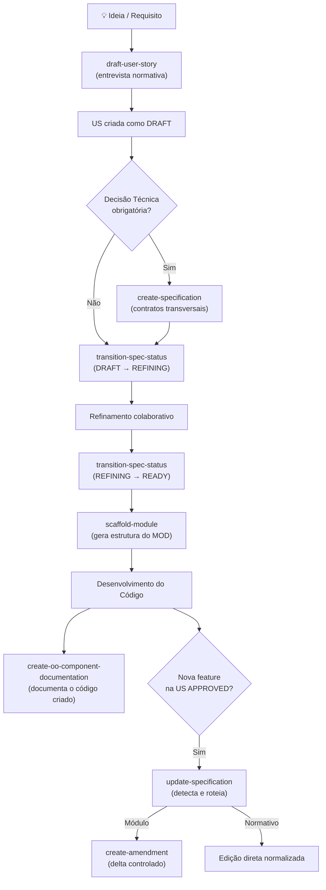

# Agent Skills — Guia de Uso e Fluxo Completo

## 🗺️ Mapa do Fluxo Completo

O processo segue uma esteira bem definida. Veja onde cada skill se encaixa:

```
[ IDEIA ] → [ ÉPICO/US ] → [ REFINAMENTO ] → [ READY ] → [ SCAFFOLD ] → [ CÓDIGO ] → [ DELTA/MANUTENÇÃO ]
```

---

## 1. `draft-user-story` — *A porta de entrada*

**Quando usar:** No início de tudo — quando você tem uma **ideia nova** e precisa transformá-la numa User Story estruturada e normativa.

Ela atua como um **entrevistador normativo**: faz perguntas em blocos sequenciais, garantindo que nenhum detalhe arquitetural seja esquecido antes de escrever uma linha de código.

| Bloco | O que captura |
|---|---|
| 1 — Contexto | Objetivo de negócio, atores, fluxo feliz, fora de escopo |
| 2 — UX e Telemetria | Telas, ações do usuário, eventos de auditoria |
| 3 — Domínio | Entidades, regras, invariantes, LGPD |
| 4 — API/OpenAPI | Endpoints, roles, `operationId`, `x-tags`, idempotência |
| 5 — Testes | Cobertura unitária vs. integração, casos negativos |

**Saída:** cria fisicamente `docs/04_modules/user-stories/features/US-MOD-XXX.md` com status **DRAFT**, usando o template canônico.

> **Gatilho prático:** *"Quero criar uma user story para o módulo de notificações"*

---

## 2. `create-specification` — *Para contratos técnicos transversais*

**Quando usar:** Quando a necessidade **não é um módulo de negócio**, mas sim uma decisão técnica ou arquitetural que precisa ser documentada antes de virar código.

**Exemplos clássicos:**
- Definir a estratégia de cache (Redis, TTL, invalidação)
- Especificar o padrão de eventos de domínio
- Documentar contratos com sistemas externos (webhooks, filas)
- Definir a estratégia de testes antes de implementar
- Especificar padrões de observabilidade

> ⚠️ **Regra de ouro:** Se for `MOD-XXX`, use `scaffold-module`. Se for uma **decisão de infraestrutura, integração ou estratégia**, use `create-specification`. É o ponto de partida para documentar "como o sistema funciona", enquanto o `draft-user-story` documenta "o que o sistema faz".

**Saída:** arquivo em `docs/03_especificacoes/` seguindo o template canônico.

---

## 3. `transition-spec-status` — *O guardião da qualidade*

**Quando usar:** Após refinar a US (ou especificação), quando você quer **avançar o status** do documento: `DRAFT → REFINING → READY → APPROVED`.

Essa skill é a **única forma legítima** de mudar o campo `estado_item` — ela executa um script Node.js que valida o DoR (Definition of Ready) antes de qualquer promoção. Isso evita que USs incompletas entrem no fluxo de desenvolvimento.

**O que o script valida:**
- Owner preenchido?
- Critérios Gherkin presentes?
- Dependências resolvidas?
- Campos obrigatórios do template preenchidos?

> [!IMPORTANT]
> A skill possui uma **Regra de Ouro**: o agente **NUNCA** edita `estado_item` manualmente. Se o script falhar, ele reporta os itens pendentes para você corrigir e tentar de novo.

**Fluxo típico:**
```
US criada (DRAFT) → refinamento manual → "validar DoR" (REFINING) → mais refinamento → "promover para READY" → READY → aprovação → scaffold
```

> **Gatilhos práticos:** *"Promover US-MOD-005 para READY"*, *"Validar DoR desta spec"*

---

## 4. `scaffold-module` — *O gerador da estrutura do módulo*

**Quando usar:** Após a US estar com status `READY` ou `APPROVED` — é o passo que **materializa o épico em estrutura de documentação técnica** do módulo.

Ela lê o normativo `DOC-DEV-001` em tempo real (zero alucinação) e gera toda a árvore de arquivos:

```
docs/04_modules/mod-{ID}-{nome}/
├── mod.md              ← Índice do módulo
├── CHANGELOG.md
└── requirements/
    ├── BR-{ID}.md      ← Regras de Negócio
    ├── FR-{ID}.md      ← Requisitos Funcionais
    ├── DATA-{ID}.md    ← Modelo de Dados
    ├── INT-{ID}.md     ← Integrações
    ├── SEC-{ID}.md     ← Segurança
    ├── UX-{ID}.md      ← Jornadas UX
    └── NFR-{ID}.md     ← Requisitos Não-Funcionais
```

Após gerar os arquivos, automaticamente invoca `update-markdown-file-index` para atualizar o `mod.md` e o `docs/INDEX.md` global.

> **Gate de segurança:** Se a US não estiver `READY`/`APPROVED`, a skill **bloqueia a execução** e avisa você.

> **Gatilho prático:** *"Scaffold do módulo MOD-015 de gestão de contratos"*

---

## 5. `update-specification` — *O roteador inteligente de atualizações*

**Quando usar:** Quando você precisa **atualizar uma especificação existente**.

Ela funciona como um **porteiro com dois caminhos**:

```
Arquivo está em docs/04_modules/mod-*/requirements/**?
├── SIM → Delega para `create-amendment`  (preserva rastreabilidade)
└── NÃO → Aplica edição direta normalizada (normativos, specs técnicas)
```

> **Por que isso importa?** Arquivos de módulo gerados pelo scaffold são **imutáveis por design** — eles possuem um aviso `⚠️ ARQUIVO GERIDO POR AUTOMAÇÃO`. Qualquer alteração deve passar pelo sistema de amendments para manter rastreabilidade histórica.

> **Gatilho prático:** *"Atualizar a regra de retry na spec de integração"*, *"Mudar a política de senha na BR-005"*

---

## 6. `create-amendment` — *O sistema de deltas controlados*

**Quando usar:** Quando a US de uma **nova feature está `APPROVED`** e você precisa adicionar comportamento, corrigir ou revisar uma especificação de módulo existente — **sem destruir o arquivo base**.

É a forma canônica de **evoluir módulos sem perder rastreabilidade**. Cada amendment é categorizado por:

- **Pilar:** `br`, `fr`, `data`, `int`, `sec`, `ux`, `nfr`
- **Natureza:** `M` (Melhoria), `R` (Revisão), `C` (Correção)

**O que ela faz automaticamente:**
1. Cria o arquivo de emenda com numeração sequencial (ex: `FR-101-M02.md`)
2. Adiciona referência no arquivo base (`FR-101.md`)
3. Atualiza o `mod.md` com a referência ao novo amendment
4. Registra um bump semântico no `CHANGELOG.md` do módulo

> **Gate de segurança:** A US que motiva o amendment **precisa estar `APPROVED`**. Se estiver em outro status, a skill bloqueia.

> **Gatilho prático:** *"Criar emenda para adicionar a regra de notificação por email na FR-008"*

---

## 7. `create-oo-component-documentation` — *A documentação do código que já existe*

**Quando usar:** **Depois que o código backend foi implementado** — quando você quer documentar handlers Fastify, repositórios Drizzle, services ou middlewares que já foram criados.

Ela analisa o código real e gera documentação seguindo C4 Model + Arc42, com diagramas Mermaid e tabelas de interface.

**O que ela valida e documenta:**

| Contrato | O que verifica |
|---|---|
| **RBAC** | Guards de role presentes nos handlers |
| **X-Correlation-ID** | Propagação do `correlationId` em logs e eventos |
| **RFC 9457** | Erros no formato Problem Details |
| **Idempotency-Key** | POSTs com side-effects suportam reenvio seguro |
| **Multi-Tenant** | Queries filtram por `tenant_id` |

**Saída:** `docs/03_especificacoes/components/{component-name}-documentation.md`

> **Gatilho prático:** *"Documentar o UserRepository"*, *"Gerar doc técnica do AuthController"*

---

## 🔄 Fluxo Completo Integrado



---

## 📋 Resumo em uma linha por skill

| Skill | Fase | Uma linha |
|---|---|---|
| `draft-user-story` | **Início** | Transforma uma ideia em US normativa via entrevista |
| `create-specification` | **Início/Paralelo** | Documenta contratos técnicos que não são módulos de negócio |
| `transition-spec-status` | **Refinamento** | Valida o DoR e avança o status da US com segurança |
| `scaffold-module` | **Pré-código** | Materializa a US aprovada em estrutura de arquivos do módulo |
| `update-specification` | **Evolução** | Roteia atualizações: amendment (módulos) ou edição direta (outros) |
| `create-amendment` | **Evolução** | Adiciona deltas rastreados a specs de módulo sem alterar o original |
| `create-oo-component-documentation` | **Pós-código** | Documenta componentes backend implementados com contratos arquiteturais |
